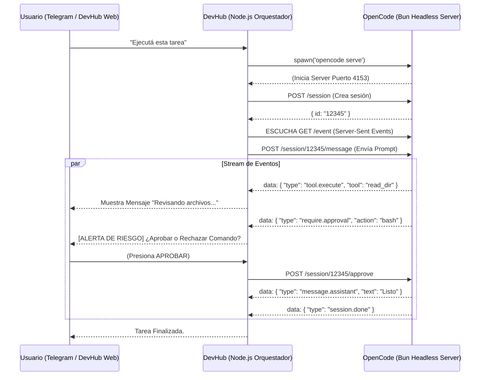

# 21. Implementación de OpenCode Headless

## 1. Visión General
Esta documentación detalla la integración nativa del motor de **OpenCode** dentro del ecosistema de DevHub. Inicialmente, OpenCode se ejecutaba de forma rudimentaria como un binario de terminal empaquetado dentro de una sesión de `tmux`, lo que ocasionaba dependencias frágiles, un consumo excesivo de memoria por procesos zombies, y la imposibilidad de trackear con fidelidad el flujo visual de los agentes desde la UI de DevHub o Telegram.

El nuevo diseño abandona `tmux` por completo para ejecutar OpenCode como un **microservicio Headless**, utilizando su servidor nativo interno (`opencode serve`) potenciado por Bun (Hono). Esta aproximación garantiza un streaming de eventos robusto, bidireccional y altamente programable.

---

## 2. Decisiones Arquitectónicas

### 2.1. Separación de Entornos (El Problema Bun vs Node.js)
Aunque DevHub corre sobre **Node.js** (Next.js / Express), **OpenCode** está profundamente integrado con **Bun**. Exportar las funciones de la librería base de OpenCode y utilizarlas directamente desde Node resultaba inviable debido a conflictos en las promesas del runtime y dependencias a nivel de sistema.

> [!TIP]
> **Solución Elegida: Microservicio Local**
> El orquestador de DevHub inicializa el agente mediante `child_process.spawn` apuntando al comando `opencode serve`. Todo el intercambio de información subsiguiente se realiza vía peticiones REST HTTP comunes (`fetch`) y Server-Sent Events (SSE).

### 2.2 Bases de Datos Independientes
Para mantener el sistema mantenible a largo plazo, hemos decidido **mantener desacopladas** la base de datos de DevHub (Supabase/Postgres) y la base local de OpenCode (SQLite). 

> [!IMPORTANT]
> **Estrategia Upstream Segura:**
> Esta separación nos permite hacer `git pull` de actualizaciones maestras del repositorio oficial de OpenCode (Upstream) en el futuro, sin dañar o corromper nuestras migraciones de DevHub. Si las bases estuvieran unidas, las migraciones futuras chocarían.

---

## 3. Desglose de la Implementación (Fases de Desarrollo)

### Fase 1: El Motor Headless (Capa OpenCode)
Descubrimiento crucial: El código de OpenCode ya incluye soporte maduro para una API REST con EventSource (SSE) integrada, orientada en la carpeta `packages/opencode/src/server/`.
Se aprovecha directamente este entorno sin escribir un Wrapper (envoltorio) manual:
- Se expone el puerto para comunicación (`4153`).
- El endpoint `POST /session` inicializa IDs de sesión.
- El endpoint `GET /event` actúa como un bus infinito devolviendo datos JSON en vivo que indican el estado exacto de la mente del agente.

### Fase 2: Cliente Orquestador (Capa DevHub)
Refactorización del servicio que conecta DevHub con OpenCode (ubicado en `telegram-bot/services/opencode.js`):
- **Eliminación de tmux:** Muerte de `tmux capture-pane`, y el uso inestable de parseo de sintaxis ANSI.
- **Streaming Bidireccional:** El bot Node.js lee el stream nativo de SSE enviado por OpenCode.
- **Parsing In-Flight:** En vez de un output general masivo, cada trozo de texto (`tool.execute`, `message.assistant`) es procesado y reenviado dinámicamente como mini eventos a la interfaz o a Telegram.

### Fase 3: Flujo Interactivo y Mitigación de Riesgos
La autonomía absoluta del agente incurre en riesgos cuando solicita realizar tareas destructivas (ej. eliminar carpetas ráfaga o ejecutar Drop tables).
- **Intercepción:** Si OpenCode envía el evento lógico en JSON de tipo `require.approval`, DevHub frena el loop.
- **Delegación a la UI:** El Telegram Bot o el chat interno de DevHub despliega automáticamente un botón (InlineKeyboard): `[Aprobar] / [Rechazar]`.
- **Reanudación:** Al presionarse el botón por el usuario, DevHub golpea con un HTTP POST a `/session/:id/approve` o `/abort`, logrando un Workflow "Human-in-the-loop" elegante.

---

## 4. Implicaciones a Nivel Sistema

### 4.1. Beneficios
1. **Estabilidad:** No hay pérdida de contexto ni cuelgues causados por la desincronización de stdout.
2. **Eficiencia:** Un Websocket/SSE HTTP es notablemente más liviano y veloz que emular el renderizado de una TTY por detrás en background.
3. **Escalabilidad Visual:** Ahora podemos tomar los payloads de herramientas ejecutándose y mostrarlos de forma inmersiva en el chat de Telegram o la Web (ej: *"El agente Orquestador está leyendo tus archivos internos..."*), brindando una experiencia Premium para el usuario final.

### 4.2. Mantenibilidad
Las únicas colisiones probables serán cambios en la API REST interna del equipo de OpenCode. Si actualizan el formato de los payload JSON, nosotros solo deberemos mapear en `telegram-bot/services/opencode.js` los nuevos parámetros. No hay refactorización profunda necesaria.

---

## 5. Diagrama de Flujo del Protocolo

## 6. Próximos Eventuales Pasos
* Mapeo estricto de todos los esquemas JSON de salida en DevHub.
* Soporte a visualización de logs de red de OpenCode nativos hacia una tabla `agent_logs` en Supabase para analíticas futuras.
