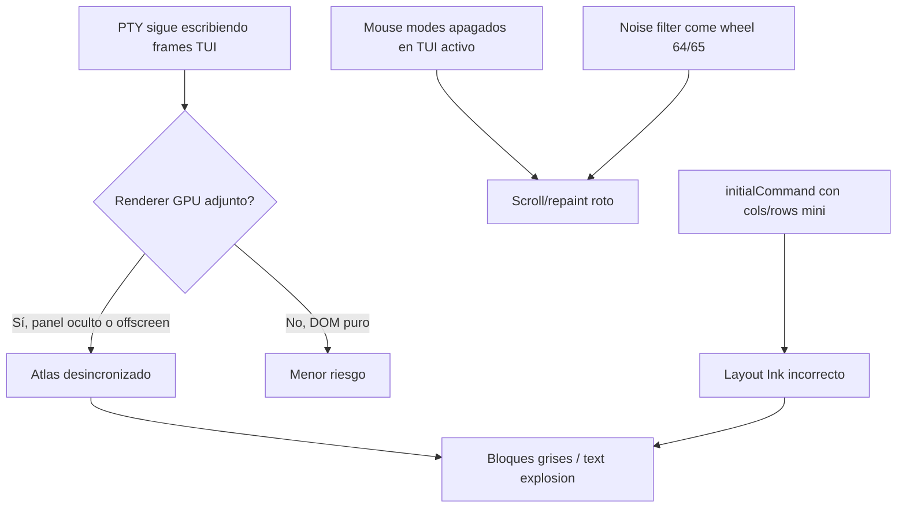

# Causas raíz — corrupción visual terminal TUI

Documento de análisis para handoff. No implica que todas las causas estén confirmadas con logs en la sesión `ses_abc`; están ordenadas por probabilidad según código y sesiones previas de debugging.

---

## 1. Ciclo de vida del renderer GPU (causa principal)

### Mecanismo

`TerminalTTY` mantiene el **PTY conectado** y el **proceso TUI escribiendo** aunque el panel no sea visible (`isVisibleInLayout === false`, workspace inactivo, split sin foco, dock maximizado).

Los addons `xterm-addon-canvas` y `xterm-addon-webgl` cachean **glyph atlases** en GPU. Si el addon sigue registrado mientras:

- el panel está `opacity: 0` / `visibility: hidden`, o
- el canvas tiene tamaño 0 momentáneo, o
- WebKitGTK reparenta el WebView,

…las escrituras PTY siguen actualizando el buffer lógico de xterm pero el atlas GPU queda **stale** o **parcialmente allocado**. Al volver a mostrar el panel aparecen bloques grises o glifos basura.

### Evidencia en código

- `shouldReleaseCanvasRendererOnLayoutHide` + `releaseCanvasAddon('layout-hidden-canvas')` — mitigación para canvas.
- `releaseWebglAddonForInactivePanel` — hoy se usa en **split collapse / inactive sibling**, no necesariamente en **workspace hide** de panel único WebGL.
- Test: `hiding a canvas panel releases the Canvas addon to avoid atlas corruption while hidden` en `TerminalTTY.xterm-webgl.test.jsx`.

### Por qué es peor en `.deb`

| Entorno                          | Renderer típico             | Estabilidad          |
| -------------------------------- | --------------------------- | -------------------- |
| `npm run dev` (Chrome), 1 panel  | xterm-webgl                 | Alta                 |
| Tauri/WebKitGTK, 2+ paneles      | xterm-canvas o DOM fallback | Media/baja           |
| Installed app + workspace switch | Mezcla webgl↔canvas↔dom     | Donde más se reporta |

---

## 2. Mouse / focus reporting interfería con Ink (causa contribuyente)

### Mecanismo

Secuencia histórica única:

```text
\x1b[?1004l\x1b[?1000l\x1b[?1002l\x1b[?1003l\x1b[?1006l...
```

Se enviaba al **enfocar** terminales para evitar “DA garbage” al PTY. Efecto colateral: **modos 1000/1006** (mouse/SGR) se apagaban en el TUI **activo**, que los necesita para wheel scroll y a veces para repaint coherente.

### Fix intentado (sin commit)

- Focus (1004) siempre off en blur paths.
- Mouse modes off **solo** en paneles inactivos o en `focusout`.
- Paneles TUI activos (`tuiSessionActiveRef`) conservan mouse.

---

## 3. Filtro de ruido PTY eliminaba scroll legítimo (causa contribuyente)

### Mecanismo

`stripTerminalMouseReporting` en `terminalNoiseFilter.js` borraba cualquier `\x1b[<…M/m`. Los botones **64 y 65** son **rueda arriba/abajo SGR** — scroll intencional hacia OpenCode/grok, no leak.

### Fix intentado (sin commit)

- `TERMINAL_MOUSE_CLICK_LEAK_RE` — solo botones 0–3.
- `containsTerminalInputNoise` — excluye 64/65 del chequeo de ruido.

---

## 4. Carrera viewport / initialCommand (causa contribuyente)

### Mecanismo

`sendInitialCommandIfReady` exige `viewportFitConfirmedRef.current === true`. Eso se setea en `confirmViewportFit` tras `fitAddon.fit()`.

Si el contenedor aún mide el mínimo del dock (~280×180 → ~28 cols × 9 rows) cuando se dispara el fit:

1. Se pega `opencode --session ses_abc\r` con grid diminuto.
2. Ink layoutiza para 28×9.
3. Luego un resize real llega tarde; el TUI no siempre relayoutiza bien bajo xterm GPU.

Síntoma compatible: footer visible (TUI arrancó) pero zona de transcripto corrupta o vacía.

---

## 5. Animación / visibilidad del workspace (mitigado parcialmente)

`resolveWorkspaceShellVisibilityStyle` en `workspaceAnimProps.js` pasó de crossfade a **hide instantáneo** con `contain: strict` para que paneles inactivos no sigan pintando durante 120–160 ms de fade.

Si la captura es **con workspace activo y paneles visibles**, esta causa sola no explica el fallo; sí explica recurrencia al **cambiar de workspace** antes del freeze visual.

---

## 6. Confusión grok vs OpenCode en el router de wheel (riesgo de regresión)

Cambios locales introducen ramas:

- **grok** → `buildTerminalWheelArrowSequence` (siempre).
- **OpenCode** tras footer → passthrough nativo xterm; antes → SGR sintético + page/arrow.

La captura muestra UI **grok** con transcripto muerto: encaja con **causa 1** más que con scroll, porque el footer Ink sí renderizó.

---

## Diagrama causal (resumen)



---

## Lo que NO parece ser la causa

- **Paquetes apt faltantes** en el `.deb` — descartado en sesión 2026-06-09; el PTY y el TUI arrancan.
- **SQLite / sidecar caído** — habría overlay de desconexión, no footer Ink.
- **OpenCode session ID inválido** — suele mostrar error en el TUI, no atlas corrupto en tres paneles.
