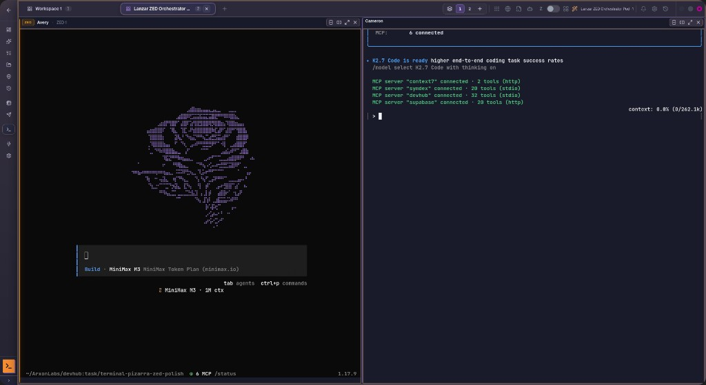
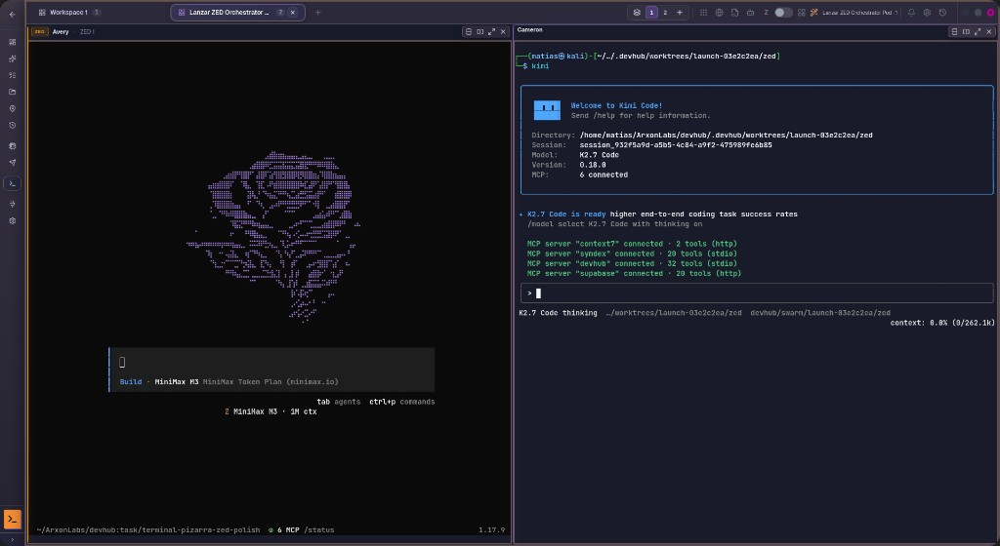

# 04 — Rayitas horizontales y contenido corrido al cambiar workspace (OpenCode / Kimi)

**Fecha:** 2026-06-21  
**Contexto:** `.deb` / Tauri WebKitGTK, workspace con **2+ paneles** (renderer `xterm-canvas`), sesiones OpenCode (`opencode --session …`) o Kimi/Kini.

---

## Síntoma (capturas del usuario)





- **Rayitas:** líneas horizontales que atraviesan el arte ASCII / transcripto del TUI (OpenCode con rose, paneles Avery / Cameron).
- **Tras cambiar workspace o ventana interna:** el footer Ink (atajos, “K2.7 Code thinking…”, barra de contexto) queda **desplazado hacia abajo** o “descentralizado”.
- El TUI sigue vivo (footer visible, prompt `>`) pero el **bitmap canvas** no coincide con el buffer lógico de xterm.

---

## Por qué volvió a aparecer (historia de cambios)

| Etapa                            | Qué se hizo                                                                                                                                | Efecto en las rayitas                                                                |
| -------------------------------- | ------------------------------------------------------------------------------------------------------------------------------------------ | ------------------------------------------------------------------------------------ |
| **Antes (solo DOM)**             | Renderer `xterm` puro                                                                                                                      | Lento en splits pero **sin** artefactos GPU                                          |
| **Introducción xterm-webgl**     | Default `xterm-webgl` para paneles nuevos                                                                                                  | Mejor perf; en WebKitGTK inestable → se forzó canvas en splits                       |
| **Mitigación canvas (76097c7)**  | `xterm-addon-canvas` para splits; `releaseCanvasAddon` on layout hide; hide instantáneo del workspace shell                                | **Redujo** bloques grises; rayitas menores si el atlas se limpiaba bien              |
| **Causa 3/4 packaging (05)**     | TWM dormant / unmount fuera de `/terminales`; Tauri Linux → DOM default                                                                    | Menos crash WebView; splits siguen en **canvas**                                     |
| **Regresión detectada Jun-2026** | `shouldClearGpuAtlasOnWorkspaceShow` **no** limpiaba atlas canvas tras `release-on-hide` (solo WebGL tenía `webglReleasedOnLayoutHideRef`) | Al volver al workspace: canvas reattach **sin** clear → **rayitas** y footer corrido |

En resumen: las mitigaciones de **packaging/WebKit** no reintrodujeron el bug directamente; lo que lo reactivó fue un **hueco en el lifecycle canvas** — paridad incompleta con el path WebGL al ocultar/mostrar workspaces.

---

## Causa raíz técnica

### 1. Canvas release sin flag de “necesito clear al show”

WebGL ya usaba `webglReleasedOnLayoutHideRef`:

```text
hide workspace → releaseWebglAddon → flag=true → show → clearAtlas=true → flag=false
```

Canvas hacía `releaseCanvasAddon('layout-hidden-canvas')` pero **no** seteaba un flag equivalente. Los pases `layout-recover-delay-*` corrían con `clearAtlas: false` si cols/rows no cambiaron.

### 2. Política conservadora de `shouldClearGpuAtlasOnWorkspaceShow`

Para `xterm-canvas`, solo se limpiaba atlas en:

- `workspace-show-pending`
- ciertos `layout-settled-panel-*`

**No** en:

- `workspace-show-settled` / `layout-recover-*` (salvo fase `immediate` vía parámetro explícito)
- Tras release-on-hide cuando el addon ya se había re-adjuntado async

El PTY **sigue escribiendo** mientras el panel está `visibility:hidden`. Al reattach, el canvas mezcla frames viejos (filas desplazadas) con el buffer nuevo → rayitas horizontales.

### 3. Cambio de ventana / foco Tauri

`reactivateTerminalViewport` (focus / visibility) usaba `clearAtlas: false` por defecto. En modo canvas, al volver del alt-tab o cambiar ventana del SO, el bitmap no se refrescaba completo.

---

## Corrección aplicada (2026-06-21)

**Primera ola (insuficiente):** `canvasReleasedOnLayoutHideRef` — paridad con WebGL; no alcanzó porque la regresión real venía de **`38453a6`**.

**Segunda ola (dirigida, tras git forensics):** ver [05-regression-git-forensics-38453a6.md](./05-regression-git-forensics-38453a6.md)

**Archivo:** `src/components/TerminalTTY.jsx`

| Cambio                                          | Detalle                                                                      |
| ----------------------------------------------- | ---------------------------------------------------------------------------- |
| `fillSlack: false` en **filas**                 | Revert parcial de `38453a6` — evita fila parcial recortada (rayita inferior) |
| `scheduleInactiveViewportRepaint`               | Restaura `clearAtlas: splitCanvasClear` (38453a6 lo había puesto en `false`) |
| `shouldSkipReactivateViewportOnPanelActivation` | No skip en canvas split 2+ paneles                                           |
| Activación panel canvas split                   | `clearAtlas: true` forzado                                                   |
| `canvasReleasedOnLayoutHideRef`                 | (primera ola) sigue activo para release-on-hide                              |

**Tests:** `TerminalTTY.test.js` — `shouldClearGpuAtlasOnWorkspaceShow` actualizado.

---

## Cómo verificar

```bash
# App instalada o tauri dev
# 1. Workspace con 2 paneles, OpenCode o Kimi en cada uno
# 2. Cambiar pestaña de workspace (Workspace 1 ↔ otro)
# 3. Cambiar ventana interna V1/V2/V3 si aplica
# 4. Alt-tab fuera y volver a DevHub

tail -f data/logs/terminal-debug.log
# Buscar:
#   canvas-released … layout-hidden-canvas
#   canvas-attached … canvas-reattach
#   layout-recover-immediate (con clearAtlas efectivo)
```

**Criterio de éxito:** sin rayitas tras switch; footer Ink alineado con el grid; no hace falta Reload.

---

## Si vuelve a pasar

1. Confirmar renderer en log: `RENDER:*` → `xterm-canvas` vs `xterm` vs `xterm-webgl`.
2. ¿`canvas-released` sin `canvas-attached` posterior? → race async; revisar burst `TERMINAL_LAYOUT_RECOVER_BURST_MS`.
3. ¿Un solo panel en Tauri Linux? Debería ser `xterm` DOM (`shouldAvoidWebglOnThisRuntime`); rayitas en DOM apuntan a otro bug (noise filter / PTY resize).
4. Ver también [05-deb-webkit-page-couldnt-load](../05-deb-webkit-page-couldnt-load/README.md) si la WebView entera cae (distinto de rayitas locales).

---

## Relacionado

- [README.md](./README.md) — catálogo general corrupción TUI
- [02-causas-raiz.md](./02-causas-raiz.md) §1 GPU atlas
- [04-terminal-lifecycle-coverage-gaps](../04-terminal-lifecycle-coverage-gaps/README.md)
