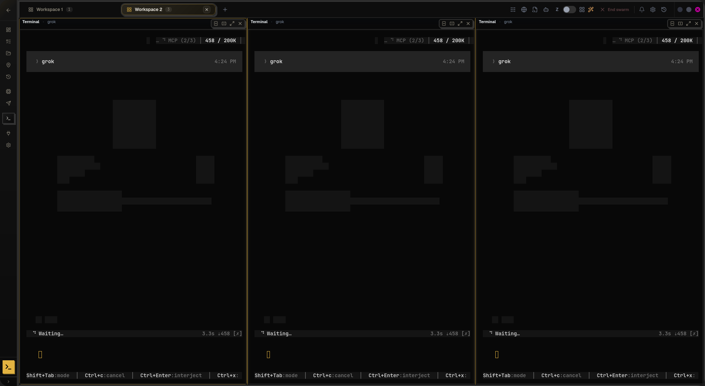

# 03 — Corrupción visual en terminales TUI (OpenCode / grok)

## Resumen

Sesiones TUI lanzadas o restauradas desde DevHub — típicamente `opencode --session <id>` o `grok` — muestran artefactos visuales en el viewport xterm: bloques grises sin texto legible, glifos superpuestos (“text explosion”), o la UI de Ink atascada en **Waiting…** con el layout roto. El problema aparece con más frecuencia en la **app instalada (.deb / Tauri)** y en **workspaces con varios paneles**, no tanto en `npm run dev` con un solo panel en Chrome.

**Estado:** abierto — mitigaciones parciales en rama `feature/terminal-renderer-xterm-webgl`; el síntoma sigue siendo reproducible según captura del 2026-06-10.

**Comando de contexto reportado:** `opencode --session ses_abc` (restore de sesión OpenCode; el TUI visible puede ser el agente **grok** embebido en OpenCode o paneles con `grok` directo).

---

## Síntoma observado (captura 2026-06-10)



- Tres paneles terminales lado a lado (Workspace 2 activo).
- Cada panel muestra cabecera **grok**, contador de contexto `RCP (2/3) 458 / 200K`, estado **Waiting…** y la barra de atajos Ink (`Shift+Tab: mode`, `ctrl+c: cancel`, …).
- El área de transcripto está vacía de texto legible; solo se ven **rectángulos grises de bajo contraste** sobre fondo negro (artefactos de canvas/WebGL o celdas Ink sin repintar).
- Los tres paneles son casi idénticos → sugiere corrupción de renderer compartida o mismo estado TUI replicado en splits, no un fallo aislado de una sola sesión PTY.

---

## Causas raíz (análisis)

| #   | Causa                                                           | Por qué rompe el TUI                                                                                                                                                                                                                                                                                         |
| --- | --------------------------------------------------------------- | ------------------------------------------------------------------------------------------------------------------------------------------------------------------------------------------------------------------------------------------------------------------------------------------------------------ |
| 1   | **GPU atlas sigue pintando mientras el panel está oculto**      | `xterm-addon-canvas` / `xterm-addon-webgl` mantienen atlases WebGL activos en paneles inactivos (opacity 0, workspace no activo, split sibling sin foco) mientras el **PTY sigue recibiendo frames** del TUI Ink. El atlas se desincroniza → bloques grises, glifos duplicados o “explosión” de texto.       |
| 2   | **Diferencia dev vs producción en tier de renderer**            | En Chrome (`npm run dev`) un panel suele usar **WebGL**. En Tauri/WebKitGTK con **2+ paneles** el resolver baja a **canvas** o **DOM**; WebKitGTK es menos estable con canvas que Chrome. El bug se manifiesta sobre todo en `.deb` instalado.                                                               |
| 3   | **Desactivación agresiva de mouse reporting (modos 1000/1006)** | `disableTerminalFocusReporting` enviaba secuencias que **apagaban mouse tracking en paneles activos**. OpenCode y grok dependen de wheel SGR para scroll del transcripto; al cortar esos modos el TUI deja de repintar bien o el scroll va al historial del shell.                                           |
| 4   | **Filtro de ruido PTY comía eventos wheel intencionales**       | `stripTerminalMouseReporting` eliminaba **todos** los reportes `\x1b[<…` incluidos botones **64/65** (rueda SGR). Esos bytes son scroll legítimo hacia el TUI, no “leak noise”.                                                                                                                              |
| 5   | **Carrera viewport → `initialCommand`**                         | `viewportFitConfirmed` puede dispararse con grid mínimo (~28×9) antes de que el layout del dock termine de asentarse. `opencode --session …` o `grok` arrancan con **cols/rows incorrectos**; Ink dibuja un layout que luego no coincide con el viewport real.                                               |
| 6   | **Crossfade de workspace con paneles montados**                 | Animar `opacity` en el shell del workspace dejaba paneles xterm-canvas **montados y escribiendo offscreen** durante el fade. Mitigado con `resolveWorkspaceShellVisibilityStyle` (hide instantáneo: `visibility: hidden`, `contain: strict`).                                                                |
| 7   | **Mezcla de rutas grok vs OpenCode en scroll/wheel**            | grok (Ink) scrolla transcripto con **flechas**; OpenCode usa **SGR wheel nativo** tras detectar footer. Tratar ambos igual (Page Up/Down o desactivar mouse) rompe uno u otro. La captura con footer grok visible pero transcripto corrupto encaja con renderer dañado **después** de que el TUI ya arrancó. |

**Hipótesis secundaria (no confirmada en logs):** tres paneles idénticos podrían indicar **split con el mismo `initialCommand`** o remount duplicado; conviene correlacionar `panelId` / `sessionId` en `data/logs/terminal-debug.log`.

---

## Qué se intentó (sin cerrar el bug)

### Ya en `76097c7` (commit en rama)

- Default renderer **xterm-webgl** para paneles nuevos.
- **release-on-hide** para `CanvasAddon` en paneles ocultos por layout.
- Shell de workspace con **ocultación instantánea** (sin crossfade) para evitar bleed de glifos.
- Overhaul del dock derecho / Zed overlay (cambios colaterales de foco y visibilidad).

### Cambios locales sin commitear (2026-06-10)

Archivos: `TerminalTTY.jsx`, `terminalNoiseFilter.js` (+ tests).

| Cambio                                                                                   | Motivo                                                                      |
| ---------------------------------------------------------------------------------------- | --------------------------------------------------------------------------- |
| Separar `TERMINAL_DISABLE_FOCUS_REPORTING_SEQ` vs `TERMINAL_DISABLE_MOUSE_REPORTING_SEQ` | No cortar mouse en paneles TUI activos; solo en blur/inactivos.             |
| `detectGrokTuiReady`, `resolveTerminalWheelScrollPrefer`, `isGrokSessionRef`             | Distinguir grok (flechas) de OpenCode (SGR).                                |
| Wheel handler en **capture phase** + `resolveTerminalPointerElement`                     | Evitar que xterm convierta wheel en flechas al PTY antes del router DevHub. |
| Tras footer OpenCode confirmado → **delegar wheel a xterm nativo**                       | Passthrough SGR para OpenCode.                                              |
| `stripTerminalMouseClickLeak` / `containsTerminalInputNoise`                             | Filtrar clicks fugados pero **preservar wheel 64/65**.                      |
| `TERMINAL_DEFAULT_INPUT_ZONE_ROWS` 4 → 2                                                 | Ajuste de hit-test transcripto vs input.                                    |

**Evaluación:** estas mitigaciones atacan causas **3, 4 y 7** y mejoran scroll; **no garantizan** eliminar la corrupción de atlas (**causas 1, 2, 5, 6**) si el panel sigue con GPU renderer adjunto mientras está oculto o si WebGL no se libera en workspace switch de panel único.

---

## Cómo reproducir / recolectar evidencia

```bash
# 1. Cerrar todas las instancias DevHub
# 2. Arrancar app instalada o tauri dev
npm run tauri:dev   # o abrir DevHub_0.1.1_amd64.deb

# 3. Workspace con 2–3 paneles terminales
# 4. En cada panel (o restore):
opencode --session ses_abc
# o
grok

# 5. Cambiar de workspace, maximizar browser, volver, resize ventana
# 6. Logs:
tail -f data/logs/terminal-debug.log
# Buscar: canvas-released, webgl-released-inactive-panel, fit-skipped,
#         zeroSized, workspace-show-*, reactivate-settled
```

---

## Navegación

- [Síntoma y evidencia detallada](./01-sintoma-y-evidencia.md)
- [Causas raíz ampliadas](./02-causas-raiz.md)
- [Cambios intentados (diff y archivos)](./03-cambios-intentados.md)
- [**Rayitas / footer corrido al cambiar workspace (2026-06-21)**](./04-rayitas-workspace-switch-2026-06-21.md)
- [Comandos y señales de log](./commands-used.md)

---

## Siguiente paso recomendado (para quien retome)

1. Confirmar en logs si los paneles corruptos usaban `xterm-webgl`, `xterm-canvas` u `xterm` DOM al momento del fallo (`RENDER:*` en `terminal-debug.log`).
2. Verificar si falta **release de WebGL on layout hide** en paneles de workspace único (canvas ya se libera; webgl solo en split-inactive hoy).
3. Reproducir con **un solo panel** vs **tres splits** para separar causa 1 vs causa 5.
4. No declarar cerrado hasta pasar protocolo `docs/26_TERM-01_Terminal_Renderer_Evidence_Pack.md` en **installed app** con sesión `opencode --session` real.

---

## Lifecycle gaps (post pizarra-stability)

Cobertura incompleta de guards en swarm, split, relaunch: ver **[04-terminal-lifecycle-coverage-gaps](../04-terminal-lifecycle-coverage-gaps/README.md)**.
