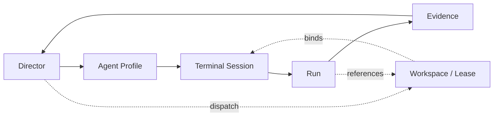

# SW-8.0C — Terminales por agente, proveedores y permisos

## Inventario actual

### Runtime / procesos

- `src/lib/swarm/processManager.js` — ciclo de vida de `opencode serve`, adopción por PID, health, shutdown, orphans.
- `src/app/api/agenthub/opencode/start/route.js` — `processManager.ensure()`.
- `src/app/api/agenthub/opencode/stop/route.js` — `processManager.shutdown()`.
- `src/app/api/agenthub/opencode/status/route.js` — estado de proceso + cola + concurrencia.

### Terminales / PTY

- `src/lib/terminal/ttyServer.js` — PTY websocket server, sesiones persistidas, restore, close, replay.
- `src/lib/terminal/sessionStore.js` — persistencia `~/.devhub/terminal-sessions.json` con TTL.
- `src/lib/terminal/cwdGuard.js` — guardrail de cwd con fallback seguro.
- `src/lib/terminal/nativeVteBridge.js` — puente UI ↔ Tauri para abrir/enfocar/redimensionar/cerrar paneles.
- `src/lib/terminal/processTelemetry.js` — hoy stub.
- `src/lib/terminal/__tests__/*` — cobertura de restore, close, cwd y bridge.

### Tauri / nativo

- `src-tauri/src/native_vte.rs` — `native_vte_open/focus/resize/set_visibility/close`, spawn GTK/VTE, `session_id` opcional, detecta `opencode --session ses_*` y `hermes`.
- `src-tauri/src/lib.rs` — lifecycle de app, cleanup de puertos zombie, arranque de runtime.

### Swarm durable / trazabilidad

- `src/lib/db/localDb.js` — `swarm_processes`, `agent_workspaces`, `agent_runs`, `agent_artifacts`, snapshots/aprovals.
- `devhub-mcp/server.js` — `prepareAgentWorkspaceLease`, `listAgentWorkspaces`, `listAgentRuns`, `getLatestAgentWorkspaceForTask`, `getRunFactsForTask`.
- `src/lib/swarm/supervisorLoop.js` — evaluación durable de workspace/run/approval/orphan/dirty-excluded.
- `src/lib/operations/swarmControl.js` — proyecciones UI de agents/workspaces/runs/approvals.

### UI actual

- `src/views/SwarmControl.jsx` — consume snapshot de control room.
- `src/views/AgentHub.jsx` — usa sesiones OpenCode/headless y status polling.

## Estado actual

1. **Cómo se abren procesos actualmente**
   - OpenCode: `processManager.ensure()` hace `spawn(local.cmd, local.args)` para `opencode serve` y lo trackea en `swarm_processes`.
   - PTY shell: `ttyServer.createSession()` hace `node-pty.spawn(shell, spawnArgs, { cwd, env })`.
   - Native VTE: `native_vte_open()` crea un panel GTK/VTE y hace `terminal.spawn_sync(...)`.

2. **Cómo se registran procesos o sesiones**
   - `swarm_processes`: PID/port/status/cwd/metadata para el proceso OpenCode.
   - `agent_workspaces`: identidad y lifecycle del workspace.
   - `agent_runs`: run durable con `workspace_id`, `task_id`, `agent_id`, baseline y observado.
   - `agent_artifacts`: evidencia por run.
   - `agent_hub_sessions` + `telegram_session_map`: sesiones de AgentHub/UI, no terminal ownership.
   - `sessionStore`: sesiones terminal locales con `id/cwd/shell/title/lastSeenAt/restored`.

3. **Cómo asociar terminal a `agent_id` / `task_id` / `workspace_id` / `run_id`**
   - Ya existe el anclaje durable correcto para ejecución: `agent_workspaces.id` ↔ `agent_runs.run_id` ↔ `agent_artifacts.run_id`.
   - Falta un vínculo explícito entre terminal runtime y esos IDs. Hoy sólo hay `session_id`/`panel_id`/`terminalId`.
   - Reuso razonable: mapear terminal runtime a `workspace_id`, y derivar `task_id` / `agent_id` / `run_id` desde `agent_workspaces` + `agent_runs`; no inventar una segunda verdad.

4. **Cómo abrir / adjuntar / enfocar / cerrar sesiones**
   - OpenCode: HTTP `/session`, `/session/:id/message`, `/event`, `/session/status`, `/session/:id/abort`.
   - PTY shell: websocket `ttyServer` reattaches por `terminalId`, replay si hay historial; `closeSession()` mata PTY y borra de memoria.
   - Native VTE: `native_vte_open/focus/resize/set_visibility/close`.

5. **Cómo recuperar sesiones tras reinicio**
   - PTY: `sessionStore.loadSessions()` + `restoreSessions()` recrean PTYs desde disco; TTL 7 días.
   - OpenCode: `processManager.adoptExisting()` usa PID file y health; si no, spawn.
   - Tauri native VTE: no hay restore durable de paneles/sesiones; sólo re-hydrate en memoria del runtime.

6. **Riesgos de shells huérfanas**
   - `ttyServer` persiste procesos al cerrar socket; si el cierre de app falla, el PTY queda vivo.
   - `native_vte_open()` usa `exec <command>`; si el caller le pasa un comando amplio, la shell hereda todo.
   - `processManager` sólo limpia lo que conoce por PID file/DB; cualquier terminal fuera de ese tracking puede quedar huérfana.

7. **Riesgos de permisos peligrosos**
   - `initial_command` en native VTE es ejecución directa por shell script.
   - `ttyServer` permite `spawnArgs` / `cwd` / env del proceso; si el upstream no valida, hay inyección operacional.
   - `resolveTerminalSpawnCwd()` protege cwd, pero no restringe identidad ni comandos.
   - No hay trust boundary explícito por proveedor/rol: hoy terminal runtime y capacidad del agente están demasiado cerca.

8. **Diferencias por proveedor**
   - **OpenCode**: mejor encaje con control plane actual; tiene server headless, session API, status, abort y señales de aprobación.
   - **Codex**: no hay adapter dedicado en el repo; hoy caería como shell/TUI o proceso externo, con menos introspección y sin API propia visible aquí.
   - **Claude Code**: igual que Codex en este repo; por ahora se comporta como runtime externo que necesita wrapper/shell adapter, no como server headless canónico.

9. **Qué ya existe y conviene reutilizar**
   - `processManager` para OpenCode headless.
   - `ttyServer` + `sessionStore` + `cwdGuard` para shells persistentes.
   - `native_vte_*` para panel nativo en Linux.
   - `agent_workspaces` / `agent_runs` / `agent_artifacts` como verdad durable.
   - `supervisorLoop` para recuperación, retries y orphan handling.

## Flujo propuesto



### Lectura del flujo

- **Director** decide intención, límites y proveedor.
- **Agent Profile** define permisos, provider y runtime role.
- **Terminal Session** es el runtime efímero/persistente.
- **Run** es la unidad durable de ejecución.
- **Evidence** es lo que cierra el loop: artifacts, traces, approvals, comments.

## Propuesta de adapter por proveedor

### OpenCode

- Adapter canónico.
- Reusar `opencode serve` + session API.
- Usar `workspace_id` como anchor; `session_id` de OpenCode queda como runtime id, no como verdad durable.
- Permisos mínimos: read/search, message stream, approval gate, abort, attach status.

### Codex

- Adapter de fallback vía PTY/shell mientras no exista API propia integrada.
- Resolver `cwd` y `env` con el mismo guardrail que `ttyServer`.
- Tratarlo como proceso externo sin asumir recuperación nativa.

### Claude Code

- Igual que Codex: adapter shell/TUI primero.
- Requiere heurísticas de detección de sesión si el runtime expone IDs por stdout.
- No conceder acceso amplio por defecto; sólo capability explícita por perfil.

## Riesgos de seguridad / permisos

- **Inyección por comando inicial**: no pasar `initial_command` libre desde UI sin allowlist por perfil.
- **Shell escape**: `exec` en native VTE y PTY shell deben recibir comandos ya normalizados.
- **Ownership collision**: dos runtimes no deben poder reclamar el mismo `workspace_id` o `run_id` sin lease/token.
- **Orphan recovery**: si la sesión muere, el control plane debe distinguir “stale”, “orphaned”, “active” y “completed”.
- **Permission creep**: no mezclar rol de terminal con rol de ejecución; el profile decide, no el runtime.

## Plan concreto para SW-8.4A y SW-8.8A

### SW-8.4A

- Definir el **TerminalSession contract** durable/operativo: `terminal_id`, `provider`, `agent_id`, `task_id`, `workspace_id`, `run_id`, `cwd`, `status`, `last_seen_at`.
- Reusar el binding ya existente en `agent_workspaces` / `agent_runs`.
- Formalizar el adapter contract por provider: `open`, `attach`, `focus`, `resize`, `close`, `restore`, `heartbeat`.

### SW-8.8A

- Implementar recuperación post-restart sin shells huérfanas: reconciliar sesiones vivas vs DB vs PID/pty/native state.
- Marcar orphans con reason class y cerrar/reclaim por lease.
- Introducir política de permisos por profile: allowlist de comandos, approval gates y límites por provider.

## Tests que deberían existir después

- OpenCode: adopción/restart, abort, session-status, orphan cleanup.
- PTY: restore after restart, close kills process, cwd fallback, env sanitization.
- Native VTE: open/focus/resize/close, mapping de `session_id`, no abrir con bounds faltantes.
- Swarm durable: terminal ↔ workspace/run binding, lease ownership, stale/orphan recovery.
- Seguridad: allowlist de comandos por provider, rechazo de payloads no autorizados, no reuse de workspace sin token.

## Conclusión

La base ya existe, pero está dividida en tres runtimes: OpenCode headless, PTY shell, y native VTE. El siguiente paso correcto no es crear otro runtime paralelo, sino unificar el **binding durable** y el **adapter contract** sobre lo ya existente.

## Git status --short final

```txt
?? .claude/
?? .plyrium-forge/
?? docs/swarm-control/
?? opencode.json
```
