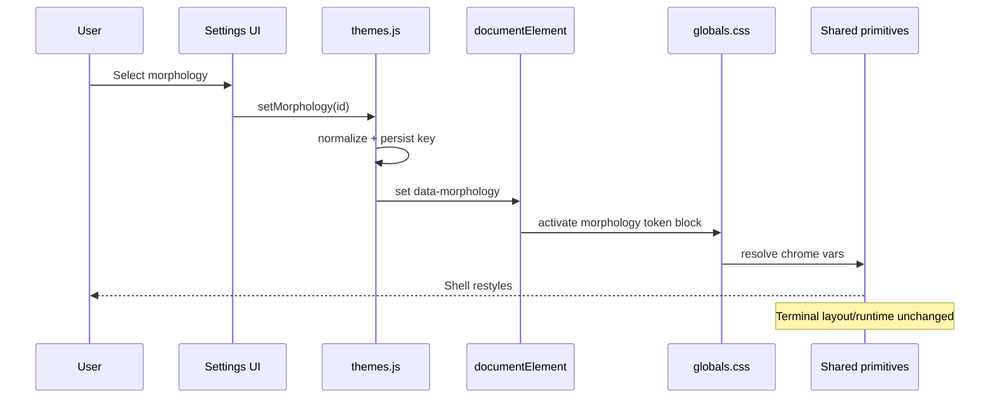

# Design: Brutalist Stage Morphology

## Technical Approach

Add a second visual axis, `data-morphology`, beside `data-theme`. Keep theme responsible for palette and terminal colors; move chrome shape/surface behavior into morphology tokens in `globals.css`. Shared primitives adopt those tokens first, then terminal shell wrappers consume them without changing terminal runtime, panel geometry, or control placement.

## Architecture Decisions

| Decision                 | Choice                                                                                                                                                                         | Alternatives considered                       | Rationale                                                                                            |
| ------------------------ | ------------------------------------------------------------------------------------------------------------------------------------------------------------------------------ | --------------------------------------------- | ---------------------------------------------------------------------------------------------------- |
| Morphology API location  | Extend `src/lib/theme/themes.js` with morphology registry/storage helpers                                                                                                      | New `morphology.js` module                    | Existing theme/zoom document-sync lives here already; keeps settings wiring low-risk and reviewable. |
| Token ownership          | `data-theme` owns hue/palette/`--terminal-*`; `data-morphology` owns radius, border width, control shadow, panel treatment, motion offsets                                     | Put amber/brutalist colors inside morphology  | Preserves independent axes. `brutalist-stage` must read current theme colors, not hardcode amber.    |
| Shared surface primitive | Create `src/components/ui/chrome-surface.jsx`; let `SwarmSurfaceCard.jsx` wrap or re-export it                                                                                 | Reuse control-room-local component everywhere | Moves seed primitive to the correct app-wide boundary without forcing page-specific restyles.        |
| Terminal protection      | Only tokenized wrappers may change in `App.js`, `TerminalWorkspacesManager.jsx`, `TerminalTTY.jsx`; layout tree, safe-zone geometry, controls order, renderer flow stay frozen | Direct terminal redesign from preview         | Keeps protected terminal contract intact and matches proposal guardrails.                            |

## Data Flow

Appearance UI → `themes.js` normalization/storage → `localStorage(devhub:morphology)` + `<html data-morphology>` → `[data-morphology]` token block in `globals.css` → shared primitives (`Button`, `ChromeSurface`, `WorkspacePageTitle`) → page shells + terminal wrappers.

Theme path stays separate:

`data-theme` → `--surface-*`, `--accent-*`, `--terminal-*` → `TerminalThemeSync` / content colors.



## File Changes

| File                                                                                                                                                          | Action | Description                                                                    |
| ------------------------------------------------------------------------------------------------------------------------------------------------------------- | ------ | ------------------------------------------------------------------------------ |
| `src/lib/theme/themes.js`                                                                                                                                     | Modify | Add `MORPHOLOGIES`, options, normalize/get/set/apply helpers.                  |
| `src/app/globals.css`                                                                                                                                         | Modify | Add morphology token families and `[data-morphology='brutalist-stage']` block. |
| `src/components/ui/chrome-surface.jsx`                                                                                                                        | Create | Shared surface/pill/panel chrome primitive seeded from control-room surfaces.  |
| `src/components/ui/button.jsx`                                                                                                                                | Modify | Split color variants from morphology-driven chrome classes.                    |
| `src/components/control-room/SwarmSurfaceCard.jsx`                                                                                                            | Modify | Reuse shared primitive instead of owning the pattern.                          |
| `src/components/WorkspaceSidebar.jsx` / `src/components/workspace/WorkspacePageTitle.jsx`                                                                     | Modify | Replace hardcoded radii/borders/gradients with morphology tokens.              |
| `src/views/ProjectDashboard.jsx` / `src/views/Tareas.jsx` / `src/views/SwarmControl.jsx`                                                                      | Modify | Adopt shared chrome primitives on representative product surfaces.             |
| `src/App.js` / `src/components/TerminalWorkspacesManager.jsx` / `src/components/TerminalTTY.jsx`                                                              | Modify | Tokenize shell wrappers only; preserve protected terminal structure.           |
| `src/views/Ajustes.jsx` / `src/app/settings/appearance/page.jsx`                                                                                              | Modify | Add morphology selector independent from theme selector.                       |
| `src/app/settings/appearance/__tests__/page.test.jsx` / `src/components/__tests__/TerminalThemeSync.test.js` / `src/components/__tests__/TerminalTTY.test.js` | Modify | Cover axis separation and terminal protection.                                 |

## Interfaces / Contracts

```js
export const MORPHOLOGIES = {
  DEFAULT: 'default',
  BRUTALIST_STAGE: 'brutalist-stage',
};

// theme colors stay on data-theme; morphology is hue-free chrome
// examples: --chrome-radius-panel, --chrome-radius-control,
// --chrome-border-width, --chrome-shadow-panel, --chrome-shadow-control,
// --chrome-control-fill, --chrome-panel-fill, --chrome-press-offset
```

Protected terminal contract:

- keep `panelChromeSafeZoneMinTop = 34`
- keep panel controls order: split-right, split-down, focus, close
- keep `data-testid` anchors (`panel-safe-zone-*`, `panel-header-actions-*`, `terminal-viewport-shell`, `terminal-content-body`)
- keep `TerminalThemeSync` driven by theme tokens only

## Testing Strategy

| Layer       | What to Test                                                                                                   | Approach                                                                           |
| ----------- | -------------------------------------------------------------------------------------------------------------- | ---------------------------------------------------------------------------------- |
| Unit        | Morphology normalization/storage/apply helpers; token separation in terminal theme builder                     | Extend `themes.js` and `TerminalThemeSync` tests.                                  |
| Integration | Settings persist theme and morphology independently; shared primitives switch chrome without route duplication | Jest page/component tests around appearance flows and primitives.                  |
| E2E         | Dashboard/swarm/terminal switch morphology while terminal geometry and controls remain stable                  | Playwright smoke with terminal route assertions on safe-zone and visible controls. |

## Migration / Rollout

No data migration required. Rollout order: (1) registry + CSS tokens with default morphology parity, (2) shared primitives and representative pages, (3) terminal shell tokenization with regression checks, (4) expose `brutalist-stage` in settings once terminal checks pass.

## Open Questions

- [ ] Should `Ajustes.jsx` and `/app/settings/appearance/page.jsx` both expose morphology on day one, or is one now legacy-only?
- [ ] Do we hide `brutalist-stage` behind a temporary settings flag until terminal regression coverage lands?
