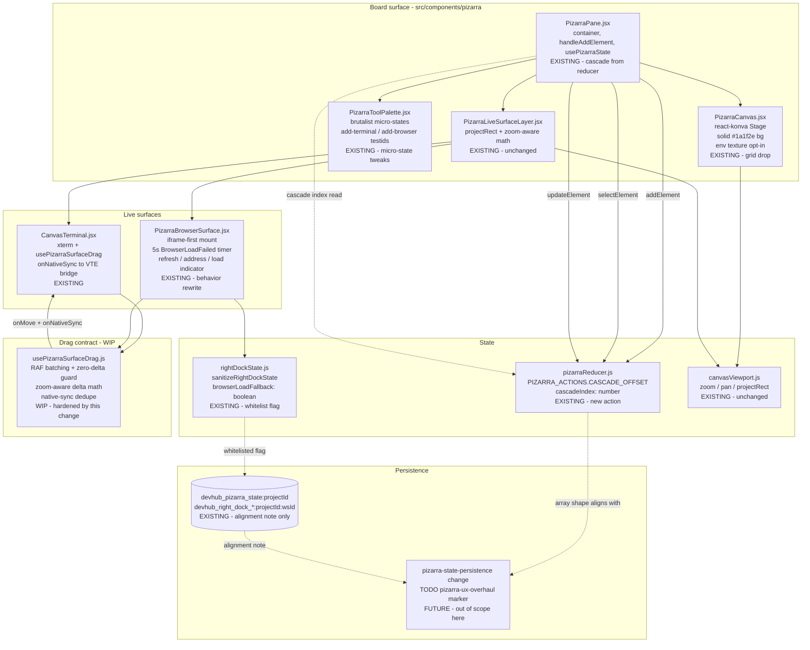
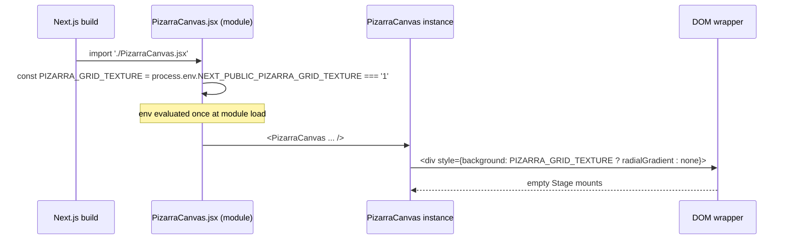
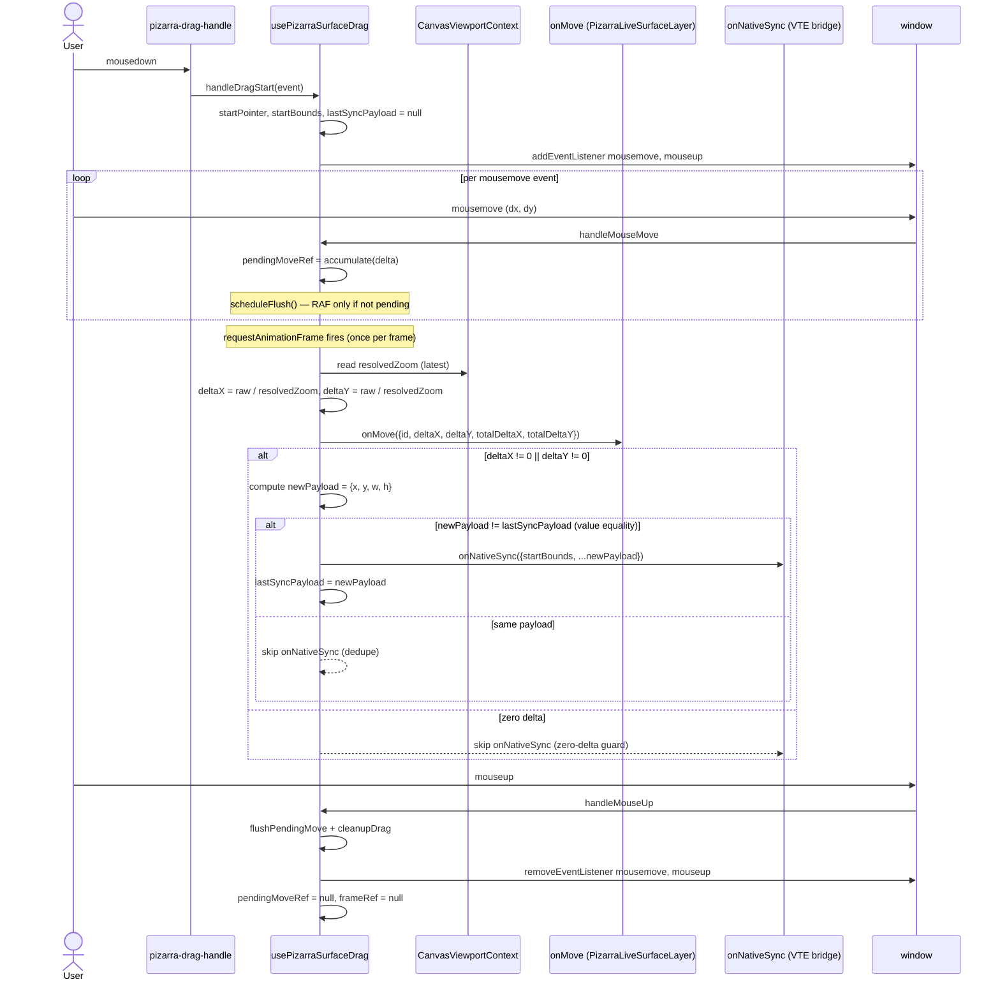
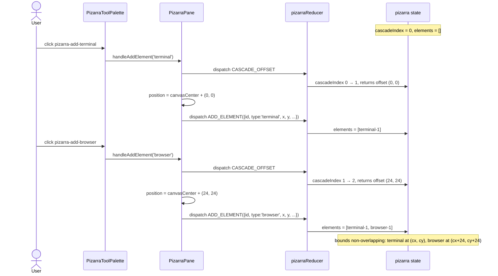

# Design: Pizarra UX Overhaul (Phase 1)

> Branch: `feature/session-workspace-restore`. Working tree WIP MUST be preserved; every change edits in place. The untracked `src/components/pizarra/usePizarraSurfaceDrag.js` is the contract surface for Move 3 — do NOT discard it.

## 1. Overview

This change ships a **scoped Phase 1** of the pizarra (board) UX overhaul. It removes the unused Konva dot/line grid, locks down the recently-extracted RAF-batched drag hook (`usePizarraSurfaceDrag`) with a zoom-aware contract, fixes the pizarra browser's "stuck on `RefreshCw`" symptom by switching to iframe-first mount with a 5s explicit-failure surface, and eliminates element stacking on creation via a reducer-driven cascade offset. It also tightens the brutalist micro-states on the tool palette, browser header, and right-dock tab strip. Persistence reconciliation, the pizarra↔workspace identity bridge, and the multi-tab browser are explicitly deferred (see §8). The change stays under the 800-line single-PR budget, leaves the dead `src/components/workspace/PizarraPane.jsx` placeholder untouched (per user instruction), and makes the WIP drag hook the durable contract for the follow-up `pizarra-workspace-bridge` change.

## 2. Architecture map

Six architectural nodes interact in this change. Solid borders = existing nodes; dashed borders = new or newly-extended contracts.



**Legend.** Boxes with `EXISTING` already exist in the working tree; `WIP` is the untracked file the change locks down; `FUTURE` is the in-flight `pizarra-state-persistence` change that this design carries a TODO marker for. Dashed edges = doc-only or future-work links.

## 3. Per-move design

### 3.1 Move 1 — Grid → solid (`board-canvas` Req 1-2, `pizarra-canvas` delta)

**Current state.** `PizarraCanvas.jsx` lines 294-319 build a `gridLines[]` array of Konva `<Line>` elements inside a `<Layer listening={false}>` at `gridSize=32`, color `rgba(255,255,255,0.04)`. The grid is rendered but never used for snap (per explore report, the only consumer of the canvas is the live surface layer which does its own pre-zoomed-bounds math). The outer canvas container `background: '#1a1f2e'` is set on `PizarraPane.jsx` line 212 and again inside the Konva-loading fallback on `PizarraCanvas.jsx` line 269.

**New state.** The grid `for`-loops and the `gridSize` constant are removed. The Konva stage renders only the shapes layer + transformer. The wrapper still carries `background: '#1a1f2e'` (move it to the `PizarraCanvas` root div explicitly so the loading fallback and the loaded state share the same color). An env-driven CSS `background-image: radial-gradient(...)` at 4% opacity is added to the wrapper when `NEXT_PUBLIC_PIZARRA_GRID_TEXTURE` is truthy, read **once** at module scope (`const PIZARRA_GRID_TEXTURE = process.env.NEXT_PUBLIC_PIZARRA_GRID_TEXTURE === '1'`). When falsy (default), the wrapper has no `background-image`.

The `LOADING CANVAS...` text in the early-return block (lines 257-288) only renders when `konvaLoadError === true`; the healthy path renders an empty `<Stage>` skeleton so the surrounding container geometry is stable.

**Sequence diagram — module-scope env read.**



**Data structures (JS at runtime).**

```typescript
// src/components/pizarra/PizarraCanvas.jsx (module scope)
const PIZARRA_GRID_TEXTURE: boolean =
  typeof process !== 'undefined' &&
  process.env?.NEXT_PUBLIC_PIZARRA_GRID_TEXTURE === '1';

// konvaLoadError is the only state that gates the loading fallback
type CanvasState = {
  konva: typeof import('react-konva') | null;       // lazy-loaded
  konvaLoadError: Error | null;
  drawing: { startX: number; startY: number; type: string } | null;
};
```

**Error/edge cases.**
- `process` undefined in the browser: guard with `typeof process !== 'undefined'`. (Next.js inlines the env at build time, but the dev server may pass through the literal string.)
- Multiple `<PizarraCanvas>` instances in the same process: the env is read once at module scope; subsequent mounts reuse `PIZARRA_GRID_TEXTURE`.
- `konvaLoadError` set after a healthy mount: the `LOADING CANVAS...` text becomes visible. The user can refresh to retry the lazy import.
- `width` or `height` is `0` during the first `ResizeObserver` tick: render the empty `<Stage>` at `width=800, height=600` defaults (existing behavior) and let the observer correct on the next tick.

**Test strategy reference.** `board-canvas` Req 1-2 → `PizarraCanvas.grid.test.jsx`. Req 4 → also asserts `data-testid="pizarra-canvas"` and `jest.setup.js` RAF shim coverage.

---

### 3.2 Move 2 — Drag contract (`board-terminal-drag` Req 1-6)

**Current state.** `usePizarraSurfaceDrag.js` (WIP, untracked) is the recently-extracted hook. It RAF-batches via `frameRef` + `pendingMoveRef`, has a zero-delta early-return (line 87), and cancels the in-flight RAF on unmount (lines 47-52). It does NOT divide the raw `clientX/Y` delta by `resolvedZoom` — that division is done downstream in `PizarraLiveSurfaceLayer.jsx` lines 46-51 (`x: shape.x + totalDeltaX / resolvedZoom`). It does NOT dedupe `onNativeSync` calls when the resolved position has not changed. It does NOT cancel RAF on `mouseup` (it flushes via `flushPendingMove` first, then calls `cleanupDrag`, so a separate `mouseup` mid-frame flushes instead of cancelling). It does NOT add a `data-testid="pizarra-drag-handle"` to the draggable element (the browser drag handle has a per-shape id, and the terminal header has `data-testid="canvas-terminal-header"`).

**New state.** The hook contract gains four explicit guarantees:
1. **RAF coalescing.** A `requestAnimationFrame` is scheduled at most once per drag; subsequent `mousemove` events accumulate into `pendingMoveRef` and the RAF callback fires `onMove` + `onNativeSync` once per frame.
2. **Zero-delta short-circuit.** `onNativeSync` is NOT called when `totalDeltaX === 0 && totalDeltaY === 0`. `onMove` MAY be called once with the zero delta (caller decides; the test asserts `onNativeSync` is skipped, not `onMove`).
3. **Zoom-aware delta math.** The hook reads the latest `resolvedZoom` at RAF-flush time and divides the raw delta by it BEFORE passing to `onMove`. This shifts the division out of `PizarraLiveSurfaceLayer` into the hook so the hook is the single source of truth for the contract. **Conflict note** below (§4).
4. **Native-sync dedupe.** A `lastSyncPayloadRef` (structurally equal to `{x, y, width, height}`) is updated after every `onNativeSync` call; subsequent flushes that produce the same payload skip the call.

A `data-testid="pizarra-drag-handle"` is added to the terminal header (`CanvasTerminal.jsx` line 127) and the browser surface's drag handle button (`PizarraBrowserSurface.jsx` line 132, currently `pizarra-browser-drag-handle-${shape.id}` — keep the per-shape id and add the static `pizarra-drag-handle` on the same node so the spec contract and the existing per-shape selector coexist).

**Sequence diagram — RAF-batched drag with zoom + native sync.**



**Data structures (JS at runtime).**

```typescript
// src/components/pizarra/usePizarraSurfaceDrag.js
type Bounds = { x: number; y: number; width: number; height: number; screenX?: number; screenY?: number };

type DragMoveMeta = { terminalId?: string; panelId?: string };

type DragMovePayload = {
  id: string;
  deltaX: number;        // already divided by resolvedZoom
  deltaY: number;        // already divided by resolvedZoom
  totalDeltaX: number;   // already divided by resolvedZoom
  totalDeltaY: number;   // already divided by resolvedZoom
} & DragMoveMeta;

type NativeSyncPayload = {
  startBounds: Bounds;
  totalDeltaX: number;   // raw, pre-zoom
  totalDeltaY: number;   // raw, pre-zoom
  x: number;             // resolved position for VTE bridge
  y: number;
  width: number;
  height: number;
};

type UsePizarraSurfaceDragOptions = {
  surfaceId: string;
  bounds: Bounds;
  onSelect?: (id: string) => void;
  onMove?: (payload: DragMovePayload) => void;
  moveMeta?: DragMoveMeta;
  onNativeSync?: (payload: NativeSyncPayload) => void;
  resolvedZoom?: number; // read from CanvasViewportContext inside the hook
};
```

**Error/edge cases.**
- `mousedown` on a non-primary button (`event.button !== 0`): ignored, no listeners installed.
- `mousedown` followed immediately by `mouseup` (single click, no drag): `flushPendingMove` is called but `pendingMoveRef` is `null`; `onMove` is not called; `cleanupDrag` removes listeners.
- Two `mousedown`s in quick succession (rapid re-grip): the prior `cleanupRef.current?.()` is invoked before the new listeners install, so only one drag is active at a time.
- `resolvedZoom` changes between `mousedown` and the next RAF flush: the hook reads the latest value, so a mid-drag zoom (wheel) uses the post-scroll zoom. The previous frame's `lastSyncPayload` is still in the new coordinate system if the zoom changes, which is acceptable (the VTE bridge receives a one-frame stale payload, then a fresh one on the next flush).
- Unmount mid-drag: `useEffect` cleanup runs `cleanupRef.current?.()` and `cancelAnimationFrame(frameRef.current)`. `onMove` and `onNativeSync` are NOT called after unmount.
- `resolvedZoom === 0` (defensive): the hook clamps to `1` to avoid `Infinity` / `NaN` deltas.

**Test strategy reference.** `board-terminal-drag` Req 1-6 → `usePizarraSurfaceDrag.test.js`. 11 scenarios per the spec; the contract surface is the most-tested in this change.

---

### 3.3 Move 3 — Element placement (`board-element-placement` Req 1-3)

**Current state.** `PizarraPane.handleAddElement` (lines 132-158) hard-codes `canvasCenter = { x: canvasSize.width / 2 - 320, y: canvasSize.height / 2 - 200 }` for both `'terminal'` and `'browser'` adds. The pizarra reducer (`pizarraReducer.js`) has no `CASCADE_OFFSET` action and no `cascadeIndex` field. The state shape is `{ activeTool, activeToolSettings, elements, selectedElementIds }`.

**New state.** A `PIZARRA_ACTIONS.CASCADE_OFFSET` action is added to the reducer. The action returns `{ nextState, offset: { x, y } }` (or the consumer reads the next state's `cascadeIndex` and computes the offset; see §7 for the algorithm). The state shape gains `cascadeIndex: number` initialized to `0`. `handleAddElement` dispatches `CASCADE_OFFSET` (to get the next offset) then `ADD_ELEMENT` (with the offset-applied `x`/`y`) in a single batch. Two consecutive `handleAddElement('terminal')` and `handleAddElement('browser')` calls produce non-overlapping bounds because the second add reads `cascadeIndex === 1` and offsets by `(24, 24)`.

The reducer is the single source of truth for cascade math: no `useEffect`, no `useRef`, no `state.elements.length` derivation. Element deletion does NOT rewind `cascadeIndex` (the spec is explicit: cascade is a counter, not a count of live elements).

**Sequence diagram — two consecutive adds.**



**Data structures (JS at runtime).**

```typescript
// src/lib/pizarra/pizarraReducer.js
type PizarraState = {
  activeTool: 'select' | 'text' | 'rect' | 'circle' | 'line' | 'arrow';
  activeToolSettings: object;
  elements: PizarraElement[];
  selectedElementIds: string[];
  cascadeIndex: number;  // NEW: deterministic cascade counter
};

type CascadeOffset = { x: number; y: number };

type PizarraAction =
  | { type: 'SET_TOOL'; payload: string }
  | { type: 'SET_TOOL_SETTINGS'; payload: object }
  | { type: 'ADD_ELEMENT'; payload: PizarraElement }
  | { type: 'UPDATE_ELEMENT'; payload: { id: string; changes: object } }
  | { type: 'DELETE_ELEMENT'; payload: string }
  | { type: 'SELECT_ELEMENTS'; payload: string[] }
  | { type: 'DESELECT_ALL' }
  | { type: 'CASCADE_OFFSET' };   // NEW: pure action, advances cascadeIndex

// The reducer returns the new state; the consumer reads cascadeIndex and computes the offset.
function pizarraReducer(state: PizarraState, action: PizarraAction): PizarraState;
```

**Error/edge cases.**
- `cascadeIndex` overflow: capped modulo 8 inside the reducer. The next call after the 8th returns offset `(0, 0)` again. The spec is explicit that wraparound overlap is acceptable for Phase 1; full collision avoidance is deferred.
- `handleAddElement` called with an unknown type: the reducer still dispatches `CASCADE_OFFSET` (so the counter advances consistently), but `createShape` returns `null` and the dispatch is skipped. Tests cover the known-type paths only.
- Two adds in the same React batch: both `CASCADE_OFFSET` and both `ADD_ELEMENT` dispatches coalesce correctly because `useReducer` processes them in order. The second `CASCADE_OFFSET` reads the post-first-`CASCADE_OFFSET` state, so the offsets are sequential even in a batch.
- Reducer called with `cascadeIndex` undefined (legacy state shape): the reducer treats it as `0` and initializes the field on the first `CASCADE_OFFSET`. This handles the persistence migration window (see §9).

**Test strategy reference.** `board-element-placement` Req 1-3 → `pizarraReducer.test.js` (unit) + `PizarraPane.cascade.test.jsx` (integration). 8 scenarios per the spec; the spec explicitly requires `userEvent` (not `fireEvent`) and asserts the click handler dispatches `CASCADE_OFFSET` then `ADD_ELEMENT` in a single batch.

---

### 3.4 Move 4 — Browser load (`board-browser-load` Req 1-5 + `board-browser-pane` Req 1-3)

**Current state.** `PizarraBrowserSurface.createDockState` (lines 22-36) initializes `browserRuntime: 'native-gtk'` on the very first mount. The `WorkspaceBrowserPane` then races `nativeRuntimeReady` to render the iframe; if the native GTK runtime never resolves (the common stuck-loading symptom per explore observation #3, `WorkspaceBrowserPane.jsx` lines 718-770), the user sees a perpetual `RefreshCw` spinner. `PizarraBrowserSurface` does not have a `BrowserLoadFailed` state, a 5s timeout, or a manual reload button. The right-dock whitelist sanitizer (`rightDockState.js` lines 121-184) does not whitelist `browserLoadFallback`.

**New state.** `createDockState` initializes `browserRuntime: 'iframe'` and `browserLoadFallback: true` by default. The pizarra browser surface mounts the iframe pointed at `shape.url` on the very first render — no waiting on `nativeRuntimeReady`, no waiting on a capability probe. A `useEffect` starts a 5-second timer; if the iframe fires no `load` event AND `nativeRuntimeReady` is still `false` when the timer fires, the surface renders a `BrowserLoadFailed` view with three failure categories (`iframe-stuck`, `native-error`, `native-timeout`) and a "Reload" button. The iframe stays rendered underneath the failure surface so any partial content remains visible.

`nativeRuntimeReady === true` plus `browserLoadFallback !== true` is the only path that flips `browserRuntime` to `'native-gtk'`. When that happens, the native surface mounts on top of the iframe (additive, not replacement).

The whitelist sanitizer in `rightDockState.js` is extended: `browserLoadFallback: boolean` is preserved across `sanitizeRightDockState` round-trips and defaults to `false` (opt-in). The Pizarra path always sets it to `true` explicitly.

The header chrome (address bar, refresh button, load-state indicator) lives in `PizarraBrowserSurface` and is exposed to `WorkspaceBrowserPane` via the existing `dockState` + `onDockStateChange` contract — no new prop drilling, no new context. The address bar calls `useBrowserPreviewController.handleSubmit` (already used by the right-dock path) so URL normalization is unchanged. The refresh button re-applies the iframe `src` and does NOT mutate `browserHistory` directly.

**Sequence diagram — iframe-first mount with 5s timeout and reload.**

```mermaid
sequenceDiagram
    participant PBS as PizarraBrowserSurface
    participant Iframe as <iframe>
    participant Native as useNativeBrowserCapability
    participant WBP as WorkspaceBrowserPane
    participant User

    Note over PBS: dockState.browserRuntime = 'iframe'<br/>dockState.browserLoadFallback = true
    PBS->>Iframe: render <iframe src={shape.url} />
    PBS->>PBS: useEffect: setTimeout(5000)
    par timer
        PBS-->>PBS: wait 5000ms
    and native probe
        PBS->>Native: useNativeBrowserCapability()
        Native-->>PBS: { supported, ready } (async)
    and iframe load
        Iframe-->>PBS: load event (maybe)
    end
    alt load fires before 5s
        PBS->>PBS: clearTimeout, BrowserLoadFailed NOT rendered
    alt native.ready fires before 5s AND !browserLoadFallback
        PBS->>WBP: dockState.browserRuntime = 'native-gtk'
        WBP-->>PBS: native surface mounts on top of iframe
    else 5s elapses, no load, no ready
        PBS->>PBS: setLoadFailed({ category: 'iframe-stuck' })
        PBS->>User: render BrowserLoadFailed + Reload button
        Note over PBS: iframe stays in DOM underneath
        User->>PBS: click Reload
        PBS->>PBS: clearTimeout, setTimeout(5000) again
        PBS->>Iframe: re-apply src={shape.url} (force reload)
    else native error event
        PBS->>PBS: setLoadFailed({ category: 'native-error' })
        PBS->>User: render BrowserLoadFailed + Reload button
    end
```

**Data structures (JS at runtime).**

```typescript
// src/components/workspace/rightDockState.js
type BrowserRuntime = 'iframe' | 'native-gtk';

type RightDockState = {
  visible: boolean;
  activeTab: 'browser' | 'editor' | 'swarm' | 'operator' | 'zed' | 'pizarra';
  browserRuntime: BrowserRuntime;          // CHANGED: default = 'iframe' for pizarra
  browserLoadFallback: boolean;            // NEW: default false (opt-in to iframe)
  editMode: boolean;
  maximized: boolean;
  maximizedView: string;
  size: number;
  browserUrl: string;
  browserHistory: string[];
  browserHistoryIndex: number;
};

// src/components/pizarra/PizarraBrowserSurface.jsx
type BrowserLoadFailureCategory = 'iframe-stuck' | 'native-error' | 'native-timeout';

type BrowserLoadFailedState = {
  category: BrowserLoadFailureCategory;
  since: number;  // timestamp of mount
};

type LoadState = {
  loadFailed: BrowserLoadFailedState | null;
  isLoading: boolean;
};
```

**Error/edge cases.**
- `nativeRuntimeReady` resolves to `true` for a moment, then drops to `false` (liveness flap): the flip is one-way per session; once `'native-gtk'`, it stays `'native-gtk'` until the component unmounts.
- `shape.url` is `null` or `undefined`: `resolveBrowserUrl` returns `window.location.origin + '/'`. The iframe mounts, the timer starts, the failure view is the recovery path.
- The iframe's `load` event fires but the page itself is in a 5xx state: the spec treats `load` as success (the user is in the page; the page can show its own error). The 5s timer is only for the case where `load` does NOT fire.
- 5s is a build-time constant in this phase (see §6).
- `dockState.browserLoadFallback` round-trip through `sanitizeRightDockState`: the field is preserved, defaults to `false` on read when absent.

**Test strategy reference.** `board-browser-load` Req 1-5 → `PizarraBrowserSurface.test.jsx` (existing WIP-modified) + a new `rightDockState.test.js` for Req 5. `board-browser-pane` Req 1-3 → same `PizarraBrowserSurface.test.jsx` for the address bar / refresh / load indicator, and `WorkspaceRightDock.test.jsx` for the tab strip 1px inner border.

---

### 3.5 Move 5 — Browser pane chrome + brutalist polish (`board-browser-pane` Req 1-5)

**Current state.** `PizarraBrowserSurface.jsx` renders a drag handle button but NO header chrome (no address bar, no refresh button, no load indicator) — the user sees a window without controls. `PizarraToolPalette.jsx` already uses `btnSecondaryStyle` from the chrome morphology module; hover/active states come from `btnSecondaryStyle` but are not explicit in `PizarraToolPalette` (the test assertion is on the computed `border-color` change). `WorkspaceRightDock.jsx` lines 33-37 implement the tab strip but the active-tab styling is implicit.

**New state.**
- **Address bar.** A single `<input type="text">` in the header with the current `dockState.browserUrl` as its value. `onKeyDown` calls `useBrowserPreviewController.handleSubmit` (or a tiny local handler that calls `commitBrowserNavigation`) and normalizes via `normalizeBrowserUrl`. Enter submits. No tab list. No "+ new tab" affordance.
- **Refresh button.** A small icon button (Lucide `RefreshCw`) that re-applies the iframe `src` by toggling a `srcReloadKey` state and going through the existing browser preview controller's refresh action so `browserHistory` is preserved. Hover state: border-color tint (no transform). Active state (mousedown): 1px inset border in the accent color.
- **Load state indicator.** A Lucide `RefreshCw` icon next to the address bar that is visible in three states: `idle` (no spinner, no icon), `loading` (animated `animate-spin` class), `failed` (no spinner, but the pane body renders the `BrowserLoadFailed` view from Move 4).
- **Tool palette micro-states.** Each tool button gets an explicit `onMouseEnter` / `onMouseLeave` handler that toggles a `hovered` data-state and a CSS class that changes `border-color` (no `transform`). The active tool button keeps its 1px accent border (already in `PizarraToolPalette.jsx` lines 85-88; the test asserts the computed `border-color` matches the accent token).
- **Right-dock tab strip 1px inner border.** Inactive tabs keep the default border; the active tab gets a 1px inset border in the accent color. The tab strip's height, padding, and font are unchanged.
- **Header hover.** The browser pane's header row gets an explicit `onMouseEnter` that adds a `border-bottom` color tint (no `transform`).

**Sequence diagram — header chrome rendering on mount.**

```mermaid
sequenceDiagram
    participant PBS as PizarraBrowserSurface
    participant WBP as WorkspaceBrowserPane
    participant User

    PBS->>PBS: dockState = createDockState(shape.url)
    PBS->>WBP: <WorkspaceBrowserPane dockState={...} />
    WBP-->>PBS: dockState ready (browserUrl, history, runtime)
    PBS->>User: render header row
    Note over PBS: <input value={browserUrl}><br/><button refresh /><br/><RefreshCw state />
    User->>PBS: type "http://example.com", press Enter
    PBS->>WBP: handleSubmit → commitBrowserNavigation
    WBP-->>PBS: dockState.browserUrl = "http://example.com"
    PBS->>PBS: iframe src updates, history appends
    User->>PBS: hover refresh button
    PBS-->>User: border-color tint (no transform)
    User->>PBS: mousedown on refresh
    PBS-->>User: 1px inset accent border
```



**Data structures (JS at runtime).**

```typescript
// src/components/pizarra/PizarraBrowserSurface.jsx
type HeaderChrome = {
  addressValue: string;        // bound to dockState.browserUrl
  isLoading: boolean;          // bound to dockState.isLoading
  loadFailed: BrowserLoadFailedState | null;  // from Move 4
  srcReloadKey: number;        // increments to force iframe reload
  isHovered: boolean;          // for border-bottom tint
  refreshActive: boolean;      // mousedown state for inset border
};
```

**Error/edge cases.**
- Address bar receives a malformed URL: `normalizeBrowserUrl` returns `''` for invalid input; the existing `useBrowserPreviewController` falls back to the search URL or the previous URL. The Phase 1 spec reuses the existing path, so no new edge case here.
- Refresh clicked while a navigation is in progress: the spinner is already showing; the click re-applies the src and re-arms the 5s timer (Move 4 covers this).
- Header hover state while a drag is in progress on the same header: the drag handler (`onMouseDown`) takes priority via `event.stopPropagation()`; the hover handler is `onMouseEnter`/`onMouseLeave` and does not interfere.

**Test strategy reference.** `board-browser-pane` Req 1-3 → `PizarraBrowserSurface.test.jsx`. Req 4-5 → same file for header hover; `WorkspaceRightDock.test.jsx` for the tab strip.

---

### 3.6 Move 6 — Persistence alignment (`pizarra-state-persistence` Req 1-3, doc-only)

**Current state.** The in-flight `pizarra-state-persistence` change has a `design.md` that specifies `elements: Map<elementId, PizarraElement>` and a `viewport: {x, y, zoom}` field. The actual `pizarraReducer.js` uses `elements: Array<PizarraElement>` and the viewport lives in `CanvasViewportContext` (`src/lib/pizarra/canvasViewport.js`), NOT in the reducer. The explore report flags this as a spec-vs-impl conflict.

**New state.** This change does NOT modify the persistence implementation. It carries a forward-pointer TODO in the in-flight `pizarra-state-persistence` change's `design.md` (or a follow-up patch to it) so the array shape is adopted as the source of truth when persistence lands. The actual localStorage `devhub_pizarra_state:{projectId}` schema remains a follow-up concern. See §9 — migration is N/A for Phase 1.

**Data structures (JS at runtime).** No code change. The `pizarra-state-persistence` spec's TODO carries the pointer:

```javascript
// TODO(pizarra-ux-overhaul): pizarra-state-persistence spec uses
// elements: Map<id, PizarraElement> — this is stale. The actual
// reducer uses elements: Array. Adopt the array shape per
// openspec/changes/pizarra-ux-overhaul/specs/pizarra-state-persistence/spec.md
// and remove this TODO when reconciled.
```

**Error/edge cases.** None — this move is doc-only.

**Test strategy reference.** `pizarra-state-persistence` Req 1-2 → `pizarraReducer.test.js` (asserts `state.elements` is an array, not a Map; asserts `state` has no `viewport` key). Req 3 → doc review; no automated test.

---

## 4. CSS scale and zoom — explicit decision

**Decision: keep `transform: scale(zoom)` in `PizarraCanvas.jsx` for Phase 1.**

The current `PizarraCanvas.jsx` line 330 has:
```js
transform: `translate(${pan.x}px, ${pan.y}px) scale(${zoom})`,
transformOrigin: '0 0',
```

The `pizarra-terminal-integration/design.md` (Decision: "Zoom via DOM attributes, not CSS transform") explicitly forbids this:
> CSS `transform: scale()` — breaks FitAddon because getBoundingClientRect() ignores CSS transforms

The `pizarra-terminal-integration` design rule is that zoom should be propagated by updating container DOM `width`/`height` attributes so that `FitAddon.fit()` (which uses `getBoundingClientRect()`) computes the correct cols/rows. The current implementation violates this rule, and the live surface layer works around it by pre-zooming bounds in `PizarraLiveSurfaceLayer.jsx` lines 46-51.

**Why we are not fixing it in Phase 1.** Fixing the zoom model is a separate refactor:
- It requires changing `PizarraCanvas.jsx` to NOT apply `transform: scale()` to the wrapper, AND to apply per-shape `width`/`height` math so that the Konva stage renders shapes at the right physical size.
- It requires auditing every shape renderer (rect, circle, line, arrow, text) to use DOM-attribute zoom instead of CSS transform.
- It requires re-verifying that `FitAddon.fit()` continues to work for the canvas-mounted xterm instances.
- It is a ~150-200 line refactor with a meaningful regression risk (visual drift, shape positioning bugs, terminal sizing).

The new drag hook contract (Move 2) is **zoom-agnostic at the math layer**: it accepts `resolvedZoom` as input and divides deltas by it. The contract is correct under either zoom model. If the future refactor moves the zoom math into DOM attributes, the hook's `onMove` payload remains `{ deltaX: totalDeltaX / resolvedZoom, deltaY: totalDeltaY / resolvedZoom }` and the downstream `updateElement` reducer is unchanged.

### Conflict note

This decision **conflicts with** the explicit design rule in `pizarra-terminal-integration/design.md` Decision #1 ("Zoom via DOM attributes, not CSS transform"). The conflict is acknowledged and **deferred to a future change** that will:

1. Remove `transform: scale()` from `PizarraCanvas.jsx` line 330.
2. Apply zoom by multiplying per-shape `width`/`height` and the Stage's `width`/`height` attributes.
3. Audit all shape renderers in `src/lib/pizarra/shapeRenderers.jsx` for `transform: scale()` reliance.
4. Re-verify `FitAddon.fit()` continues to size the canvas-mounted xterm correctly.
5. Update the `pizarra-terminal-integration/design.md` rule to reflect the implemented reality (or vice versa, if the refactor lands first).

**Mitigation.** The drag hook contract is unit-tested with `resolvedZoom` as a parameter, so the math is locked regardless of the zoom model. `usePizarraSurfaceDrag.test.js` asserts `delta = raw / resolvedZoom` and exercises `resolvedZoom = 0.5, 1.0, 2.0` cases. The hook survives a future zoom-model refactor unchanged.

## 5. The `browserLoadFallback` field

**Location.** Added to `src/components/workspace/rightDockState.js`. Field type: `boolean`. Default: `false` (opt-in to iframe).

**Shape.**

```typescript
// rightDockState.js
type RightDockState = {
  // ... existing fields ...
  browserLoadFallback: boolean;  // NEW
};
```

**DEFAULT_RIGHT_DOCK_STATE change.**
```javascript
const DEFAULT_RIGHT_DOCK_STATE = {
  // ... existing fields ...
  browserLoadFallback: false,  // NEW
};
```

**Whitelist sanitizer change.** `sanitizeRightDockState` (lines 121-184) adds:
```javascript
const browserLoadFallback = rawState.browserLoadFallback === true;
```
And includes `browserLoadFallback` in the returned object literal (line 172-183). The sanitizer must preserve the field on round-trip (no filtering for type, no default substitution when the field is present).

**Read default.** `readRightDockState` returns the default state when the storage key is missing or malformed; the default already includes `browserLoadFallback: false`. No additional logic needed.

**Persistence handling of missing/invalid values.**
- Missing field: defaults to `false` (no opt-in).
- Non-boolean value (`true !== rawState.browserLoadFallback`): the strict `=== true` check coerces to `false`. The whitelist is intentionally strict to avoid TypeScript-like drift in a JS codebase.
- `null` / `undefined` / `0` / `"true"` (string) / `1` (number): all coerced to `false`. Only literal `true` opts in.
- Malformed JSON: `readRightDockState` catches the parse error and returns the default, which has `browserLoadFallback: false`. The user must explicitly enable it in the consuming code (`PizarraBrowserSurface.createDockState`).

**Pizarra-specific initialization.** `PizarraBrowserSurface.createDockState` sets `browserLoadFallback: true` explicitly because the pizarra always wants iframe-first. The right-dock path keeps the default `false` (it still races `nativeRuntimeReady`).

**Downstream consumers.** `PizarraBrowserSurface` reads `dockState.browserLoadFallback` to decide whether to flip `browserRuntime` to `'native-gtk'` when `nativeRuntimeReady` resolves. When `true`, the flip never happens. The right-dock path (`WorkspaceBrowserPane`) is unchanged and continues to use `browserRuntime` without consulting `browserLoadFallback`.

**Test.** A new `src/components/workspace/__tests__/rightDockState.test.js` covers:
- `sanitizeRightDockState` preserves `browserLoadFallback: true`.
- `readRightDockState` defaults the field to `false` when absent.
- `readRightDockState` coerces non-boolean values to `false`.
- Round-trip via `writeRightDockState` → `readRightDockState` preserves the field.

## 6. 5s iframe load failure timeout

**Constant.** `const PIZARRA_BROWSER_LOAD_TIMEOUT_MS = 5000;`

**Location.** Module-scope constant in `src/components/pizarra/PizarraBrowserSurface.jsx`. Exported as a named export so tests can override it (via `jest.isolateModules` + a `process.env.NEXT_PUBLIC_PIZARRA_BROWSER_LOAD_TIMEOUT_MS` env override, or by re-importing the module after `jest.resetModules`).

**Where the timer starts.** In a `useEffect` on mount:
```javascript
useEffect(() => {
  if (loadFailed) return;  // don't restart if already failed
  const handle = setTimeout(() => {
    if (iframeDidLoad) return;            // success path
    if (nativeRuntimeReady) return;        // success path via native
    setLoadFailed({ category: 'iframe-stuck', since: Date.now() });
  }, PIZARRA_BROWSER_LOAD_TIMEOUT_MS);
  return () => clearTimeout(handle);
}, [shape.id, loadFailed, iframeDidLoad, nativeRuntimeReady]);
```

**Policy on success.** When the iframe fires `onLoad`, the `useEffect` cleanup clears the timer (`return () => clearTimeout(handle)`) and the effect's deps (`iframeDidLoad`) advance; subsequent re-runs of the effect skip the timer because `loadFailed` is `null` and the early returns do not run. The `BrowserLoadFailed` view is not rendered.

**Policy on failure.** When the timer fires AND `iframeDidLoad === false` AND `nativeRuntimeReady === false`, the surface renders `<BrowserLoadFailed category="iframe-stuck" onReload={handleReload} />` and the iframe stays rendered underneath (position: absolute, z-index: 1; the failure view is z-index: 5).

**Policy on reload.** The Reload button:
1. Clears the `loadFailed` state (`setLoadFailed(null)`).
2. Increments `srcReloadKey` to force a re-mount of the iframe (or calls `iframeRef.current.src = iframeRef.current.src` to force a reload).
3. Re-runs the `useEffect`, which re-arms the 5s timer.
4. The failure view remains mounted only if the timer fires again.

**Policy on native error.** The native GTK runtime (via `useNativeBrowserCapability` or a similar signal) can emit an error event. When that happens, the surface sets `loadFailed({ category: 'native-error' })` immediately (the 5s timer is cleared by the effect's cleanup). The Reload button is present in all three categories.

**Policy on `nativeRuntimeReady` promise that never arrives.** If the consumer reports `nativeSupported === true` but `nativeRuntimeReady` never resolves, the 5s timer fires and the failure view renders with `category: 'native-timeout'`.

**Test.** `PizarraBrowserSurface.test.jsx` covers all four policies using `jest.useFakeTimers()` to advance time deterministically. The WIP test file already imports the JSDOM and requestAnimationFrame shim; the new tests reuse that infrastructure and add `jest.useFakeTimers()` for the timeout scenarios.

## 7. Element placement algorithm — pseudocode

```javascript
// In pizarraReducer.js
function pizarraReducer(state, action) {
  switch (action.type) {
    case PIZARRA_ACTIONS.CASCADE_OFFSET: {
      const currentIndex = state.cascadeIndex ?? 0;
      const nextIndex = (currentIndex + 1) % 8;  // modulo 8 wrap
      return {
        ...state,
        cascadeIndex: nextIndex,
      };
    }
    // ... other cases
  }
}

// In PizarraPane.jsx
function handleAddElement(type) {
  const canvasCenter = {
    x: canvasSize.width / 2 - 320,
    y: canvasSize.height / 2 - 200,
  };
  const CASCADE_STEP = 24;
  const WRAP_MODULUS = 8;
  const previousIndex = state.cascadeIndex ?? 0;
  const offsetX = CASCADE_STEP * (previousIndex % WRAP_MODULUS);
  const offsetY = CASCADE_STEP * (previousIndex % WRAP_MODULUS);
  // ↑ Same x and y offset — the cascade is a diagonal "fan" out of canvasCenter.
  //   Future refactor MAY allow per-axis independent modulus.

  // 1. Advance the cascade counter
  dispatch({ type: PIZARRA_ACTIONS.CASCADE_OFFSET });

  // 2. Create the shape at the offset-applied position
  const shape = createShape(SHAPE_TYPE[type], {
    x: canvasCenter.x + offsetX,
    y: canvasCenter.y + offsetY,
  });

  // 3. Add the element
  addElement(shape);
  selectElement(shape.id);

  // Notes:
  // - cascadeIndex is incremented BEFORE the add so the next call reads the
  //   post-increment value.
  // - The first call (cascadeIndex = 0) yields offset (0, 0) → element lands
  //   at canvasCenter exactly.
  // - The 8th call (cascadeIndex = 7) yields offset (168, 168).
  // - The 9th call (cascadeIndex = 0 again after wrap) yields offset (0, 0)
  //   and overlaps with the first element. Acceptable for Phase 1.
  // - DELETE_ELEMENT does NOT rewind cascadeIndex; the spec is explicit.
}
```

**Why modulo 8.** The cascade stays near `canvasCenter` and never escapes the viewport on the common 1280x800 canvas (max offset is `(168, 168)`, well within bounds). A future change may add per-axis independent modulus if collision avoidance becomes a real problem.

**Why the cascade lives in the reducer.** The spec is explicit: no `useEffect`, no `useRef`, no `state.elements.length` derivation. Putting the counter in the reducer makes it testable in pure isolation (the `pizarraReducer.test.js` calls the reducer directly and asserts the `cascadeIndex` advance) and makes element deletion a non-event for the counter (deleting an element does NOT rewind the counter, so the next add uses the post-deletion `cascadeIndex` value).

## 8. Out of scope (deferred)

Carried verbatim from the proposal. None of these ship in this change.

- **Pizarra↔workspace bridge** (`pizarra-workspace-bridge` change). Identity unification across the two surfaces. Path (B) registry + adapter is the recommended follow-up entry point.
- **Multi-tab browser** in either surface (`pizarra-browser-tabs` change). Tab model on dock state.
- **Persistence reconciliation** between the array-shaped reducer (actual) and the Map-shaped spec (in-flight). Owned by the in-flight `pizarra-state-persistence` change; this change only carries the TODO marker.
- **Dead placeholder cleanup** of `src/components/workspace/PizarraPane.jsx` and `src/components/workspace/usePizarraState.js`. Per user instruction, the dirty working tree is preserved and the dead placeholders are NOT deleted in this change.
- **Native GTK/VTE browser path** for the board. Phase 1 uses iframe-first; native is opt-in via `browserLoadFallback` and a future capability probe.
- **`transform: scale()` removal** in `PizarraCanvas.jsx`. See §4 conflict note. Larger refactor; needs its own design step.
- **Default browser URL alignment** between `shapeModel.js` (still defaults to `localhost:3000`) and `PizarraBrowserSurface` (uses `window.location.origin`). Cosmetic.
- **Right-dock tab strip height / padding changes.** Phase 1 only adds a 1px inner border; no layout shift.
- **Per-element-type cascade indices.** Phase 1 uses a single counter for all element types.

## 9. Migration plan

**N/A for Phase 1.** The persistence alignment is doc-only; the `pizarra-state-persistence` change carries a TODO marker but does NOT adopt the array shape in this change. The localStorage schema for the pizarra remains a follow-up concern owned by the in-flight `pizarra-state-persistence` change.

**No in-flight data migration is required for Phase 1** because:
- `pizarraReducer.js` already uses `elements: Array`. The change adds `cascadeIndex: number` to the state shape, which is `undefined` for any state that was constructed before the change. The reducer treats `undefined` as `0` (`state.cascadeIndex ?? 0`), so the first `CASCADE_OFFSET` after the upgrade initializes the field on dispatch. No `migrate` function is required.
- `dockState.browserLoadFallback` is a new field. Any existing `rightDockState` localStorage entry that lacks the field will have it defaulted to `false` by `sanitizeRightDockState`. The pizarra path always sets it to `true` explicitly, so existing pizarra users get the new behavior on first mount. The right-dock path keeps the default `false` (no behavior change).
- `dockState.browserRuntime` defaults to `'native-gtk'` for the right-dock path (unchanged). For the pizarra path, the value is set to `'iframe'` explicitly in `createDockState`, overriding any stored value. No migration of stored values.
- The drag hook (`usePizarraSurfaceDrag.js`) is a WIP file with no persisted state. The hook's contract change (Move 2) is observable only through the hook's consumers, which are `CanvasTerminal.jsx` and `PizarraBrowserSurface.jsx`. Both are updated in place; no persisted state.
- `PizarraCanvas.jsx` grid removal: no persisted state.
- `PizarraToolPalette.jsx` micro-states: no persisted state.
- `WorkspaceRightDock.jsx` tab strip border: no persisted state.

**When the in-flight `pizarra-state-persistence` change later adopts the array shape, it MUST:**
1. Update its `design.md` and `spec.md` to match the array shape.
2. Add a `migrate(state, fromVersion)` function that converts any pre-array `Map` shape to the array shape (e.g., `Object.fromEntries(map)` → array). The migration runs on read in the lazy initializer.
3. Bump `schemaVersion: 1` to `schemaVersion: 2` so the migration is gated.
4. Remove the `TODO(pizarra-ux-overhaul)` marker from the change.

## 10. Test architecture

**Test files (in build order, Jest + RTL):**

| Order | File | Scope | Spec mapping |
|-------|------|-------|--------------|
| 1 | `src/lib/pizarra/__tests__/pizarraReducer.test.js` (new) | Reducer unit tests: `CASCADE_OFFSET` math, `DELETE_ELEMENT` does not rewind `cascadeIndex`, state shape is array (not Map), no `viewport` key | `board-element-placement` Req 1-3, `pizarra-state-persistence` Req 1-2 |
| 2 | `src/components/pizarra/__tests__/usePizarraSurfaceDrag.test.js` (new) | Hook unit tests with mocked RAF / `window` listeners | `board-terminal-drag` Req 1-6 |
| 3 | `src/components/pizarra/__tests__/PizarraCanvas.grid.test.jsx` (new) | Grid absence, env texture, loading-flash absence, testids | `board-canvas` Req 1-4 |
| 4 | `src/components/pizarra/__tests__/PizarraPane.cascade.test.jsx` (new) | End-to-end cascade via `userEvent.click` on `pizarra-add-terminal` / `pizarra-add-browser` | `board-element-placement` Req 3, `board-canvas` Req 4 |
| 5 | `src/components/pizarra/__tests__/PizarraBrowserSurface.test.jsx` (modify) | Iframe-first mount, 5s timer with `jest.useFakeTimers()`, `browserLoadFallback` honor, address bar / refresh / load indicator, header hover | `board-browser-load` Req 1-5, `board-browser-pane` Req 1-4 |
| 6 | `src/components/workspace/__tests__/rightDockState.test.js` (new) | `sanitizeRightDockState` round-trip for `browserLoadFallback` | `board-browser-load` Req 5 |
| 7 | `src/components/workspace/__tests__/WorkspaceRightDock.test.jsx` (new or modify) | Active tab 1px accent inner border | `board-browser-pane` Req 5 |
| 8 | `src/components/pizarra/PizarraToolPalette.test.jsx` (modify) | Hover / active micro-state class assertions, add testids | `board-canvas` Req 3-4 |
| 9 | `jest.setup.js` (new or modify) | `requestAnimationFrame` / `cancelAnimationFrame` shim that defaults to real browser-like behavior and falls back to a microtask scheduling shim in JSDOM | `board-canvas` Req 4, `board-terminal-drag` Req 4 |

**Test names per scenario** (mapped to the spec's "Test mapping" sections):

### `pizarraReducer.test.js` (8 scenarios)
- `CASCADE_OFFSET returns (0, 0) when cascadeIndex is 0`
- `CASCADE_OFFSET advances by 24px per call`
- `CASCADE_OFFSET wraps after 8 calls (modulo 8)`
- `cascade counter is shared across element types`
- `CASCADE_OFFSET is computed without DOM measurement`
- `DELETE_ELEMENT does not rewind cascadeIndex`
- `reducer state.elements is an array, not a Map`
- `reducer state does not contain a viewport key`

### `usePizarraSurfaceDrag.test.js` (11 scenarios)
- `RAF batches multiple move events into a single onMove call`
- `mouseup cancels in-flight RAF and clears pendingMoveRef`
- `zero-delta move does not invoke onNativeSync`
- `stationary cursor does not invoke onNativeSync across 10 frames`
- `delta is divided by resolvedZoom before being passed to onMove`
- `zoom change mid-drag uses the latest resolvedZoom at flush time`
- `unmount cancels pending RAF`
- `unmount removes window mousemove and mouseup listeners`
- `onNativeSync is deduped by resolved position`
- `onNativeSync fires when the resolved position changes`
- `drag handle exposes data-testid="pizarra-drag-handle"`
- `jest setup provides requestAnimationFrame and cancelAnimationFrame` (re-exported from `jest.setup.js` shim)

### `PizarraCanvas.grid.test.jsx` (5 scenarios)
- `renders no Konva Line children when grid is disabled (default)`
- `renders CSS background-image when env flag is enabled`
- `reads NEXT_PUBLIC_PIZARRA_GRID_TEXTURE exactly once across mounts`
- `does not render the loading placeholder when konvaLoadError is false`
- `renders the loading placeholder when konvaLoadError is true`

### `PizarraPane.cascade.test.jsx` (2 scenarios + 2 testid checks)
- `two handleAddElement calls produce non-overlapping bounds`
- `add buttons dispatch CASCADE_OFFSET then ADD_ELEMENT`
- `PizarraPane root carries data-testid="pizarra-canvas"`
- `tool palette exposes pizarra-add-terminal and pizarra-add-browser testids`

### `PizarraBrowserSurface.test.jsx` (10 + 11 = 21 scenarios across `board-browser-load` + `board-browser-pane`)
- `iframe renders within 250ms even if native runtime stalls` (Req 1.1, `board-browser-load`)
- `browserRuntime flips to native-gtk only after readiness signal` (Req 1.2)
- `browserLoadFallback=true prevents native-gtk opt-in` (Req 1.3)
- `manual reload button appears after 5s if native never resolves` (Req 2.1)
- `reload button re-arms the 5s timer and resets iframe src` (Req 2.2)
- `successful iframe load cancels the 5s failure timer` (Req 2.3)
- `native runtime error triggers BrowserLoadFailed with native-error category` (Req 3.1)
- `native-supported but never-ready triggers native-timeout failure` (Req 3.2)
- `iframe is in DOM within 250ms of mount (FCP target)` (Req 4)
- (rest are header chrome from `board-browser-pane` Req 1-4)

### `rightDockState.test.js` (1 scenario)
- `sanitizeRightDockState preserves browserLoadFallback` (plus 3 additional sanitization scenarios not in the spec test mapping)

### `WorkspaceRightDock.test.jsx` (2 scenarios)
- `active tab in right-dock tab strip has 1px accent inner border`
- `inactive tabs in right-dock tab strip do not have accent border`

### `PizarraToolPalette.test.jsx` (2 scenarios)
- `hover state changes border-color without transform`
- `active tool renders 1px inset accent border`

**Total scenarios covered:** 52 (per the spec's coverage map). Tests run via `npm test` per `openspec/config.yaml`; strict TDD means each new file starts with a failing test, the implementation makes it green.

**Test environment note.** Per the explore report, the WIP test file at `src/components/pizarra/__tests__/PizarraBrowserSurface.test.jsx` already inlines a JSDOM + requestAnimationFrame shim at runtime. The spec's `board-canvas` Req 4 calls for a `jest.setup.js` shim instead. **Both coexist:** the WIP test file's inline shim remains (it makes the test file self-contained and reproducible), and the new `jest.setup.js` shim is the canonical entry point for all other test files (so they do not need to re-declare the shim). The two shims MUST agree on behavior (real-browser-like `requestAnimationFrame` with `cancelAnimationFrame` cancellation) and are kept in sync by the apply step.

---

## Rollback plan

Per `openspec/config.yaml` `apply`/`archive` rules and the proposal's rollback plan:

1. Revert the merge commit (single PR, single revert). All Phase 1 work is in one PR, so `git revert <merge-sha>` cleanly un-installs it.
2. Restore `usePizarraSurfaceDrag.js` to the WIP-tracked state if the apply step rebased it. The WIP commits `f2e6d0b`, `02a23b4`, `4fca9a9` remain reachable at their original SHAs.
3. Wipe `devhub_right_dock_*` localStorage entries if the new `browserLoadFallback` field causes a downstream consumer to choke. The whitelist sanitizer coerces unknown values to `false`, so a stale localStorage entry without `browserLoadFallback` defaults to `false` and behaves identically to pre-Phase 1.
4. No DB migrations, no schema changes, no Tauri/Rust changes — the rollback surface is purely the React reducer + components.

## Open questions

- [ ] (out of scope) Per-element-type cascade indices: a single counter drives all element types in Phase 1. Reopen if a future change needs per-type sub-indices.
- [ ] (out of scope) `transform: scale()` removal: tracked in §4. Reopen when the persistence change lands and the zoom model can be audited in a single PR.
- [ ] (out of scope) Native GTK/VTE browser path for the board: revisit when the Linux same-window seam (`linux-shell-runtime`) lands and the `useNativeBrowserCapability` hook returns real readiness signals.
- [ ] (out of scope) Default browser URL alignment between `shapeModel.js` and `PizarraBrowserSurface`. Cosmetic; reopen as a follow-up PR.
- [ ] (this change) The 5s timeout is a build-time constant. Reopen if a user-facing setting becomes warranted.

## Next step

Ready for `sdd-tasks`.
