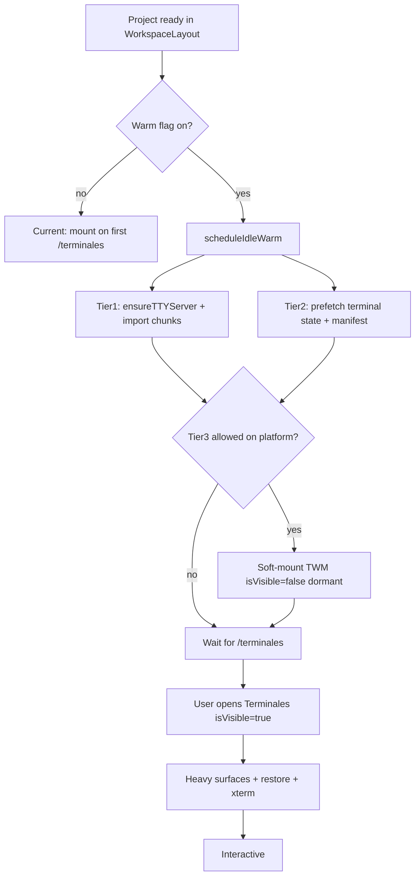

# Design: startup-latency-reoptimization

## Quick path

1. Ship **perf marks** (Phase 0) and capture cold baseline.
2. **Deps Wave A** — Next/React/Tauri/Radix patches + Turbopack verify; re-baseline.
3. **Deps Wave B** — `@xterm/*` migration; re-baseline.
4. Warm **TTY sidecar + chunk prefetch + state prefetch** on idle (Phase 1–2).
5. Optionally **soft-mount dormant TWM** behind flag (Phase 3).
6. Align with **terminal-engine-v2** surfaces.
7. **Deps Wave C/D** (Jest / selected majors) without blocking warm tiers.
8. Only then consider PTY pool / TWM `React.lazy` if marks still miss.

## Technical approach

Introduce a small **warm policy** that schedules work after the workspace project is loaded, using idle/after-paint callbacks. Work is stratified so **GPU, restore, and agent TUIs never run off-route** unless explicitly allowed by a platform-proven tier.



## Architecture decisions

| Decision             | Choice                                            | Alternatives                | Rationale                                          |
| -------------------- | ------------------------------------------------- | --------------------------- | -------------------------------------------------- |
| Deps strategy        | Waved A→B→C→D with re-baseline                    | Big-bang `update --latest`  | Isolates breakages; proves perf impact             |
| Next line            | Stay on 16.2.x; bump to latest patch              | Jump to 16.3 preview early  | Stable patches first; Turbopack already on 16      |
| Bundler              | Turbopack (Next 16 default); do not force webpack | Stay on webpack explicitly  | Build/dev speed + chunk quality                    |
| When to warm         | After project fetch + first paint / idle          | Immediate on App mount      | Avoid janking dashboard; WebKit history            |
| Default tiers        | Tier 1+2 on; Tier 3 flag; Tier 4 off              | Full eager mount            | Matches crash postmortem                           |
| Linux WebKitGTK      | Tier ≤2 until QA sign-off                         | Same as Windows             | Documented offscreen crash class                   |
| Soft-mount content   | Dormant: no restore, no WebGL, no PTY spawn       | Full hidden mount           | Keeps L1 win without L4/L5 risk                    |
| Sidecar warm         | Idempotent `ensureTTYServer(cwd)`                 | Spawn dummy PTY             | Enough for L3; no orphans                          |
| State prefetch       | Read-only cache module                            | Duplicate React state early | Simple; TWM remains source of truth on mount       |
| Heuristic            | Optional “last route was terminales” later        | Always / never              | Start with always-after-project; tune with metrics |
| Flags                | Runtime localStorage / env `DEVHUB_TERMINAL_WARM` | Build-only                  | Kill-switch without rebuild                        |
| Coordination with v2 | Warm prepares; v2 owns hide/show                  | Separate warm PTYs          | Avoid two lifecycles                               |

## Warm tiers (contract)

| Tier | Name               | Triggers                    | Allowed work                                                | Forbidden                                |
| ---- | ------------------ | --------------------------- | ----------------------------------------------------------- | ---------------------------------------- |
| 0    | Measure            | Always (dev + flagged prod) | `performance.mark/measure`, structured log                  | Behavior change                          |
| 1    | Sidecar + chunks   | Idle after project ready    | `ensureTTYServer`, dynamic import of terminal modules       | xterm open, PTY create, restore          |
| 2    | State prefetch     | Same idle window            | Read/normalize terminal state + restore manifest into cache | Write storage, spawn, GPU                |
| 3    | Soft-mount dormant | Idle + platform allowlist   | Mount TWM with `isVisible=false` dormant shell              | Startup restore, WebGL attach, panel PTY |
| 4    | Spare shell pool   | Explicit opt-in             | N≤1 spare shell session in sidecar                          | Agent TUI pre-spawn                      |

## Platform gate matrix

| Platform                 | Tier 1     | Tier 2     | Tier 3                               | Tier 4 |
| ------------------------ | ---------- | ---------- | ------------------------------------ | ------ |
| Windows (Tauri WebView2) | default on | default on | flag default **on** after Phase 2 QA | off    |
| macOS (if applicable)    | on         | on         | flag                                 | off    |
| Linux WebKitGTK packaged | on         | on         | **off** until explicit QA            | off    |
| Browser / Next dev       | on         | on         | off or flag                          | off    |

## Data flow

### Phase 1 — sidecar + prefetch

```
WorkspaceLayout (project != null)
  → requestIdleCallback / setTimeout(0) after paint
  → terminalWarmPolicy.schedule({ projectId, cwd, platform })
       ├─ ensureTTYServer(cwd)   // idempotent
       ├─ import(/* terminal chunk */) // optional
       └─ terminalStatePrefetch.load(projectId)
```

On first TWM mount:

```
TWM bootstrap
  → prefer terminalStatePrefetch.take(projectId) if fresh
  → else existing localStorage hydrate path
```

### Phase 2 — soft-mount

```
Idle warm Tier3
  → setTerminalManagerEverMounted(true) while !isTerminalRoute
  → TWM mounts with isVisible=false
  → dormant UI (no heavy surfaces)
User navigates /terminales
  → isVisible=true
  → existing heavySurfaces + startup restore path
```

## Perf marks (Phase 0)

| Mark                                       | When                                      |
| ------------------------------------------ | ----------------------------------------- |
| `dh:app-shell-start`                       | App / layout mount                        |
| `dh:project-ready`                         | Project fetch resolved                    |
| `dh:terminal-route-enter`                  | `isTerminalRoute` true                    |
| `dh:twm-mount`                             | TWM mount                                 |
| `dh:heavy-surfaces-ready`                  | `heavySurfacesReady` true                 |
| `dh:first-panel-interactive`               | First active panel reports ready / fitted |
| `dh:warm-tier-start` / `dh:warm-tier-done` | Warm scheduler                            |

Measures: `project-ready→terminal-route`, `terminal-route→first-panel-interactive`, `warm-duration`.

Expose via `window.__DEVHUB_PERF__` in non-prod or when `localStorage.devhub_perf=1`.

## File changes (planned)

| File                                                           | Action | Description                                      |
| -------------------------------------------------------------- | ------ | ------------------------------------------------ |
| `src/lib/terminal/terminalWarmPolicy.js`                       | Create | Tier selection, platform gates, scheduleIdleWarm |
| `src/lib/terminal/terminalStatePrefetch.js`                    | Create | Read-only prefetch cache                         |
| `src/lib/terminal/startupPerfMarks.js`                         | Create | mark/measure helpers                             |
| `src/App.js`                                                   | Modify | Call warm scheduler; optional early everMounted  |
| `src/components/terminal/hooks/useWorkspaceBootstrapEffect.js` | Modify | Consume prefetch; emit marks                     |
| `src/components/TerminalWorkspacesManager.jsx`                 | Modify | Marks; ensure dormant stays light under Tier 3   |
| `src/lib/terminal/ttyServer.js`                                | Modify | Ensure warmup-safe idempotent path (if gaps)     |
| Tests under `src/lib/terminal/__tests__/`                      | Create | Policy + prefetch + marks                        |

## Interfaces

```js
// terminalWarmPolicy.js
export function resolveWarmTiers({ platform, flags, lastRouteHint }) => {
  tier1: boolean, tier2: boolean, tier3: boolean, tier4: boolean
}

export function scheduleTerminalWarm({
  projectId, cwd, platform, flags,
  ensureTTYServer, prefetchState, softMountTerminalManager,
}) => { cancel: () => void }

// terminalStatePrefetch.js
export function prefetchTerminalState(projectId, storage) => Promise<PrefetchSnapshot | null>
export function takePrefetchedTerminalState(projectId) => PrefetchSnapshot | null

// startupPerfMarks.js
export function mark(name)
export function measure(name, startMark, endMark)
export function getPerfSnapshot()
```

## Budgets

| Resource                 | Budget                                    |
| ------------------------ | ----------------------------------------- |
| Idle warm CPU            | ≤ 50ms chunks; yield between tiers        |
| RSS delta after Tier 1+2 | ≤ ~30MB (tune after measure)              |
| Soft-mount Tier 3 RSS    | ≤ ~80MB extra before first visible (tune) |
| Spare PTY (Tier 4)       | N=1 max; kill on project switch           |

## Testing strategy

| Layer       | What                                               | How                                  |
| ----------- | -------------------------------------------------- | ------------------------------------ |
| Unit        | Tier matrix / flags / cancel                       | Jest `terminalWarmPolicy.test.js`    |
| Unit        | Prefetch take-once + stale                         | Jest `terminalStatePrefetch.test.js` |
| Unit        | Marks produce measures                             | Jest `startupPerfMarks.test.js`      |
| Integration | Soft-mount does not call restore when `!isVisible` | Existing bootstrap tests extended    |
| Manual      | Windows cold open → Terminales                     | Checklist in tasks                   |
| Manual      | Linux packaged project entry                       | Must not white-screen                |

## Migration / rollout

| Phase | Deliverable                                              | Flag default                |
| ----- | -------------------------------------------------------- | --------------------------- |
| 0     | Marks + baseline doc snippet in apply-progress           | marks on when `devhub_perf` |
| 0A    | Deps Wave A (Next/React/Tauri/Radix…) + Turbopack verify | n/a                         |
| 0C    | Deps Wave B (`@xterm/*`)                                 | n/a                         |
| 1     | Tier 1+2 (+ idle `@xterm` import prefetch)               | on                          |
| 2     | Tier 3 soft-mount                                        | on Windows; off Linux       |
| 3     | v2 alignment notes + any API glue                        | follows v2 flag             |
| 4     | Tier 4 / TWM lazy                                        | off                         |
| 5     | Deps Wave C (Jest)                                       | n/a                         |
| 6+    | Deps Wave D (one major per PR)                           | n/a                         |

## Rollback

1. `localStorage.devhub_terminal_warm=off` or env kill-switch → no schedule.
2. Disable Tier 3 only if soft-mount regresses.
3. Revert phase PR; marks can stay.

## Non-goals reminder

- No swarm/agent pre-launch at startup.
- No removing visibility gates for restore.
- No `visibility:hidden` GPU toggles that fight Option B keep-alive.
