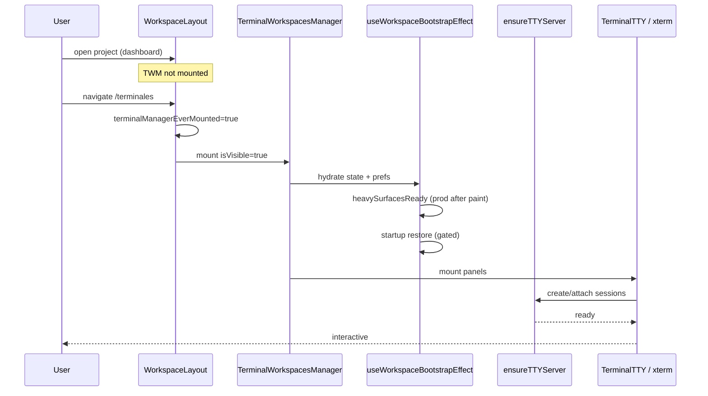

# Exploration: startup-latency-reoptimization

## Problem (operator view)

Al abrir DevHub y entrar a **Terminales**, la primera vez se siente lenta: el manager, paneles xterm y PTYs “arrancan” en ese momento. Después de la primera visita, volver a Terminales es más rápido porque el layout ya deja el manager montado en warm mode. Queremos mover trabajo **al launch / idle**, no al click de Terminales — sin repetir el crash WebKit de montar GPU off-screen.

## Current state (code facts)

### Mount policy in `WorkspaceLayout` (`src/App.js`)

```
project loaded
  └─ isTerminalRoute?
       NO  → TerminalWorkspacesManager NOT mounted
             (until terminalManagerEverMounted becomes true)
       YES → setTerminalManagerEverMounted(true)
             mount TWM with isVisible=true
```

After the first Terminales visit:

- Container stays `display: block` with Option B visibility (`opacity: 0`, `inert` when off-route).
- TWM stays mounted with `isVisible={isTerminalRoute}`.
- Comment in App: warm-mounted off-route intentionally.

**Gap:** nothing runs between “project ready” and “first Terminales navigation”. That gap is the cold pain.

### Bootstrap inside TWM

`useWorkspaceBootstrapEffect`:

- Production: `deferHeavySurfacesUntilPaint` delays heavy surfaces until after paint when visible.
- Startup restore runs only when `isVisible && isClientLoaded` (and once per page load).
- Hydration / localStorage / restore manifest work is tied to the manager lifecycle.

### TTY sidecar

`ensureTTYServer` (via `src/lib/terminal/ttyServer.js` and session API routes) is invoked when sessions are created — typically when panels need a PTY, not at app launch.

### Stay-warm already exists

| Mechanism                        | What it solves              | What it does not        |
| -------------------------------- | --------------------------- | ----------------------- |
| `terminalManagerEverMounted`     | Second+ visit to Terminales | First visit             |
| Option B opacity keep-alive      | Tab/window switch blink     | Cold mount              |
| `deferHeavySurfacesUntilPaint`   | First paint contention      | Pre-route warm          |
| `terminal-engine-v2` (in flight) | Rehydrate hidden panels     | Eager warm before route |

### Hard constraint: WebKitGTK offscreen mount

Documented in `docs/errores/05-deb-webkit-page-couldnt-load/03-webkit-terminal-mount-offscreen.md`:

- Eager TWM + startup restore + xterm/WebGL in a hidden container crashed packaged WebKitGTK (“This page couldn't load”).
- Fix class: **visibility gates** for restore/native layout; dormant when `!isVisible`.
- Any preload must respect that history — especially Linux Tauri.

## Cold-path timeline (first Terminales open)



## Latency buckets (what to measure)

| Bucket                     | Likely cost drivers                       |
| -------------------------- | ----------------------------------------- |
| L0 App shell               | React tree, theme, project fetch          |
| L1 Terminales route commit | Mount TWM, hooks tax                      |
| L2 State hydrate           | localStorage, normalize workspaces, prefs |
| L3 Sidecar                 | `ensureTTYServer`, WS listen              |
| L4 Surfaces                | xterm + WebGL addon + fit                 |
| L5 Sessions                | PTY spawn / reattach / restore            |

**Hypothesis:** L1+L2+L3 dominate first open when no sessions restore; L4+L5 dominate when many panels restore.

## Approaches

### A — Measure-only first (required)

- Add `performance.mark/measure` (and optional debug log) for L0–L5.
- Capture 10 cold starts on Windows + Linux packaged if available.
- **Pros:** Prevents optimizing the wrong bucket. **Cons:** No user win until later phases. **Effort:** Low.

### B — Sidecar + module warm (Tier 1)

- After project ready + idle: call `ensureTTYServer(cwd)` once; optionally dynamic-import terminal chunks.
- **Pros:** Safe (no GPU/DOM); shaves L3. **Cons:** Partial win. **Effort:** Low–Med.

### C — State prefetch without mount (Tier 2)

- Idle-read `devhub_terminal_state:*` + restore manifest into a small cache/module; TWM consumes cache on mount.
- **Pros:** Cuts L2 parse/normalize on route. **Cons:** Must stay consistent with storage writers. **Effort:** Med.

### D — Soft-mount dormant TWM (Tier 3)

- After idle, set `terminalManagerEverMounted=true` while still off-route, with `isVisible=false` dormant path (no restore, no WebGL).
- **Pros:** Moves L1 hook/mount cost off the click. **Cons:** Reopens WebKit risk if dormant is not truly light; memory. **Effort:** Med–High.

### E — Pre-create idle shell PTY pool (Tier 4, optional)

- Keep N=1 (or 0 by default) spare shell sessions in sidecar.
- **Pros:** Instant first empty terminal. **Cons:** RAM, orphan sessions, cwd wrong if project switches. **Effort:** High; default **off**.

### F — Bundle / code-split Terminales (parallel track)

- Lazy-load TWM chunk from dashboard; prefetch chunk on idle.
- **Pros:** Faster L0 for non-terminal users. **Cons:** Can _worsen_ first Terminales if prefetch fails; App already statically imports TWM. **Effort:** Med.

## Recommendation

| Priority | Approach             | Why                             |
| -------- | -------------------- | ------------------------------- |
| P0       | A Measure            | Decide with numbers             |
| P1       | B Sidecar warm       | Best risk/reward                |
| P1       | C State prefetch     | Cheap L2 win                    |
| P2       | D Soft-mount dormant | Biggest L1 win if WebKit-safe   |
| P3       | F Chunk prefetch     | Only if L0/L1 JS parse shows up |
| P4       | E PTY pool           | Opt-in; not default             |

**Do not** pre-launch agent TUIs (OpenCode/Grok) at app start — conflicts with restore policy, noise, and memory.

## Interaction with other changes

| Change                                 | Relationship                                                                                      |
| -------------------------------------- | ------------------------------------------------------------------------------------------------- |
| `terminal-engine-v2`                   | Warm policy must use v2 subscribe/unsubscribe + LRU when flag on; do not revive survivor-recovery |
| `terminal-session-restore-post-reboot` | Restore stays visibility-gated; warm only prepares inputs                                         |
| `native-tui-prompt-paste`              | Orthogonal; may benefit from faster panel ready                                                   |
| WebKit error docs                      | Hard acceptance: no regression on project-entry crash                                             |

## Open questions

1. Baseline numbers on this machine (Windows) and any Linux packaged build available?
2. Soft-mount Tier 3 enabled by default on Windows Chromium WebView, Linux opt-in?
3. Should warm run only when last session used Terminales (heuristic), or always after project load?
4. Acceptable idle budget (ms CPU / MB RSS) for warm work?

## Decision needed before apply

- Confirm **platform gate matrix** (Windows default Tier 1–2; Linux Tier 1 only until proven).
- Confirm **no Tier 4 by default**.
- Confirm metrics land in Phase 0 before behavior changes.
- Confirm **`@xterm/*` migration** as its own PR (recommended in `research.md`) before or with idle chunk prefetch.

## See also

Full package / framework / peer survey: [`research.md`](./research.md).
