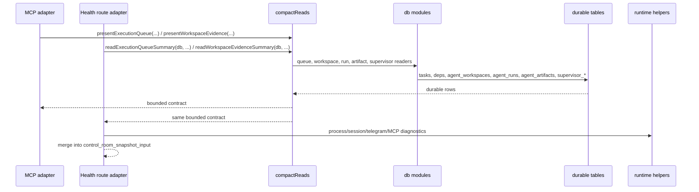

# Design: SW-14.1A Shared core extraction for compact durable reads

## Technical Approach

First slice extracts only the compact read surface already shared by public MCP and the operations health route: execution queue, workspace evidence, and the `director_queue` wrapper. Create `src/lib/db/compactReads.js` as the durable-only shared core. It will reuse existing domain readers from `swarmMissions`, `workspaces`, `agentRuns`, `artifacts`, and `supervisor`, but it MUST NOT call `fetch`, `processManager`, session routes, telegram routes, `agent_registry`, or other runtime mirrors. `devhub-mcp/server.js` and `src/app/api/agenthub/operations/health/route.js` become adapters: MCP keeps tool schemas and transport; health route keeps request parsing, runtime diagnostics, and `control_room_snapshot_input` assembly. Future `devhub status|queue|agents|swarm|task|ws|run` commands are downstream consumers only. No schema change and no MCP pruning in this slice.

## Architecture Decisions

| Area              | Options                                                                 | Decision                                                                 | Rationale                                                                                                                                         |
| ----------------- | ----------------------------------------------------------------------- | ------------------------------------------------------------------------ | ------------------------------------------------------------------------------------------------------------------------------------------------- |
| Core placement    | `devhub-mcp/` ESM package, `src/lib/operations` ESM, root CJS module    | `src/lib/db/compactReads.js` (CJS), re-exported by `src/lib/db/index.js` | `devhub-mcp` already uses `createRequire()` for root CJS, and the Next route already imports the CJS barrel. This avoids dual-build/package work. |
| Shared boundary   | Health route calls MCP over HTTP; both adapters call one core           | Both adapters call shared core directly                                  | Removes extra hop, locks semantic parity, and keeps transport wrappers thin.                                                                      |
| Runtime isolation | Core reads live hints/process/session state; runtime stays outside core | Durable-only core + internal runtime helper                              | Public read contracts stay portable; high-frequency plumbing remains internal.                                                                    |

## Data Flow



Flow rule: queue order, blocked semantics, latest run selection, and latest artifact selection come from the shared core. Runtime diagnostics may enrich the route response, but they never replace durable truth.

## File Changes

| File                                              | Action | Description                                                                                                                             |
| ------------------------------------------------- | ------ | --------------------------------------------------------------------------------------------------------------------------------------- |
| `src/lib/db/compactReads.js`                      | Create | Shared durable read core: queue/evidence readers plus storage-agnostic contract builders.                                               |
| `src/lib/db/index.js`                             | Modify | Re-export shared core through existing `localDb.js` compatibility barrel.                                                               |
| `devhub-mcp/server.js`                            | Modify | Replace inline queue/evidence composition with shared core; keep Zod schemas, `ok/err`, and Supabase/SQLite adapter glue.               |
| `src/app/api/agenthub/operations/health/route.js` | Modify | Replace HTTP bounce + duplicate `director_queue` shaping with shared core; keep mission snapshot/timeline and POST handoff logic local. |
| `src/lib/runtime/operationalHealthSources.js`     | Create | Internal-only process/session/telegram/MCP health readers used by the route, never by public MCP.                                       |

## Interfaces / Contracts

```js
// src/lib/db/compactReads.js
readExecutionQueueSummary(db, { projectId, limit = 20, includeBlocked = false, nowMs });
readWorkspaceEvidenceSummary(db, { workspaceId });

presentExecutionQueue({ queue, total });
presentWorkspaceEvidence({ workspace, latestRun, latestArtifact });
createDirectorQueueContract({ queue, handoff });
```

Contract rules:

- `present*` helpers are transport-neutral and storage-neutral.
- `read*Summary` helpers are SQLite/local durable readers only.
- MCP Supabase code reuses `present*` helpers after its existing row fetches.
- Adapters may rename wrapper fields, but MUST NOT re-rank queue items or invent fallback truth.
- No schema, table, or tool argument changes in this slice.

## Testing Strategy

| Layer             | What to Test                                                                                                | Approach                                                                                                                                                        |
| ----------------- | ----------------------------------------------------------------------------------------------------------- | --------------------------------------------------------------------------------------------------------------------------------------------------------------- |
| Unit              | `compactReads` blocked semantics, latest-run/artifact selection, stable empty states, no runtime dependency | New `src/lib/db/compactReads.test.js`, red first with in-memory SQLite.                                                                                         |
| Integration       | MCP parity for `get_execution_queue` and `get_workspace_evidence`                                           | Extend `tests/agenthub/mcp/task-leases.test.js`, `devhub-mcp/tests/integration/tasks.test.js`, and `devhub-mcp/tests/integration/agent-runs-artifacts.test.js`. |
| Route integration | Health route uses same queue/evidence semantics as MCP wrappers                                             | Extend `tests/agenthub/api/operations-health.test.js` with shared fixtures and parity assertions.                                                               |
| E2E               | No new surface in this slice                                                                                | Defer CLI/UI E2E to downstream consumer slices.                                                                                                                 |

## Migration / Rollout

1. Add `compactReads.js` and unit tests with zero adapter changes.
2. Switch SQLite MCP path and health route to shared core; preserve current JSON shapes.
3. Switch Supabase MCP path to shared `present*` helpers for parity.
4. Remove dead inline helpers only after parity tests pass.

No migration required. No durable schema change. No CLI command implementation. Future CLI commands remain downstream consumers of the same core.

## Open Questions

None.
