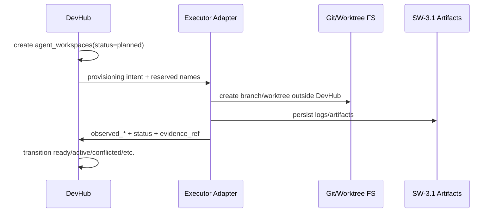

# Design: SW-2.1 Agent Workspaces Strategy

## Technical Approach

DevHub adds a dedicated `agent_workspaces` control-plane record and never performs git/worktree mutations. Executors reserve against DevHub metadata, provision outside MCP, then report observed branch/head/path/dirty state plus opaque `evidence_ref`. This freezes the contract SW-2.2 depends on and gives SW-3.1 a stable audit hook.

## Architecture Decisions

| Decision           | Choice                                                                                          | Alternatives considered                                                 | Rationale                                                                                                        |
| ------------------ | ----------------------------------------------------------------------------------------------- | ----------------------------------------------------------------------- | ---------------------------------------------------------------------------------------------------------------- |
| Ownership boundary | Dedicated `agent_workspaces`; executor owns git/worktree actions                                | Reuse `devhub_agent_runs`; extend `agent_registry`/`agent_hub_sessions` | Existing runtime stores are UI/process-oriented and drift-prone; git ownership needs durable, auditable metadata |
| Identity           | Stable opaque `workspace_id`; deterministic derived names for branch/path                       | Names derived only from agent/task                                      | Stable id prevents collisions and allows retries/recovery without reusing terminal state                         |
| Baseline tracking  | Store `base_branch` + frozen `base_commit=f814998dd05cb491caf8637bf570dbd74b539090` at creation | Infer from current repo state                                           | Current tree may be `dirty-excluded`; inference would hide unsafe reality                                        |
| Evidence           | `evidence_ref` opaque and append-only by lifecycle step                                         | Embed detailed artifacts in workspace row                               | Keeps SW-2.1 narrow and leaves artifact schema to SW-3.1                                                         |

## Data Flow



Conceptual model:

| Field group    | Contents                                                                                                     |
| -------------- | ------------------------------------------------------------------------------------------------------------ |
| Identity       | `id`, `project_id`, `agent_id`, `current_task_id`, `run_id_or_session_id`                                    |
| Reservation    | `repo_root`, logical `workspace_path`, physical `worktree_path`, `base_branch`, `base_commit`, `branch_name` |
| Observed state | `observed_branch`, `observed_head`, `observed_dirty`, `last_error`                                           |
| Recovery/audit | `recovery_reason`, `evidence_ref`, timestamps                                                                |

State machine:

`planned -> provisioning -> ready -> active -> paused -> active`

Exceptional/terminal:

- `provisioning|ready|active|paused -> conflicted`
- `ready|active|paused|conflicted -> cleanup_pending -> completed|failed`
- `ready|active|paused -> orphaned -> cleanup_pending|failed`

Invariants: non-terminal rows are mutable; terminal rows are immutable history and MUST NOT be reused.

## Naming / Locking Strategy

- `workspace_id`: opaque UUID/ULID generated by DevHub; primary lock key.
- `workspace_path`: logical identifier `workspace://<project_id>/<workspace_id>`; never repointed.
- `worktree_path`: executor-owned filesystem path like `.worktrees/<project_slug>/<workspace_id>`.
- `branch_name`: `agent/<agent_slug>/<task_or_run_slug>--<workspace_short_id>`.
- `base_branch`: explicit snapshot from planning input; stored, never implied.

Locks are reservation-first: unique constraints on `id`, `branch_name`, `worktree_path`, plus one active workspace per `(agent_id,current_task_id)` while status is non-terminal. Executor mismatch between reserved and observed branch/head/path forces `conflicted`.

## Cleanup / Recovery

`cleanup_pending` means teardown requested, not done. `orphaned` means executor/session lease disappeared before terminal outcome. Recovery never mutates historical identity; it records `recovery_reason`, attaches a fresh `evidence_ref`, and either resumes the same workspace if reservation still matches or creates a successor workspace linked by audit evidence.

Orphan handling uses periodic ownership checks against executor/session liveness; DevHub only marks state and requests cleanup.

## File Changes

| File                                                          | Action | Description                                                                            |
| ------------------------------------------------------------- | ------ | -------------------------------------------------------------------------------------- |
| `openspec/changes/sw-2-1-agent-workspaces-strategy/design.md` | Create | SW-2.1 technical design                                                                |
| `src/lib/db/localDb.js`                                       | Modify | Add future `agent_workspaces` table/indexes; keep separate from session/process tables |
| `devhub-mcp/server.js`                                        | Modify | Add future workspace metadata endpoints/tool wiring only                               |
| `src/app/api/agent/execute/route.js`                          | Modify | Remove direct git branch creation in follow-up implementation                          |
| `src/app/api/agent/qa-result/route.js`                        | Modify | Remove direct merge/delete behavior; consume executor-reported outcomes                |
| `src/lib/agentRegistryLive.js`                                | Modify | Keep `devhub_agent_runs` observer-only bridge                                          |

## Interfaces / Contracts

```ts
type AgentWorkspaceStatus =
  | 'planned'
  | 'provisioning'
  | 'ready'
  | 'active'
  | 'paused'
  | 'conflicted'
  | 'cleanup_pending'
  | 'completed'
  | 'failed'
  | 'orphaned';

type WorkspaceReport = {
  workspace_id: string;
  status: AgentWorkspaceStatus;
  observed_branch?: string;
  observed_head?: string;
  observed_dirty?: 'clean' | 'dirty' | 'dirty-excluded';
  worktree_path?: string;
  evidence_ref?: string;
  last_error?: string;
};
```

DevHub stores reservation + observed metadata. Executor reports provisioning, drift, cleanup, and failure outcomes. SW-3.1 owns dereferencing `evidence_ref` into auditable artifacts.

## Testing Strategy

| Layer       | What to Test                                      | Approach                       |
| ----------- | ------------------------------------------------- | ------------------------------ |
| Unit        | Naming, transition guards, conflict detection     | DB/service tests               |
| Integration | Executor report updates and orphan reconciliation | Jest with local DB fixtures    |
| E2E         | UI shows observer-only workspace/run state        | Playwright after SW-2.2/SW-3.1 |

## Migration / Rollout

No data migration required for SW-2.1 design. Compatibility rule: `devhub_agent_runs`, browser window state, and terminal renderer preferences remain UI-local and MUST NOT become workspace ownership sources. Existing `devhub_agent_runs` may display linked metadata later, but only by referencing `workspace_id` or reported status.

## Open Questions

- [ ] Should successor/recovered workspaces get an explicit `supersedes_workspace_id` in SW-2.2, or stay linked only through evidence?
- [ ] Does SW-3.1 need one `evidence_ref` per lifecycle step or one latest pointer plus artifact timeline?
