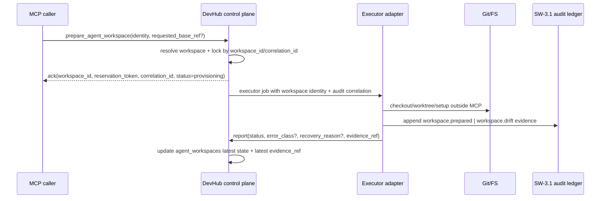

# Design: SW-2.2 Prepare Agent Workspace Tool

## Technical Approach

`prepare_agent_workspace` stays a narrow DevHub control-plane tool. DevHub accepts workspace identity plus reservation/correlation intent, persists only durable workspace metadata, and hands execution to an executor adapter. The adapter performs git/worktree/filesystem actions outside MCP, then emits workspace-preparation evidence into the SW-3.1 audit ledger. DevHub stores only lifecycle state, error/recovery metadata, and the latest opaque `evidence_ref`.

## Architecture Decisions

| Decision         | Choice                                                                                               | Alternatives considered                                                 | Rationale                                                          |
| ---------------- | ---------------------------------------------------------------------------------------------------- | ----------------------------------------------------------------------- | ------------------------------------------------------------------ |
| MCP boundary     | Keep `prepare_agent_workspace` as intent/ack + outcome reporting only                                | Add checkout/worktree/merge verbs to MCP                                | Preserves SW-2.1/SW-3.1 freeze and keeps DevHub control-plane only |
| Durable truth    | `agent_workspaces` + SW-3.1 `agent_runs` / `agent_artifacts`; `devhub_agent_runs` stays local mirror | Use `devhub_agent_runs` as source of truth                              | Runtime/UI state drifts; audit and recovery need durable records   |
| Evidence handoff | Store opaque `evidence_ref`; resolve join details in audit ledger                                    | Persist observed branch/head/path/dirty fields directly in MCP payloads | Future consumers need routing, not executor internals              |
| Retry model      | Idempotent by `workspace_id + correlation_id`; retries append new evidence, never overwrite          | Mutable retry rows or in-place evidence rewrite                         | Keeps chronology auditable and conflict recovery explicit          |

## Data Flow



Reconciliation rules:

- `ready`: executor prepared workspace; `evidence_ref` points to latest `workspace.prepared` evidence.
- `conflicted`: ownership collision, base drift, or dirty-excluded divergence observed; DevHub stores class/reason only, evidence keeps branch/head/path/dirty details.
- `orphaned`: acceptance succeeded but executor disappeared or lease expired before completion.
- `dirty-excluded`: never normalized; only reported inside evidence and reflected through conflict/orphan recovery state.

## File Changes

| File                                                             | Action | Description                                                                                                         |
| ---------------------------------------------------------------- | ------ | ------------------------------------------------------------------------------------------------------------------- |
| `openspec/changes/sw-2-2-prepare-agent-workspace-tool/design.md` | Create | SW-2.2 technical design                                                                                             |
| `devhub-mcp/server.js`                                           | Modify | Add future prepare/report handlers enforcing narrow contract and idempotent locking                                 |
| `src/lib/db/localDb.js`                                          | Modify | Add future `agent_workspaces` lock/status helpers and SW-3.1 linkage reads, not git state ownership                 |
| `src/app/api/agent/execute/route.js`                             | Modify | Remove direct `git checkout -b`; convert route into task/run kickoff that requests workspace prep via executor path |
| `src/app/api/agent/qa-result/route.js`                           | Modify | Remove direct merge/delete side effects; accept QA outcome and executor-produced evidence only                      |
| `src/lib/agentRegistryLive.js`                                   | Modify | Keep `devhub_agent_runs` observer-only by projecting durable workspace/run outcomes                                 |

## Interfaces / Contracts

```ts
type PrepareAgentWorkspaceAck = {
  workspace_id: string;
  task_id: string;
  agent_id: string;
  requested_base_ref: string;
  reservation_token: string;
  correlation_id: string;
  status: 'planned' | 'provisioning' | 'ready' | 'conflicted' | 'failed' | 'orphaned';
  accepted_at: string;
};

type PrepareWorkspaceOutcome = {
  workspace_id: string;
  correlation_id: string;
  status: 'ready' | 'conflicted' | 'failed' | 'orphaned';
  error_class?: 'base_drift' | 'ownership_collision' | 'executor_lost' | 'prepare_failed';
  recovery_reason?: string;
  evidence_ref: string; // opaque in MCP; audit resolves kind+locator+integrity+joins
  reported_at: string;
};
```

Locking: one active preparation lease per `workspace_id`; duplicate `workspace_id + correlation_id` returns prior ack unless a newer outcome arrived. New retry requires new `correlation_id`, fresh evidence, and append-only SW-3.1 rows.

## Testing Strategy

| Layer       | What to Test                                                                                      | Approach                                           |
| ----------- | ------------------------------------------------------------------------------------------------- | -------------------------------------------------- |
| Unit        | Identity validation, ack shape, lock/idempotency rules, forbidden state rewrites                  | Jest service/DB tests                              |
| Integration | Executor outcome ingestion, `evidence_ref` pass-through, success/conflict/orphaned reconciliation | Jest with local DB fixtures and audit-ledger fakes |
| E2E         | Supervisor Loop, Control Room, Telegram read workspace/run outcomes without git verbs             | Playwright + adapter contract tests                |

## Migration / Rollout

No migration required in design phase. Implementation should land SW-2.2 on top of frozen checkpoints `02d82361449a09e93e5880a08e35e3043617002d` and `4b1e344dcd202c911498af17236fcb86a2a2cb1e`, using shared baseline `f814998dd05cb491caf8637bf570dbd74b539090` while preserving `dirty-excluded` as observed reality.

## Open Questions

- [ ] Should orphan reconciliation be timer-driven from workspace lease expiry, or only from explicit executor heartbeat failure?
- [ ] Does QA approval always emit merge evidence through the executor adapter, or do we need a separate policy gate before merge-capable evidence is accepted?
