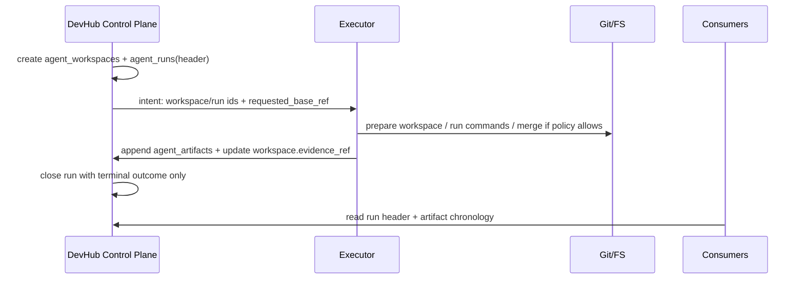

# Design: SW-3.1 Agent Runs and Artifacts Model

## Technical Approach

DevHub keeps `agent_workspaces` as the control-plane reservation from SW-2.1 and adds a separate audit model: immutable `agent_runs` headers plus append-only `agent_artifacts`. Executors still own git/worktree/branch/merge behavior; DevHub stores intent, observed outcomes, and evidence references only. This freezes enough taxonomy, lineage, and integrity rules for SW-2.2, Supervisor Loop, Control Room, and Telegram consumption without binding to a specific storage engine.

## Architecture Decisions

| Decision       | Choice                                                                             | Alternatives considered                                         | Rationale                                                                   |
| -------------- | ---------------------------------------------------------------------------------- | --------------------------------------------------------------- | --------------------------------------------------------------------------- |
| Durable truth  | `agent_runs` + `agent_artifacts`; `devhub_agent_runs` stays UI/runtime mirror only | Reuse `devhub_agent_runs`; embed evidence in `agent_workspaces` | Keeps audit history immutable and avoids browser/runtime drift              |
| Evidence model | Append-only artifact ledger with typed rows and opaque-but-routable `evidence_ref` | Mutable event log; free-text notes only                         | Consumers need chronology, replay safety, and routing without executing git |
| Git boundary   | Git/worktree/branch/merge remain executor actions represented as evidence          | MCP verbs for checkout/merge/delete                             | Preserves SW-2.1 boundary and fixes current route violations                |
| Recovery       | New run per retry/recovery with lineage links; never rewrite prior run identity    | Reopen/mutate failed run                                        | Makes retries auditable and keeps original provenance intact                |

## Data Flow



Flow rule: `agent_workspaces.evidence_ref` points to the latest authoritative artifact locator for that workspace lifecycle, while the run timeline lives in `agent_artifacts`.

## File Changes

| File                                                           | Action | Description                                                                        |
| -------------------------------------------------------------- | ------ | ---------------------------------------------------------------------------------- |
| `openspec/changes/sw-3-1-agent-runs-artifacts-model/design.md` | Create | SW-3.1 technical design                                                            |
| `src/lib/db/localDb.js`                                        | Modify | Add future durable persistence for `agent_runs` / `agent_artifacts`                |
| `devhub-mcp/server.js`                                         | Modify | Add future metadata/reporting endpoints, not git verbs                             |
| `src/app/api/agent/execute/route.js`                           | Modify | Remove direct branch creation; treat startup as run creation + evidence ingestion  |
| `src/app/api/agent/qa-result/route.js`                         | Modify | Remove direct merge/delete; record QA outcome and executor-produced merge evidence |
| `src/lib/agentRegistryLive.js`                                 | Modify | Continue observer-only bridge from durable state to UI mirror                      |

## Interfaces / Contracts

```ts
type AgentRunHeader = {
  run_id: string;
  workspace_id: string;
  task_id: string;
  agent_id: string;
  requested_base_ref: string;
  baseline_commit: string; // includes frozen safe baseline
  observed_start: { branch?: string; head?: string; dirty?: 'clean' | 'dirty' | 'dirty-excluded' };
  status: 'planned' | 'running' | 'paused' | 'succeeded' | 'failed' | 'aborted' | 'superseded';
  predecessor_run_id?: string;
  recovery_group_id?: string;
  terminal_reason_class?: string;
};

type ArtifactKind =
  | 'workspace.prepared'
  | 'workspace.drift'
  | 'workspace.cleanup'
  | 'git.branch'
  | 'git.commit'
  | 'git.merge'
  | 'git.checkout'
  | 'command.exec'
  | 'test.result'
  | 'diff.patch'
  | 'qa.result'
  | 'attachment.log'
  | 'attachment.file'
  | 'decision.note'
  | 'error.report';

type AgentArtifact = {
  artifact_id: string;
  run_id: string;
  seq: number; // monotonic within run
  phase: 'prepare' | 'execute' | 'qa' | 'cleanup' | 'recovery';
  kind: ArtifactKind;
  producer: 'executor' | 'devhub' | 'qa' | 'supervisor';
  summary: string;
  evidence_ref: string;
  parent_artifact_id?: string;
  supersedes_artifact_id?: string;
  integrity: { content_digest?: string; locator_version?: string; observed_at: string };
};
```

`prepare_agent_workspace` emits at least one `workspace.prepared` or `workspace.drift` artifact containing requested base ref, observed branch/head/dirty/path, provisioning outcome, drift/error details, and the locator stored back into SW-2.1 `evidence_ref`. Legacy opaque refs remain valid if artifact metadata supplies kind + locator semantics.

Ordering/integrity: artifact rows are append-only; chronology is `(run_id, seq)` primary and timestamp secondary. No in-place edits except additive indexing metadata. Corrections or retries append new rows using `supersedes_artifact_id`.

Consumer contract: Supervisor Loop reads latest run header plus ordered artifacts to decide retry/escalation; Control Room renders timeline and attachments; Telegram adapter summarizes run status from header and links to artifact evidence without needing git access.

## Testing Strategy

| Layer       | What to Test                                                                               | Approach                     |
| ----------- | ------------------------------------------------------------------------------------------ | ---------------------------- |
| Unit        | Header immutability, seq monotonicity, taxonomy validation, lineage rules                  | DB/service tests             |
| Integration | `prepare_agent_workspace` evidence emission, QA outcome recording, route boundary refactor | Jest with local DB fixtures  |
| E2E         | UI/Telegram/Control Room consume chronology without `devhub_agent_runs` ownership          | Playwright and adapter tests |

## Migration / Rollout

No migration required in design phase. Implementation should dual-write runtime mirrors only for UI compatibility, but durable reads for audit/recovery MUST come from `agent_runs` and `agent_artifacts`.

Rollout note after SW-3.1A:

- `agentRegistryLive` and Telegram status helpers now consume durable run/artifact projections for status/outcome summaries.
- `devhub_agent_runs` remains UI/session-local metadata only (panel/session identity, launch hints).
- Next implementation dependency stays `SW-2.2`: `prepare_agent_workspace` must emit durable `workspace.prepared` / `workspace.drift` artifacts with auditable locator metadata.

## Open Questions

- [ ] Should `recovery_group_id` be run-scoped only, or also shared across workspace successors created after orphan cleanup?
- [ ] Do large attachments stay inline-addressable through `evidence_ref`, or require a separate blob locator profile?
