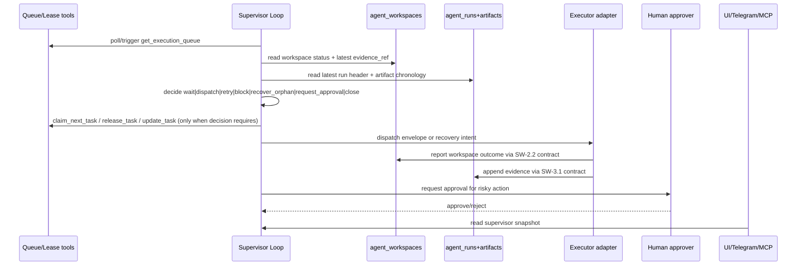

# Design: SW-4.1 Supervisor Loop Design

## Technical Approach

Supervisor Loop is one control-plane evaluator over the existing DevHub queue/lease contract. It reads `get_execution_queue`, `claim_next_task`, `renew_task_lease`, `release_task`, `agent_workspaces`, `agent_runs`, `agent_artifacts`, and latest `evidence_ref`, then emits only normalized orchestration outcomes. Executor adapters still own git/worktree/merge/filesystem side effects. The direct git in `src/app/api/agent/execute/route.js` and `src/app/api/agent/qa-result/route.js` is confirmed legacy debt and MUST stay outside supervisor ownership.

## Architecture Decisions

| Decision         | Choice                                                                                                                             | Alternatives considered                            | Rationale                                                                                        |
| ---------------- | ---------------------------------------------------------------------------------------------------------------------------------- | -------------------------------------------------- | ------------------------------------------------------------------------------------------------ |
| Queue ownership  | Reuse current queue + lease tools                                                                                                  | New scheduler/state machine in parallel            | Prevents split-brain assignment; `server.js` already cleans expired leases and claims atomically |
| Durable truth    | Tasks keep lease/status budget; `agent_workspaces` own workspace lifecycle; `agent_runs`/`agent_artifacts` own evidence chronology | Use `devhub_agent_runs` or executor logs as truth  | Runtime/browser state drifts; recovery needs durable records                                     |
| Retry budget     | Keep task-level `retry_count` as compatibility counter; derive attempt lineage from `agent_runs`                                   | Move retries fully into run rows                   | Preserves current queue contract while adding auditable attempt history                          |
| Approval gate    | Risky outcomes pause on explicit approval checkpoint keyed by task/workspace/run/evidence                                          | Infer approval from QA progress                    | Merge/cleanup/deletion must be human-authorized and auditable                                    |
| Consumer surface | Expose normalized supervisor snapshot, not executor internals                                                                      | UI/Telegram read terminal logs/filesystem directly | Keeps SW-5.1/SW-6.1/SW-7.1 decoupled from runtime details                                        |

## Data Flow



## Read / Write Boundaries

| Surface             | Supervisor reads                                                             | Supervisor writes                                                 |
| ------------------- | ---------------------------------------------------------------------------- | ----------------------------------------------------------------- |
| Task queue + lease  | queue order, `assigned_to`, `claim_token`, `lease_expires_at`, `retry_count` | claim/release, `status`, `retry_count`, blocking metadata/comment |
| Workspace metadata  | `workspace_id`, lifecycle state, recovery reason, latest `evidence_ref`      | recovery classification only; never branch/path/git details       |
| Run/artifact ledger | latest run, terminal reason, ordered artifacts, approval-worthy evidence     | supervisor decision notes / lineage links only                    |
| Executor adapter    | prep ack, terminal evidence availability                                     | dispatch/resume/recovery intent only                              |
| Approval channel    | pending/approved/rejected decision                                           | approval request payload with task/workspace/run/reason/evidence  |

## State Model

Primary flow: `idle -> dispatch_pending -> lease_active -> awaiting_evidence -> closed`.

Detours: `dispatch_pending -> blocked`; `lease_active -> retry_pending`; `lease_active -> awaiting_approval`; `lease_active|awaiting_evidence -> recovering_orphan`; any non-terminal state -> `blocked`; all terminal paths -> `closed` with final reason class.

Counters: `attempt_count` = run lineage count, `retry_count` = task compatibility counter, `unchanged_failure_count`, `approval_request_count`, `orphan_recovery_count`. `retry` increments only when latest terminal evidence is recoverable and differs from the last blocked failure. `block` is mandatory when budget is exhausted, approval is missing/rejected, dependency remains blocked, or identical failure evidence repeats without a new recovery artifact. Stale reconciliation uses current lease expiry plus last-known workspace/run metadata; `dirty-excluded` remains observed state, never normalized.

## File Changes

| File                                                       | Action | Description                                                                                                           |
| ---------------------------------------------------------- | ------ | --------------------------------------------------------------------------------------------------------------------- |
| `openspec/changes/sw-4-1-supervisor-loop-design/design.md` | Create | SW-4.1 technical design                                                                                               |
| `devhub-mcp/server.js`                                     | Modify | Add future supervisor evaluation, projection reads, and approval/recovery wiring on top of existing queue/lease tools |
| `src/lib/db/localDb.js`                                    | Modify | Add future durable supervisor projection/approval persistence without moving git state into MCP                       |
| `src/lib/agentRegistryLive.js`                             | Modify | Continue mirror-only UI projection from durable supervisor/workspace/run data                                         |
| `src/app/api/agent/execute/route.js`                       | Modify | Remove direct branch creation later; convert to executor dispatch consumer                                            |
| `src/app/api/agent/qa-result/route.js`                     | Modify | Remove direct merge/delete later; convert to approval/result ingestion only                                           |

## Interfaces / Contracts

```ts
type SupervisorSnapshot = {
  task_id: string;
  supervisor_state:
    | 'idle'
    | 'dispatch_pending'
    | 'lease_active'
    | 'awaiting_evidence'
    | 'retry_pending'
    | 'blocked'
    | 'awaiting_approval'
    | 'recovering_orphan'
    | 'closed';
  outcome?:
    | 'wait'
    | 'dispatch'
    | 'retry'
    | 'block'
    | 'recover_orphan'
    | 'request_approval'
    | 'close';
  reason_class?:
    | 'approval_required'
    | 'approval_rejected'
    | 'stale_lease'
    | 'orphaned_workspace'
    | 'orphaned_run'
    | 'dirty_excluded_observed'
    | 'recoverable_failure'
    | 'blocked_dependency'
    | 'unchanged_failure'
    | 'completed';
  task_retry_count: number;
  attempt_count: number;
  workspace_id?: string;
  run_id?: string;
  evidence_ref?: string;
  updated_at: string;
};

type SupervisorDispatch = {
  task_id: string;
  agent_id: string;
  claim_token: string;
  workspace_id?: string;
  mode: 'start' | 'resume' | 'retry' | 'recover';
  approval_required: boolean;
};
```

Downstream consumers read `SupervisorSnapshot`; they do not inspect terminal sessions, local paths, or `devhub_agent_runs`.

## Testing Strategy

| Layer       | What to Test                                                                              | Approach                                |
| ----------- | ----------------------------------------------------------------------------------------- | --------------------------------------- |
| Unit        | Decision matrix, counters, retry budget, approval gating, stale/orphan classification     | Pure supervisor evaluator tests         |
| Integration | Queue claim/release with workspace/run evidence joins and approval checkpoints            | Jest with DB fixtures + ledger fakes    |
| E2E         | UI/Telegram/Control Center render normalized supervisor states without executor internals | Playwright + MCP adapter contract tests |

## Migration / Rollout

No migration required in design phase. Apply phase should land supervisor reads/writes incrementally, preserving current queue/lease APIs and frozen SW-2.1/SW-3.1/SW-2.2 contracts.

## Non-Goals and Debt Boundaries

- No git/worktree/merge/filesystem verbs in supervisor or MCP.
- No replacement of queue scoring, lease schema, or worker contract.
- No promotion of `devhub_agent_runs` to durable truth.
- No legitimization of current direct git side effects in execute/qa routes; they remain cleanup debt behind future supervisor gates.

## Open Questions

- [ ] Should approval persistence live as a dedicated store or as typed SW-3.1 decision artifacts plus lightweight projection?
