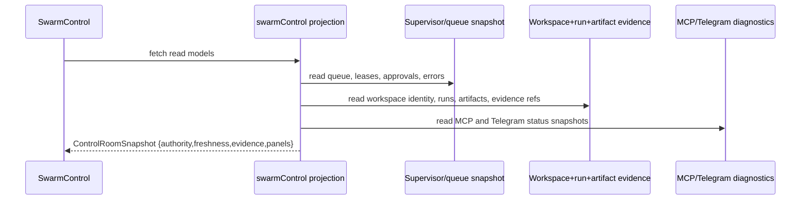

# Design: SW-5.1 Control Room UI Redesign

## Technical Approach

Replace `SwarmControl` mixed telemetry page with a snapshot-first Workspace Control Room. The page composes one read-only `ControlRoomSnapshot` from frozen durable sources already owned by SW-2.1/SW-2.2/SW-3.1/SW-4.1/SW-6.1/SW-7.1: supervisor queue/lease state, workspace identity, run/artifact evidence, approval gates, Telegram adapter status, and MCP diagnostics. UI keeps only presentation state (`filters`, `selection`, `expansion`, `layout`). SSE, `agent_registry`, `devhub_agent_runs`, and `localStorage` stop participating in authoritative status synthesis.

## Architecture Decisions

| Decision                                                                                    | Alternatives considered                                                 | Rationale                                                                                                                                     |
| ------------------------------------------------------------------------------------------- | ----------------------------------------------------------------------- | --------------------------------------------------------------------------------------------------------------------------------------------- |
| Compose one `ControlRoomSnapshot` projection in UI operations layer                         | Keep per-panel fetch/inference inside `SwarmControl.jsx`                | Current page mixes sessions, tasks, health, config, and local mirrors; one projection gives one truth shape for UI/Telegram/MCP presentation  |
| Durable snapshot drives core panels; live/runtime feeds become hints only                   | Continue using SSE/session stream and `agent_registry` for active truth | Frozen contracts already define durable ownership; runtime mirrors drift and must not override supervisor/workspace/run evidence              |
| Separate core state from diagnostic overlay                                                 | Mix Telegram/MCP/process details into primary agent/task cards          | Queue/lease/workspace/approval truth is primary; MCP and Telegram are adapter/diagnostic context and should not dilute control-room authority |
| Remove mutating control affordances from main surface except human approvals and safe opens | Preserve launch/kill/release/cancel controls as first-class actions     | SW-5.1 is read-model UI, not orchestration; dangerous or state-mutating verbs violate the frozen boundary                                     |

## Data Flow



## Panel Structure

1. **Control header** — workspace/project identity, supervisor state, `active/max`, queue depth, snapshot freshness, evidence coverage.
2. **Agents & claims** — claimed task, lease expiry, supervisor state, assigned workspace/run ids.
3. **Workspaces** — workspace status, branch identity, dirty/degraded/orphan markers, latest evidence ref.
4. **Runs & artifacts** — latest run outcome, artifact timeline, diff/test/QA evidence links.
5. **Approvals & errors** — pending/approved/rejected gates, blocked reasons, explicit missing-evidence errors.
6. **Diagnostic overlay** — Telegram adapter state, MCP doctor/list-tools/smoke, process/session-stream diagnostics.

## State Ownership Boundaries

| State                                                             | Owner                                       |
| ----------------------------------------------------------------- | ------------------------------------------- |
| Queue, lease, approval, supervisor status                         | SW-4.1 durable snapshot                     |
| Workspace identity and lifecycle                                  | SW-2.1 / SW-2.2 durable workspace records   |
| Run/artifact evidence and chronology                              | SW-3.1 durable ledger                       |
| Telegram and MCP status semantics                                 | SW-6.1 / SW-7.1 shared diagnostic snapshots |
| Filters, expanded rows, selected task/run/workspace, layout prefs | UI-only ephemeral state                     |
| SSE traces, `agent_registry`, `devhub_agent_runs`                 | Compatibility hints only; never canonical   |

## Freshness / Evidence Rules

- Every summary card MUST show `authority`, freshness, and at least one evidence ref/count when available.
- `healthy/current` is valid only when upstream snapshot says so; UI MUST NOT infer it from absence of errors.
- Missing evidence with a known record => `degraded`.
- Missing upstream snapshot => `unavailable` with named dependency (`supervisor`, `workspace`, `mcp`, `telegram`, etc.).
- Legacy live hints MAY render as “live activity” secondary labels, visually separated from canonical status.

## Degraded / Recovery Presentation

- **Stale**: keep last durable payload, yellow stale badge, show observed timestamp.
- **Unavailable**: empty/error panel with missing source and no replacement health inference.
- **Recovery/orphan/conflict**: render supervisor/workspace reason class directly, plus latest evidence ref.
- **Approval pending**: badge on affected task/workspace/run row; risky outcome shown as unapplied.

## File Changes

| File                                     | Action | Description                                                                                            |
| ---------------------------------------- | ------ | ------------------------------------------------------------------------------------------------------ |
| `src/views/SwarmControl.jsx`             | Modify | Replace mixed live-control layout with Control Room shell and read-only panels                         |
| `src/lib/operations/swarmControl.js`     | Modify | Add `composeControlRoomSnapshot` and panel selectors from shared snapshots                             |
| `src/lib/operations/contracts.js`        | Modify | Define control-room authority/freshness/evidence contracts                                             |
| `src/components/SwarmQueuePanel.jsx`     | Modify | Consume queue/lease snapshot slice; remove standalone authoritative fetch path from Control Room usage |
| `src/components/chat/MCPStatusPanel.jsx` | Modify | Render SW-7 diagnostic overlay semantics instead of inferred server list summary                       |
| `src/lib/agentRegistryLive.js`           | Modify | Demote to compatibility mapper for optional live hints/open-terminal links only                        |
| `src/components/control-room/*.jsx`      | Create | Split header, agents, workspaces, evidence, approvals, diagnostics into focused panels                 |

## Interfaces / Contracts

```ts
type ControlRoomSnapshot = {
  header: {
    workspace_label: string;
    supervisor_state: string;
    active: number;
    max: number;
    queue_depth: number;
    authority: string;
    freshness: string;
    evidence_refs: string[];
  };
  agents: Array<{
    agent_id: string;
    task_id?: string;
    lease_expires_at?: string;
    workspace_id?: string;
    run_id?: string;
    supervisor_state: string;
    authority: string;
    freshness: string;
    evidence_ref?: string;
  }>;
  diagnostics: {
    telegram?: SnapshotStatus;
    mcp?: SnapshotStatus;
    process?: SnapshotStatus;
    session_stream?: SnapshotStatus;
  };
};
```

## Testing Strategy

| Layer       | What to Test                                                                       | Approach                                     |
| ----------- | ---------------------------------------------------------------------------------- | -------------------------------------------- |
| Unit        | Snapshot composition, authority precedence, degraded mapping, legacy hint demotion | Jest on `src/lib/operations/swarmControl.js` |
| Integration | `SwarmControl` panel rendering from shared snapshots only                          | React tests with mocked read-model payloads  |
| E2E         | Control Room, Telegram, and MCP show consistent statuses/evidence                  | Playwright parity checks                     |

## Migration / Rollout

No migration required. Roll out by introducing `ControlRoomSnapshot`, switching panels to it, then removing legacy status synthesis from authoritative paths.

## Open Questions

- [ ] Should session traces remain a separate optional “live activity” drawer, or move fully out of Control Room once durable artifact timelines cover operator needs?
