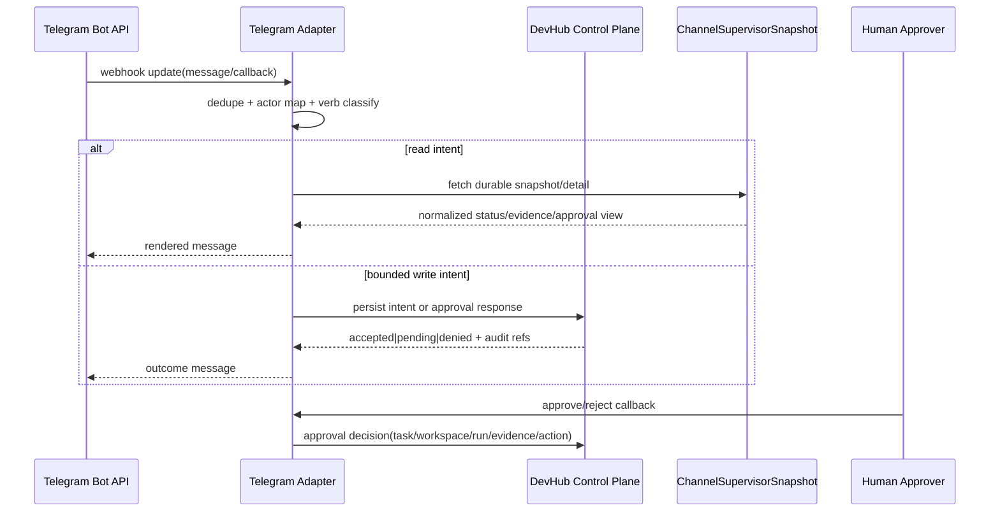

# Design: SW-6.1 Telegram External Adapter Plan

## Technical Approach

Telegram becomes a thin adapter over durable DevHub control-plane state. Inbound updates are normalized into intent envelopes, identity-mapped to DevHub actors, checked against an allowlisted verb set, and persisted as auditable requests or approval decisions. Outbound messages render only from the shared supervisor/channel snapshot defined for SW-5.1 UI and SW-7.1 MCP, never from Telegram-local session/runtime mirrors or `devhub_agent_runs`.

## Architecture Decisions

| Decision       | Choice                                                                                             | Alternatives considered                            | Rationale                                                                                            |
| -------------- | -------------------------------------------------------------------------------------------------- | -------------------------------------------------- | ---------------------------------------------------------------------------------------------------- |
| Read model     | Shared durable `ChannelSupervisorSnapshot` for Telegram/UI/MCP                                     | Separate Telegram status payloads                  | Prevents drift; current `/api/telegram/status` derives busy state from `agent_logs` and local tables |
| Write boundary | Telegram writes only adapter-bounded records: intents, approvals, delivery receipts, subscriptions | Direct task/lease/run/workspace mutations          | Preserves SW-2.1/SW-3.1/SW-2.2/SW-4.1 control-plane contract                                         |
| Legacy reuse   | Reuse `telegram_session_map`, message persistence, and formatting seams only                       | Revive LLM bridge/tool orchestration               | `docs/13_Telegram_LLM_Bridge.md` and review docs show stale, unsafe orchestration debt               |
| Approval model | Risky intents create pending approval checkpoints keyed by task/workspace/run/evidence/action      | Implicit approval from chat role or prior progress | Human-risk gate stays explicit, auditable, and replay-safe                                           |

## Data Flow



Replay rules: inbound idempotency key = `telegram:update_id + actor_id + normalized_target + normalized_action`; callback approvals also include approval checkpoint id. Replays return the prior durable outcome. Delivery failures only update notification/delivery state.

## File Changes

| File                                                                                      | Action | Description                                                                                                             |
| ----------------------------------------------------------------------------------------- | ------ | ----------------------------------------------------------------------------------------------------------------------- |
| `openspec/changes/sw-6-1-telegram-external-adapter-plan/design.md`                        | Create | SW-6.1 technical design                                                                                                 |
| `src/lib/db/localDb.js`                                                                   | Modify | Add durable adapter tables/projections for intents, approvals, actor mapping, delivery state, and shared snapshot reads |
| `devhub-mcp/server.js`                                                                    | Modify | Expose bounded adapter-facing read/write helpers without git/worktree/filesystem verbs                                  |
| `src/app/api/telegram/status/route.js`                                                    | Modify | Stop deriving Telegram-local busy truth; serve shared durable snapshot only                                             |
| `src/views/TelegramMonitor.jsx` / `src/views/telegramMonitorRealtime.js`                  | Modify | Consume shared snapshot/degraded states instead of local realtime heuristics                                            |
| `telegram-bot/services/session-bridge.js` / `telegram-bot/services/telegram-persister.js` | Modify | Keep chat/session persistence, add intent/audit correlation seams, quarantine orchestration logic                       |
| `docs/13_Telegram_LLM_Bridge.md`                                                          | Modify | Mark stale orchestration/LLM-bridge model as deprecated and point to external-adapter boundary                          |
| `docs/review/MODULO-06-telegram-bot.md`                                                   | Modify | Link review findings to quarantined legacy surfaces and required retirement follow-up                                   |

## Interfaces / Contracts

```ts
type TelegramIntentEnvelope = {
  idempotency_key: string;
  actor_id: string;
  chat_id: string;
  message_id: string;
  action:
    | 'status.query'
    | 'task.detail'
    | 'workspace.detail'
    | 'approval.respond'
    | 'notification.retry'
    | 'subscription.set';
  target_ref?: { task_id?: string; workspace_id?: string; run_id?: string; approval_id?: string };
  payload?: { decision?: 'approve' | 'reject'; subscription?: 'mute' | 'unmute' };
};

type ChannelSupervisorSnapshot = {
  task_id: string;
  supervisor_state: string;
  workspace_id?: string;
  run_id?: string;
  approval?: { id: string; status: 'pending' | 'approved' | 'rejected'; expires_at?: string };
  evidence_ref?: string;
  delivery?: { last_status: 'sent' | 'failed' | 'retry_pending'; last_attempt_at?: string };
  degraded: boolean;
};
```

## Testing Strategy

| Layer       | What to Test                                                                                          | Approach                             |
| ----------- | ----------------------------------------------------------------------------------------------------- | ------------------------------------ |
| Unit        | Verb allowlist, actor mapping, idempotency keying, stale approval rejection, renderer fallbacks       | Jest service tests                   |
| Integration | Webhook→intent persistence, approval checkpoint dedupe, snapshot assembly, delivery retry bookkeeping | Jest with SQLite fixtures            |
| E2E         | Telegram/UI/MCP render same snapshot and deny forbidden verbs                                         | Playwright + adapter contract suites |

## Migration / Rollout

No migration in design phase. Rollout should start read-only: shared snapshot first, then bounded intents, then approval callbacks. Legacy bridge/tool-calling code stays quarantined behind explicit deprecation docs until removed.

## Open Questions

- [ ] Should actor allowlist mapping live in dedicated Telegram adapter tables or reuse a generalized channel-identity registry for future non-Telegram adapters?
