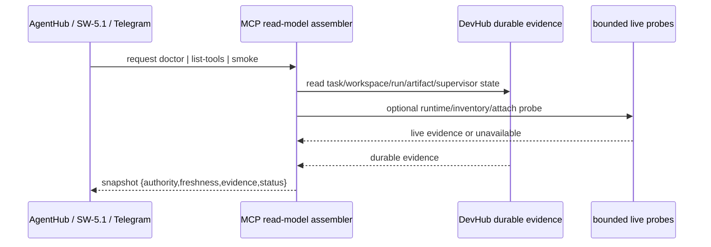

# Design: SW-7.1 MCP Control Center Verifiable

## Technical Approach

Implement SW-7.1 as one shared diagnostic read model, not a new control plane. `doctor`, `list-tools`, and `smoke` will be serialized from durable DevHub evidence first (`tasks`, `agent_workspaces`, `agent_runs`, `agent_artifacts`, supervisor state), then optionally enriched by bounded live MCP probes. Existing `/api/agenthub/mcp/status` becomes compatibility debt wrapper over the same read model so AgentHub, SW-5.1, and Telegram read one truth shape.

## Architecture Decisions

| Decision                                            | Alternatives considered                      | Rationale                                                                                                                                      |
| --------------------------------------------------- | -------------------------------------------- | ---------------------------------------------------------------------------------------------------------------------------------------------- |
| Shared `McpControlCenterSnapshot` read model        | Keep `/mcp/status` inferred-only payload     | Current route hardcodes `KNOWN_MCP_SERVERS` and returns inferred/stale data; SW-7.1 needs verifiable authority/evidence without parallel truth |
| Durable-first, probe-second assembly                | Live MCP probe as primary truth              | OpenCode may not expose inventory; durable DevHub contracts from SW-2.1/SW-3.1/SW-4.1 are frozen truth and probes may only enrich/degrade      |
| Classify unsafe executor verbs as non-control-plane | Surface all discovered tools as safe actions | Frozen boundary forbids Git/worktree/branch/merge/filesystem as general MCP control-plane actions                                              |
| GTK/VTE attach reported as optional evidence        | Make attach mandatory for smoke health       | Roadmap and spec freeze attach as observability-only, not runtime requirement                                                                  |

## Data Flow



`doctor` returns probe cards by class: `environment`, `runtime`, `permissions`, `database`, `inventory`, `attach`.

`list-tools` merges:

- durable DevHub MCP catalog from `devhub-mcp/server.js`
- optional live executor inventory
- configured-only fallback from legacy route/config

`smoke` verifies read-path reachability only: serializer, durable evidence joins, bounded connectivity, optional attach visibility.

## File Changes

| File                                              | Action | Description                                                                                       |
| ------------------------------------------------- | ------ | ------------------------------------------------------------------------------------------------- |
| `src/app/api/agenthub/mcp/status/route.js`        | Modify | Replace inferred-only payload with compatibility wrapper over shared snapshot                     |
| `src/lib/operations/health.js`                    | Modify | Consume MCP snapshot authority/freshness/evidence instead of note-based inference                 |
| `src/app/api/agenthub/operations/health/route.js` | Modify | Read MCP diagnostic summary from shared serializer                                                |
| `src/components/chat/MCPStatusPanel.jsx`          | Modify | Render doctor/list-tools/smoke states, authority badges, degraded reasons, safe-action boundaries |
| `src/lib/operations/contracts.js`                 | Modify | Extend health/diagnostic contracts with evidence-bearing MCP snapshot types                       |
| `src/lib/mcp/control-center.js`                   | Create | Assemble durable-first doctor/list-tools/smoke snapshot and compatibility response                |
| `tests/unit/mcp-control-center.test.js`           | Create | Snapshot assembly, degraded cases, unsafe tool classification                                     |
| `tests/unit/operations-health.test.js`            | Modify | Validate new MCP source mapping                                                                   |
| `tests/unit/mcp-status-contract.test.js`          | Modify | Preserve legacy route compatibility while adding authority/evidence fields                        |

## Interfaces / Contracts

```js
type EvidenceRef = { kind: string, ref: string | null, authority: 'durable'|'live'|'configured' }
type Probe = {
  key: 'environment'|'runtime'|'permissions'|'database'|'inventory'|'attach',
  status: 'healthy'|'degraded'|'unavailable',
  authority: 'durable'|'live'|'configured',
  freshness: 'current'|'stale'|'unknown',
  reason: string,
  evidence: EvidenceRef[]
}
type McpControlCenterSnapshot = {
  observed_at: string,
  doctor: { probes: Probe[] },
  list_tools: { tools: Array<{ name: string, authority: string, safe_action: boolean, evidence: EvidenceRef[] }> },
  smoke: { status: 'pass'|'fail'|'degraded', checks: Probe[] }
}
```

## Testing Strategy

| Layer       | What to Test                                                                            | Approach                                                |
| ----------- | --------------------------------------------------------------------------------------- | ------------------------------------------------------- |
| Unit        | Snapshot assembly, authority precedence, degraded fallback, non-control-plane filtering | Jest on `src/lib/mcp/control-center.js`                 |
| Integration | `/api/agenthub/mcp/status` compatibility and health-route consumption                   | Route tests with mocked durable evidence + mocked fetch |
| E2E         | AgentHub/Control Room render same snapshot semantics                                    | Playwright parity tests for UI surfaces                 |

## Migration / Rollout

No migration required. Roll out behind compatibility serialization: legacy `servers[]` remains until UI consumers switch fully to `doctor` / `list-tools` / `smoke` fields.

## Open Questions

- [ ] Should the durable DevHub MCP tool catalog be exported from `devhub-mcp/server.js` or mirrored into a read-only manifest for UI-safe reuse?
- [ ] Which exact SW-4.1 supervisor snapshot selector should own MCP evidence joins versus exposing a dedicated `swarm-observability` adapter?
