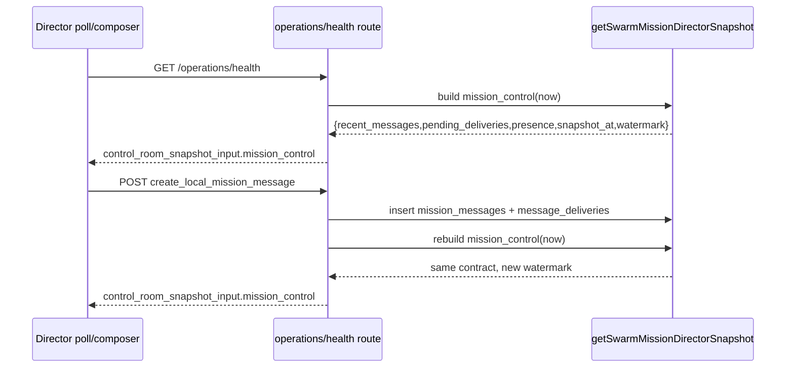

# Design: SW-8.2C Director Inbox Loop MVP

## Technical Approach

Keep `mission_control` durable-first and make `getSwarmMissionDirectorSnapshot()` the only inbox selector. This slice adds bounded `recent_messages`, bounded `pending_deliveries`, TTL-evaluated `presence`, and additive `snapshot_at` + `watermark` fields. `GET /api/agenthub/operations/health` and composer `POST` both return that same `mission_control` shape; `swarmControl` only normalizes/pass-throughs it. No new tables, no SSE, no binding/session resolution.

## Architecture Decisions

| Decision            | Choice                                                                                                  | Alternatives considered                     | Rationale                                                                         |
| ------------------- | ------------------------------------------------------------------------------------------------------- | ------------------------------------------- | --------------------------------------------------------------------------------- |
| Selector owner      | Compute bounds, TTL grouping, and watermark in `src/lib/db/localDb.js`                                  | Build parts in route/UI                     | Durable selector stays canonical and testable                                     |
| Watermark semantics | `watermark = sha1(canonical durable material)`; exclude `snapshot_at` and TTL-derived `effective_state` | Use request time; use latest timestamp only | No-op polls keep same watermark while presence can reclassify at a new clock tick |
| Compatibility       | Return `recent_messages` plus temporary `latest_message` alias                                          | Break old fixtures immediately              | Smallest safe slice; existing consumers keep working while tests migrate          |
| Scope guard         | Do not call session/binding/live-stream seams from inbox projection                                     | Reuse binding/session helpers               | Prevents bleed into SW-8.2D / SW-8.3A / SW-8.4A                                   |

## Data Flow



## File Changes

| File                                                         | Action | Description                                                                        |
| ------------------------------------------------------------ | ------ | ---------------------------------------------------------------------------------- |
| `openspec/changes/sw-8-2c-director-inbox-loop-mvp/design.md` | Create | SW-8.2C technical design                                                           |
| `src/lib/db/localDb.js`                                      | Modify | Add bounded inbox queries, `snapshot_at`, durable `watermark`, compatibility alias |
| `src/lib/db/localDb.test.js`                                 | Modify | Lock ordering, bounds, watermark stability, TTL/no-op behavior                     |
| `src/app/api/agenthub/operations/health/route.js`            | Modify | Reuse one `mission_control` response helper for GET and POST                       |
| `tests/agenthub/api/operations-health.test.js`               | Modify | Assert GET/POST semantic parity on `mission_control`                               |
| `src/lib/operations/swarmControl.js`                         | Modify | Normalize `snapshot_at`/`watermark`; keep `latest_message` fallback                |
| `src/lib/operations/__tests__/swarmControl.test.js`          | Modify | Verify additive fields and compatibility normalization                             |

## Interfaces / Contracts

```ts
type MissionControlSnapshot = {
  mission: Mission | null;
  participants: MissionParticipant[];
  recent_messages: MissionMessage[]; // newest-first, max 20
  latest_message: MissionMessage | null; // compatibility alias only
  pending_deliveries: MissionDelivery[]; // pending|retry_pending, max 20
  presence: { active: PresenceRow[]; stale: PresenceRow[]; offline: PresenceRow[] };
  snapshot_at: string; // request clock
  watermark: string; // sha1 of canonical durable material
};
```

`watermark` material is canonical JSON built from durable rows already present in `mission_control`: mission core fields, participant rows, bounded message rows, bounded pending delivery rows, and raw presence rows ordered deterministically. Include durable identifiers plus persisted timestamps/status fields; exclude `snapshot_at`, `effective_state`, and any runtime/log/session fields. Result: watermark changes only when a durable row in the returned snapshot changes.

Pending delivery ordering uses latest durable activity (`max(updated_at,last_attempt_at) DESC, rowid DESC`). Presence grouping still evaluates TTL at `snapshot_at` with current 120s rule.

## Testing Strategy

| Layer       | What to Test                                                                                                                                                        | Approach                                            |
| ----------- | ------------------------------------------------------------------------------------------------------------------------------------------------------------------- | --------------------------------------------------- |
| Unit        | `recent_messages` and `pending_deliveries` order/limit 20; watermark stable across no-op polls; watermark changes on participant/message/delivery/presence mutation | `src/lib/db/localDb.test.js` with in-memory SQLite  |
| Integration | GET health and composer POST return same `mission_control` fields and compatibility alias                                                                           | `tests/agenthub/api/operations-health.test.js`      |
| UI contract | `extractMissionControlPayload()` accepts new shape and legacy `latest_message` fixtures; selectors return null defaults for `snapshot_at`/`watermark`               | `src/lib/operations/__tests__/swarmControl.test.js` |

## Migration / Rollout

No migration required. This is additive projection work over existing durable rows.

## Open Questions

- [ ] None.
