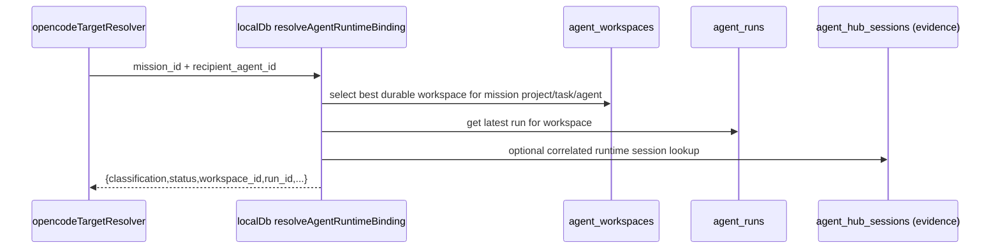

# Design: SW-8.2D Binding Resolver MVP

## Technical Approach

Keep SW-8.2D as one read-side selector in `localDb`, then adapt the existing mission-specific seam to it. Canonical ownership comes only from selected `agent_workspaces` + latest `agent_runs`; runtime/session rows are evidence used only to refine `bound` into `stale`, never to create ownership. No route, UI, PTY/VTE, or lifecycle work.

## Architecture Decisions

| Decision               | Choice                                                                                                 | Alternatives considered                                              | Rationale                                                                                |
| ---------------------- | ------------------------------------------------------------------------------------------------------ | -------------------------------------------------------------------- | ---------------------------------------------------------------------------------------- | ------------------------------------------------------------------------------------------- |
| Canonical owner        | New generic resolver in `src/lib/db/localDb.js` over workspace + latest run                            | New binding table; runtime-owned lookup                              | Existing durable model already expresses ownership; new table would duplicate truth      |
| Drift containment      | Keep `run_id_or_session_id` as echoed correlation metadata only                                        | Promote it to binding key                                            | Field is overloaded today; design must constrain it, not deepen ambiguity                |
| Consumer compatibility | Keep legacy `status: bound                                                                             | unbound`for send-path callers, add additive`classification`+`run_id` | Break callers to use classification immediately                                          | Smallest safe slice; `teamTell` keeps current behavior while richer state becomes available |
| Runtime evidence scope | MVP checks only `agent_hub_sessions` from `localDb`; other runtime stores stay out-of-scope references | Pull `sessionStore`, `ttyServer`, native VTE into resolver           | Avoid lifecycle creep and cross-layer coupling while still fixing current over-trust bug |

## Data Flow



## File Changes

| File                                                      | Action | Description                                                                                                        |
| --------------------------------------------------------- | ------ | ------------------------------------------------------------------------------------------------------------------ |
| `openspec/changes/sw-8-2d-binding-resolver-mvp/design.md` | Create | Technical design for the MVP slice                                                                                 |
| `src/lib/db/localDb.js`                                   | Modify | Add generic durable-first resolver and refactor `getVerifiedMissionRecipientBinding()` into a thin mission adapter |
| `src/lib/db/localDb.test.js`                              | Modify | Replace session-owned expectations with durable-first `bound/stale/missing/orphaned` fixtures                      |
| `src/lib/swarm/opencodeTargetResolver.js`                 | Modify | Preserve legacy `status`, pass through additive `classification` and `run_id`                                      |
| `tests/unit/swarm/opencodeTargetResolver.test.js`         | Modify | Lock additive compatibility and prevent state collapse                                                             |

## Interfaces / Contracts

```js
resolveAgentRuntimeBinding(db, {
  project_id,
  agent_id,
  preferred_task_id = null,
  runtime_session_id = null,
}) => {
  classification: 'bound' | 'stale' | 'missing' | 'orphaned',
  status: 'bound' | 'unbound', // compatibility only
  reason: 'binding_found' | 'binding_stale' | 'binding_missing' | 'binding_orphaned',
  agent_id,
  workspace_id: string | null,
  run_id: string | null,
  run_id_or_session_id: string | null,
  session_id: string | null,
  opencode_session_id: string | null,
  agent_model: string | null,
  cwd: string | null,
}
```

Rules:

- `bound`: eligible workspace exists, latest run exists, workspace not orphaned, runtime evidence either matches or is not required for ownership.
- `stale`: durable workspace + run exist, but correlated runtime evidence is absent/inactive/mismatched.
- `missing`: no eligible workspace or no latest run for the selected workspace.
- `orphaned`: workspace status is `orphaned` or supervisor durable state reports `orphaned_workspace` / `orphaned_run`.

`run_id_or_session_id` is never used as ownership key. It is only echoed and MAY be used to look up runtime evidence.

## Testing Strategy

| Layer           | What to Test                                                                                  | Approach                                                                     |
| --------------- | --------------------------------------------------------------------------------------------- | ---------------------------------------------------------------------------- |
| Unit            | Resolver classification matrix: bound, stale, missing, orphaned                               | `src/lib/db/localDb.test.js` with in-memory SQLite and durable fixtures only |
| Unit            | Runtime evidence cannot create `bound`; `run_id_or_session_id` remains correlation-only       | `src/lib/db/localDb.test.js` negative fixtures                               |
| Unit            | `opencodeTargetResolver` keeps legacy `status` while preserving `classification` and `run_id` | `tests/unit/swarm/opencodeTargetResolver.test.js`                            |
| Integration/E2E | None for MVP                                                                                  | Not needed if seam remains local and additive                                |

## Migration / Rollout

No migration required. No new durable table. Existing callers keep binary `status`; newer callers may consume `classification`.

## Open Questions

- [ ] None.
