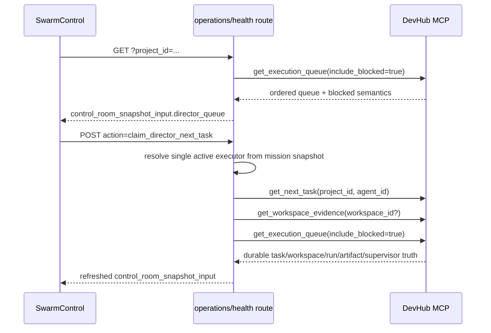

# Design: SW-8.5A Director Queue Handoff MVP

## Technical Approach

Keep SW-8.5A as a projection seam, not an orchestration rewrite. `src/app/api/agenthub/operations/health/route.js` becomes the single server facade for Director queue read + claim. It will read durable order from `get_execution_queue`, trigger one safe handoff through `get_next_task`, then immediately re-read durable queue/evidence and return one refreshed `control_room_snapshot_input`. Client code stays thin: `SwarmControl.jsx` renders a new bounded queue panel from normalized snapshot data.

## Architecture Decisions

| Decision             | Options                                                  | Choice                                                | Rationale                                                                                                                   |
| -------------------- | -------------------------------------------------------- | ----------------------------------------------------- | --------------------------------------------------------------------------------------------------------------------------- |
| Queue read authority | Client calls MCP directly; health route facade           | Health route facade                                   | Keeps one read model boundary for Control Room and avoids duplicating MCP parsing in the client.                            |
| Claim seam           | `claim_next_task`; `get_next_task`; new dispatcher       | Prefer `get_next_task`                                | It already performs safe claim + compatibility return. No new dispatch engine.                                              |
| Handoff recipient    | Free-form assignee picker; derive single active executor | Derive single active non-director mission participant | Smallest safe handoff. Prevents scope drift into dispatch UX. Disable claim when zero or multiple eligible executors exist. |

## Data Flow



Reflection rule: UI never invents optimistic task/workspace/run state. It renders only the refreshed route payload. Queue order comes only from `get_execution_queue`; claim result comes only from `get_next_task` + `get_workspace_evidence`.

## File Changes

| File                                                           | Action | Description                                                                                                                         |
| -------------------------------------------------------------- | ------ | ----------------------------------------------------------------------------------------------------------------------------------- |
| `src/lib/devhub/mcpClient.js`                                  | Create | Small server-only helper to call `/mcp/devhub/call` with `toolName`/`args`.                                                         |
| `src/app/api/agenthub/operations/health/route.js`              | Modify | Add project-scoped queue read, `claim_director_next_task` POST action, single-executor validation, and refreshed snapshot assembly. |
| `src/lib/operations/swarmControl.js`                           | Modify | Normalize/select `director_queue` slice and handoff result using existing authority/freshness helpers.                              |
| `src/components/control-room/DirectorQueuePanel.jsx`           | Create | Narrow queue UI: ordered items, blocked states, strict-order copy, one handoff button, durable result card.                         |
| `src/views/SwarmControl.jsx`                                   | Modify | Fetch health with `project_id`, wire claim submit to health POST, render `DirectorQueuePanel` under header.                         |
| `src/lib/operations/__tests__/fixtures/controlRoomSnapshot.js` | Modify | Add queue/handoff fixture data.                                                                                                     |
| `src/lib/operations/__tests__/swarmControl.test.js`            | Modify | Lock normalization/selectors for queue + handoff.                                                                                   |
| `tests/agenthub/api/operations-health.test.js`                 | Modify | Lock GET projection, POST claim refresh, blocked/empty/no-recipient cases.                                                          |
| `src/views/__tests__/SwarmControl.test.jsx`                    | Modify | Lock strict-order copy, disabled handoff states, and refreshed durable result rendering.                                            |

## Interfaces / Contracts

```js
director_queue: {
  authority: 'authoritative',
  freshness: 'current' | 'degraded',
  items: [{ id, title, status, position, priority, blocked_reason, supervisor }],
  handoff: {
    status: 'idle' | 'claimed' | 'empty' | 'blocked' | 'disabled' | 'error',
    recipient_agent_id,
    message,
    task,
    workspace,
    run,
    artifact,
    supervisor,
  }
}
```

`director_queue.handoff` is projection state only. Durable truth remains tasks + `agent_workspaces` + `agent_runs` + `supervisor_snapshots`.

## Testing Strategy

| Layer          | What to Test                                                      | Approach                                                                                                |
| -------------- | ----------------------------------------------------------------- | ------------------------------------------------------------------------------------------------------- |
| Unit           | Queue/handoff normalization                                       | Jest on `swarmControl.js` selectors with fixture-only inputs.                                           |
| Integration    | Route reads queue truth and refreshes claim result from MCP tools | Mock MCP helper in `operations-health.test.js`; assert no client-side re-ranking or optimistic records. |
| View           | Strict-order copy and disabled/enabled handoff UI                 | `SwarmControl.test.jsx` with Testing Library-style DOM harness.                                         |
| MCP regression | None new                                                          | Reuse existing `devhub-mcp` queue/claim tests; no tool changes in this slice.                           |

## Migration / Rollout

No migration required.

## Guardrails Against Scope Creep

- No new MCP tools, queue scorer, schema, lease logic, or orphan recovery logic.
- No prompt composer, approvals UI, live evidence stream, Browser/GTK, or terminal controls.
- No free-form assignee picker; exactly one eligible executor or claim stays disabled.
- No optimistic local queue/task/workspace records.

## Open Questions

- [ ] None. Existing seams are sufficient for MVP.
