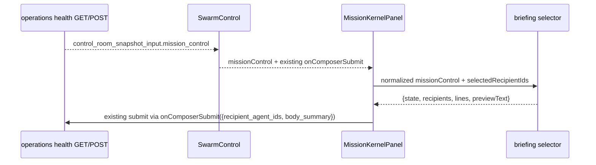

# Design: SW-8.6A Director Briefing Preview MVP

## Technical Approach

Keep this slice UI-only and selector-driven. Add one pure helper in `src/lib/operations/swarmControl.js` that derives a read-only briefing preview from normalized `mission_control` plus a selected participant-id set. Render that preview inside the existing composer area in `MissionKernelPanel.jsx`. Keep `persistMissionControlComposerMessage()`, `/api/agenthub/operations/health`, queue semantics, and durable message payloads unchanged.

## Architecture Decisions

| Decision              | Options                                          | Choice                                                      | Rationale                                                         |
| --------------------- | ------------------------------------------------ | ----------------------------------------------------------- | ----------------------------------------------------------------- |
| Preview authority     | New backend field; derive in UI helper           | Derive in pure UI helper from normalized `mission_control`  | Prevents schema/backend creep and keeps one durable truth.        |
| Helper input          | Full snapshot; normalized `mission_control` only | Normalized `mission_control` + selected ids                 | Matches scope: pure briefing derivation over mission kernel only. |
| Selection determinism | Trust click order; canonicalize selection        | Canonicalize against participant order in `mission_control` | Same snapshot + same selected set must yield identical preview.   |
| View placement        | New panel/route; existing composer seam          | Existing `MissionKernelPanel` composer seam                 | Smallest reversible MVP; submit path already exists here.         |

## Data Flow



Preview is advisory only. It is never posted back, stored locally as truth, or merged into durable mission messages.

## File Changes

| File                                                               | Action            | Description                                                                                                                                                     |
| ------------------------------------------------------------------ | ----------------- | --------------------------------------------------------------------------------------------------------------------------------------------------------------- |
| `openspec/changes/sw-8-6a-director-briefing-preview-mvp/design.md` | Create            | Technical design artifact for this slice.                                                                                                                       |
| `src/lib/operations/swarmControl.js`                               | Modify            | Add pure `selectDirectorBriefingPreview(missionControl, recipientAgentIds)` helper and tiny internal utilities only. No route/persistence edits.                |
| `src/components/control-room/MissionKernelPanel.jsx`               | Modify            | Track selected recipients locally, call helper, render bounded preview/empty/unavailable state inside current composer section, keep submit contract unchanged. |
| `src/views/SwarmControl.jsx`                                       | No planned change | Current prop seam already passes `missionControl` and `onComposerSubmit`. Only touch if a tiny pass-through is proven necessary during implementation.          |
| `src/lib/operations/__tests__/swarmControl.test.js`                | Modify            | Add deterministic helper coverage, canonical selection ordering, safe empty/unavailable states, and out-of-scope field exclusion assertions.                    |
| `src/views/__tests__/SwarmControl.test.jsx`                        | Modify            | Verify preview render inside existing kernel panel, selection-driven updates, empty/unavailable states, and unchanged submit payload.                           |

## Interfaces / Contracts

```js
export function selectDirectorBriefingPreview(missionControl = null, recipientAgentIds = []) {
  return {
    state: 'empty' | 'unavailable' | 'ready',
    recipientIds: string[],
    lines: string[],
    previewText: string,
  };
}
```

Contract rules:

- normalize/canonicalize only from mission fields already present (`mission`, `participants`, `recent_messages`, `latest_message`, `pending_deliveries`, `presence`, `snapshot_at`, `watermark`);
- ignore unknown/ineligible ids instead of fabricating recipients;
- never read `director_queue`, approvals, diagnostics, artifacts, browser, or GTK state;
- never alter `{ recipient_agent_ids, body_summary }` submit payload.

## Testing Strategy

| Layer            | What to Test                                                                                                           | Approach                                                                                                                                                           |
| ---------------- | ---------------------------------------------------------------------------------------------------------------------- | ------------------------------------------------------------------------------------------------------------------------------------------------------------------ |
| Unit             | Deterministic preview text for same snapshot/set; participant-order canonicalization; empty and unavailable states     | Extend `src/lib/operations/__tests__/swarmControl.test.js` with fixture-driven selector tests.                                                                     |
| Integration      | Preview appears inside existing `MissionKernelPanel`; selection changes update preview; no preview data sent on submit | Extend `src/views/__tests__/SwarmControl.test.jsx` using existing DOM harness and mocked `fetch`.                                                                  |
| Regression guard | No route/backend/schema/queue mutations                                                                                | Assert existing POST body stays exactly `{ action, recipient_agent_ids, body_summary }`; do not add API test changes because this slice must not touch route code. |
| E2E              | None                                                                                                                   | Not warranted for a read-only derived MVP already covered by selector + view tests.                                                                                |

## Guardrails

- **Schema/backend changes:** do not edit `src/app/api/agenthub/operations/health/route.js`, persistence helpers, or database schema.
- **Queue truth changes:** do not read or derive from `director_queue`; SW-8.5A remains separate authority.
- **Approvals/live evidence spill:** do not include approvals, artifacts, evidence refs, supervisor states, or diagnostics in preview text.
- **SW-8.7A / SW-8.8A overlap:** no prompt automation, no dispatch workflow, no agent recommendation engine, no second composer, no persisted briefing draft.
- **Browser/GTK:** no imports, copy, or behavior tied to browser preview, terminal, VTE, or GTK surfaces.

## Migration / Rollout

No migration required.

## Open Questions

- [ ] None.
