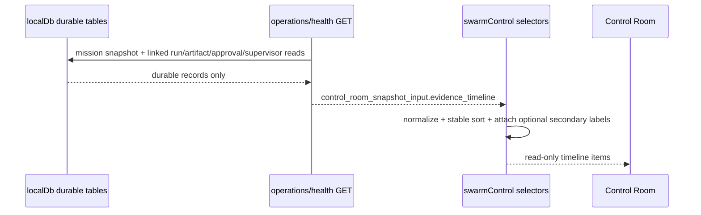

# Design: SW-8.7A Durable Evidence Timeline MVP

## Technical Approach

Keep SW-8.7A as a read-only projection seam inside the existing Control Room. Extend the GET-side snapshot assembly to append one bounded `evidence_timeline` payload derived from already durable mission-linked truth, then normalize/render that slice without adding any POST path, approval action, queue mutation, or schema work. Secondary session evidence stays optional: MVP defines the slot and label, but does not introduce any new runtime-only fetch requirement.

## Architecture Decisions

| Decision             | Options                                                                                    | Choice                                                     | Rationale                                                                                                                     |
| -------------------- | ------------------------------------------------------------------------------------------ | ---------------------------------------------------------- | ----------------------------------------------------------------------------------------------------------------------------- |
| Projection authority | Derive in UI only; derive in GET snapshot + normalize in client                            | GET snapshot assembly + `swarmControl` normalization       | Keeps one canonical read model for Control Room and avoids divergent client-only composition rules.                           |
| Timeline scope       | Whole project durable history; active mission-linked durable history                       | Active mission-linked durable history                      | Matches verified repo reality: current Control Room already centers on active mission snapshot, so this is smallest safe MVP. |
| Secondary evidence   | Query `agent_traces`/session SSE now; omit entirely; allow optional linked annotation only | Optional linked annotation only, clearly labeled secondary | Meets spec without promoting runtime hints to truth or expanding into SW-9.x session/recovery work.                           |
| Ordering             | Per-panel local order; deterministic global comparator                                     | Deterministic comparator in selector                       | Same snapshot must yield same order on every read/test.                                                                       |

## Data Flow



Primary rows come from `mission_messages`, `message_deliveries`, `agent_presence`, mission-linked `agent_runs`, latest linked `agent_artifacts`, `supervisor_snapshots`, and `supervisor_approval_checkpoints`. Sort key: durable event time DESC, then fixed kind rank, then stable durable id. Secondary session evidence, if present in input, is rendered only under its linked primary item and never participates in sort or authority.

## File Changes

| File                                                               | Action | Description                                                                                                                                       |
| ------------------------------------------------------------------ | ------ | ------------------------------------------------------------------------------------------------------------------------------------------------- |
| `openspec/changes/sw-8-7a-durable-evidence-timeline-mvp/design.md` | Create | Technical design artifact.                                                                                                                        |
| `src/app/api/agenthub/operations/health/route.js`                  | Modify | GET-only helper builds bounded `evidence_timeline` from existing durable reads; POST branches stay untouched.                                     |
| `src/lib/operations/swarmControl.js`                               | Modify | Normalize timeline items, apply deterministic comparator, expose `selectControlRoomEvidenceTimeline()`, preserve explicit missing-state metadata. |
| `src/components/control-room/EvidenceTimelinePanel.jsx`            | Create | Minimal read-only panel with primary rows, empty state, and clearly labeled secondary session evidence when present.                              |
| `src/views/SwarmControl.jsx`                                       | Modify | Render panel inside existing Control Room shell with no new actions or local truth.                                                               |
| `src/lib/operations/__tests__/fixtures/controlRoomSnapshot.js`     | Modify | Add bounded timeline fixture coverage, including optional secondary annotation sample.                                                            |
| `src/lib/operations/__tests__/swarmControl.test.js`                | Modify | Lock deterministic order, empty/missing handling, and secondary-non-authoritative behavior.                                                       |
| `tests/agenthub/api/operations-health.test.js`                     | Modify | Lock GET projection shape and prove no POST/claim/approval mutation path is touched.                                                              |
| `src/views/__tests__/SwarmControl.test.jsx`                        | Modify | Verify minimal panel render, empty state, stable ordering, and secondary labeling.                                                                |

## Interfaces / Contracts

```js
evidence_timeline: [{
  item_id,
  kind, // mission_message | delivery | presence | run | artifact | supervisor_snapshot | approval_checkpoint
  occurred_at,
  authority,
  freshness,
  summary,
  linked_ids: { mission_id, task_id, workspace_id, run_id, artifact_id, approval_checkpoint_key },
  evidence_refs: string[],
  missing_source: string | null,
  secondary_session_evidence: [{ source, observed_at, summary, authority: 'secondary' }] // optional
}]
```

## Testing Strategy

| Layer             | What to Test                                                    | Approach                                                                                |
| ----------------- | --------------------------------------------------------------- | --------------------------------------------------------------------------------------- |
| Unit              | Comparator, normalization, empty/missing rows, secondary labels | Extend `swarmControl.test.js` with fixture-driven selector tests.                       |
| Route integration | GET returns bounded durable timeline; no mutation side effects  | Extend `operations-health.test.js`; assert GET-only helpers and untouched POST actions. |
| View              | Panel placement, copy, ordering, empty state, secondary badge   | Extend `SwarmControl.test.jsx` with current DOM harness.                                |
| Regression        | No approval/queue/session-control overlap                       | Assertions that no new buttons/forms/actions appear in the panel.                       |

## Migration / Rollout

No migration required.

## Guardrails Against SW-8.8A and SW-9.x Overlap

- Do **not** add or modify POST actions in `operations/health/route.js`.
- Do **not** add approval buttons, decision controls, queue claim controls, retry controls, or recovery controls to timeline UI.
- Do **not** query or backfill unlinked `agent_traces`/SSE as primary rows.
- Do **not** introduce project-wide replay/history browsing, recovery diagnostics, or orphan handling logic.
- Do **not** change DevHub MCP tools, localDb schema, or durable write paths.

## Open Questions

- [ ] None.
