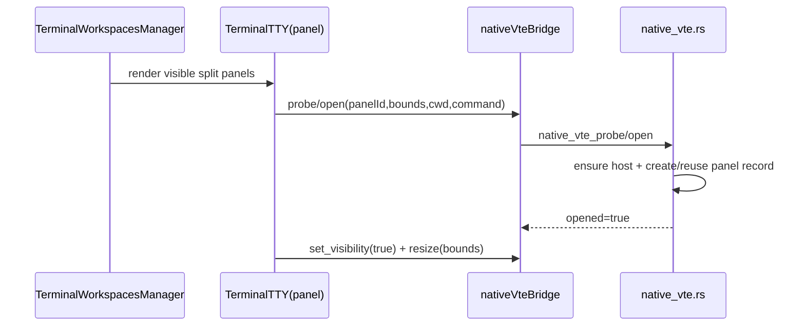
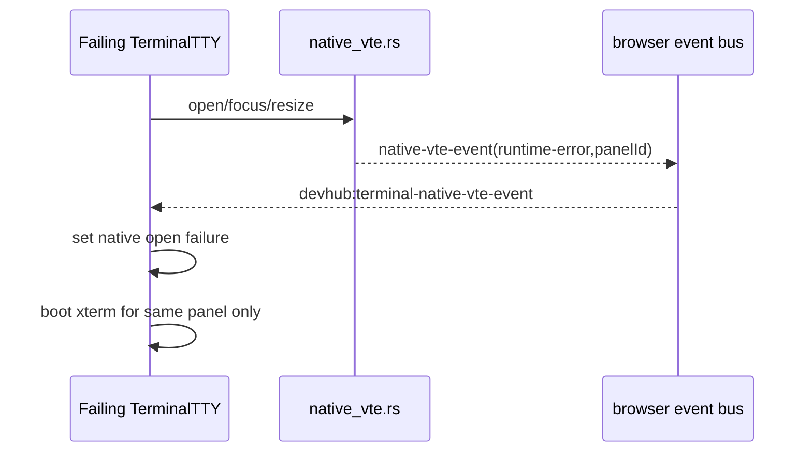

# Design: TERM-04 GTK/VTE Multi-Panel Native Split View

## Technical Approach

TERM-04 stays on TERM-03 seam: one GTK overlay host inside the main Tauri window, no external window, no engine rewrite. Change is registry evolution: from `active_panel_id` + hide-others semantics to a panel registry keyed by `panelId`, with per-panel geometry, visibility, session metadata, and failure state. React keeps one `TerminalTTY` per panel; Rust keeps many live `Terminal` widgets in one `gtk::Layout`.

Evolution path:
1. TERM-03: single active lease, commands rejected for non-active panel.
2. TERM-04: registry stores many live panels; focus becomes separate from existence.
3. Visibility, resize, and close become panel-scoped commands.
4. Failure of one panel downgrades only that panel to `xterm`.

## Architecture Decisions

| Decision | Options | Tradeoff | Choice / Rationale |
|---|---|---|---|
| Native host model | Rewrite windowing vs shared overlay | Rewrite is risky, breaks proposal scope | Keep current `gtk::Overlay` + `gtk::Layout`; lowest-delta path in `src-tauri/src/native_vte.rs`. |
| Registry ownership | Single active lease vs multi-panel map | Single lease cannot support split view | Replace active-only metadata with `panels: HashMap<String, NativePanelRecord>` plus `focused_panel_id`; existence != focus. |
| React lifecycle | Mount/unmount owns native panel vs explicit hide/detach/close | Unmount happens during view churn | JS distinguishes `open`, `set_visibility`, and `close`; unmount hides unless session truly closes. |
| Failure handling | Global fallback vs panel-local fallback | Global fallback blanks sibling native panels | Runtime/probe/open errors stay panel-local; `terminalRendererCapabilities` keeps deterministic per-panel fallback copy. |
| Focus routing | DOM active tab only vs explicit native focus owner | Native widget focus can drift from React active panel | `TerminalWorkspacesManager` owns active panel intent; `TerminalTTY` sends focus only for that panel; Rust updates `focused_panel_id` only. |

## Data Flow





ASCII routing:

`Workspace state -> panelId -> TerminalTTY -> bridge command -> Rust registry[panelId] -> gtk::Terminal`

## File Changes

| File | Action | Description |
|---|---|---|
| `src-tauri/src/native_vte.rs` | Modify | Replace single-active metadata/visibility helpers with multi-panel registry, per-panel bounds, focus owner, isolated close/fallback events. |
| `src/lib/terminal/nativeVteBridge.js` | Modify | Keep same command surface but document/normalize panel-scoped multi-panel semantics. |
| `src/components/TerminalTTY.jsx` | Modify | Remove `isActivePanel` gate from native open eligibility; add visible-panel lifecycle, resize routing, hide-vs-close policy, isolated fallback. |
| `src/components/TerminalWorkspacesManager.jsx` | Modify | Pass true visibility ownership from split layout, close policy, and panel-scoped renderer reset. |
| `src/components/terminal/terminalRendererCapabilities.js` | Modify | Add multi-panel-safe fallback copy/reasons without “active panel only” assumption. |
| `src/components/__tests__/TerminalTTY.test.js` | Modify | RED-GREEN tests for concurrent native panels, hide/close policy, isolated fallback. |
| `src/lib/terminal/__tests__/nativeVteBridge.test.js` | Modify | Bridge contract tests stay panel-scoped. |
| `src-tauri/src/native_vte.rs` tests | Modify | Registry unit tests for focus, visibility, close, geometry, and rollback-safe behavior. |

## Interfaces / Contracts

```rust
struct NativePanelRecord {
  terminal: Terminal,
  child_pid: Option<glib::Pid>,
  session_id: Option<String>,
  bounds: NativeVteBounds,
  visible: bool,
  failed: bool,
}

struct NativeVteStateSnapshot {
  focused_panel_id: Option<String>,
  visible_panel_ids: Vec<String>,
}
```

Commands stay: `open`, `focus`, `resize`, `set_visibility`, `close`. Semantic change: all operate on any registered `panelId`; only `focus` mutates focus owner.

## Testing Strategy

| Layer | What to Test | Approach |
|---|---|---|
| Unit | Registry transitions, geometry, focus owner, close policy | Rust tests first in `native_vte.rs`; no implementation before failing cases. |
| Unit | React renderer phase, visible/native eligibility, fallback isolation | Jest tests in `TerminalTTY.test.js` before code changes. |
| Integration | Split layout with 2+ visible native candidates | Extend `TerminalWorkspacesManager` tests with mocked `TerminalTTY`/bridge state. |
| Integration | Bridge payloads and browser event contract | Extend `nativeVteBridge.test.js`. |
| E2E | Linux/Tauri smoke: two visible native panels, one fails, sibling survives | Tauri/Linux smoke path; keep existing fallback assertions. |

## Migration / Rollout

No data migration required. Roll out behind TERM-04 feature flag / guarded code path inside existing `vte-experimental` flow. Rollback = restore TERM-03 single-active registry helpers, force `set_visibility(false)` on non-focused panels, and keep per-panel requested mode falling back to `xterm`.

## Open Questions

- [ ] Confirm whether right-dock/browser overlays can overlap native bounds; if yes, Rust resize must clip to workspace panel rect only.
