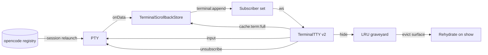

# Design: terminal-engine-v2

## Technical Approach

Move DevHub terminals from a dispose/recover model to waveterm-style contracts on the existing Tauri + Node + xterm.js stack. The sidecar becomes the source of truth for PTY output (ring buffer), termsize, and cwd. The frontend rehydrates a hidden panel from a `SerializeAddon` snapshot plus the buffered delta, instead of keeping a live renderer or running survivor-recovery bursts. A runtime per-panel flag lets v1 and v2 panels coexist until the new path is proven.

## Architecture Decisions

| Decision           | Choice                                   | Alternatives            | Rationale                                                                                                       |
| ------------------ | ---------------------------------------- | ----------------------- | --------------------------------------------------------------------------------------------------------------- |
| Scrollback storage | In-memory circular buffer, 2 MiB/session | File-backed ring buffer | Matches current session lifetime; file-backing deferred until cold-start durable sessions are required.         |
| LRU cap            | Global N=12 mounted xterm surfaces       | Per-workspace cap       | DevHub splits can show many panels; a global visible-surface budget is simpler and defers per-workspace tuning. |
| Feature flag       | Runtime per-panel `terminal-engine-v2`   | Build-time env var      | Enables panel-by-panel strangler migration and a one-line kill-switch without redeploy.                         |
| Hide lifecycle     | Explicit sidecar `unsubscribe` message   | Keep WebSocket open     | Decouples PTY kill from socket close and removes the 1-hour grace timer dependency.                             |
| Context-loss       | DOM fallback, no re-attach               | Auto-reattach WebGL     | Re-attach is the source of black-panel races; rehydration from sidecar makes DOM fallback sufficient.           |

## Data Flow



1. PTY emits bytes; `handleSessionOutput` writes them into `TerminalScrollbackStore` and broadcasts `terminal:append` only to v2 subscribers.
2. v2 panel mounts, fetches `cache:term:full`, temp-resizes to the cached termsize, writes the serialized snapshot, then replays bytes from `ptyOffset` to current.
3. Hide sends `unsubscribe`; the PTY keeps running. The panel may release GPU addons and enter the LRU graveyard.
4. Eviction from the graveyard destroys the xterm surface but keeps the PTY. Re-showing triggers rehydration.
5. Close sends `close`/`exit`; the sidecar kills the PTY and removes the session.

## File Changes

| File                                           | Action | Description                                                                                                                          |
| ---------------------------------------------- | ------ | ------------------------------------------------------------------------------------------------------------------------------------ |
| `src/lib/terminal/terminalScrollbackStore.js`  | Create | Circular 2 MiB buffer, ptyOffset tracking, subscriber replay.                                                                        |
| `src/lib/terminal/oscCwdParser.js`             | Create | OSC 7 cwd extractor; used by `ttyServer.js`.                                                                                         |
| `src/lib/terminal/opencodeSessionRegistry.js`  | Create | Durable opencode session map for Phase 7 restore.                                                                                    |
| `src/lib/terminal/ttyServer.js`                | Modify | Wire ring buffer, pub/sub, `subscribe`/`unsubscribe`, canonical termsize, OSC 7 parsing, auto-kill gate.                             |
| `src/components/TerminalTTY.jsx`               | Modify | v2 lifecycle, rehydration protocol, context-loss DOM fallback, graveyard hooks.                                                      |
| `src/components/TerminalWorkspacesManager.jsx` | Modify | Per-panel flag, graveyard/LRU orchestration, remove survivor dispatch.                                                               |
| `src/lib/terminal/sessionStore.js`             | Modify | v2 cache metadata, opencode durable restore fields.                                                                                  |
| `src/components/pizarra/CanvasTerminal.jsx`    | Modify | Remove `nativeVteBridge` import and `vte-experimental` branch.                                                                       |
| `src-tauri/src/native_vte.rs`                  | Delete | VTE backend.                                                                                                                         |
| `src/lib/terminal/nativeVteBridge.js`          | Delete | Replaced by xterm-only path.                                                                                                         |
| `src/lib/terminal/nativeVteLayoutLifecycle.js` | Delete | VTE hide/show lease logic.                                                                                                           |
| `src-tauri/linux-bin/gtk_vte_smoke.rs`         | Delete | VTE smoke binary.                                                                                                                    |
| `src/lib/terminal/terminalPanelBridge.js`      | Delete | Replaced by sidecar rehydration.                                                                                                     |
| `src-tauri/src/lib.rs`, `src-tauri/Cargo.toml` | Modify | Remove VTE command registrations and `zoha-vte`/`cairo-rs`/`glib`; keep `gtk`/`webkit2gtk`/`javascriptcore` for `native_browser.rs`. |
| `package.json`                                 | Modify | Add `@xterm/addon-serialize` (Phase 3).                                                                                              |

## Interfaces / Contracts

### `TerminalScrollbackStore`

```js
class TerminalScrollbackStore {
  append(chunk: string | Buffer): { startOffset: number, endOffset: number }
  subscribe(socket, { fromOffset?: number }): void // replays missed bytes then adds subscriber
  unsubscribe(socket): void
  snapshot(): { data: string, ptyOffset: number, cols: number, rows: number, cwd?: string }
  setSnapshot({ data, ptyOffset, cols, rows, cwd }): void
}
```

### Sidecar messages

- Client → server: `{ type: 'subscribe', v2: true }` on connect; `{ type: 'unsubscribe' }` on hide; `{ type: 'resize', cols, rows }` as a request; `{ type: 'cache:term:full', data, ptyOffset, cols, rows, cwd }`.
- Server → client: `{ type: 'ready', v2: true, ptyOffset, cols, rows, cwd }`; `{ type: 'terminal:append', data, startOffset, endOffset }`; `{ type: 'exit' }`.

### OSC 7 shell integration

Inject `DEVHUB_SESSION_ID` and `DEVHUB_BLOCK_ID` into the PTY env and ship per-shell RC snippets that emit `OSC 7` with the current cwd.

### Per-panel flag

Panel metadata gains `terminalEngineV2: boolean`. `TerminalWorkspacesManager` reads it and passes `isEngineV2` to `TerminalTTY`. New panels default to the workspace/project preference; legacy panels default to `false`.

## Testing Strategy

| Layer       | What                                                                  | How                                                               |
| ----------- | --------------------------------------------------------------------- | ----------------------------------------------------------------- |
| Unit        | `TerminalScrollbackStore` eviction, offset replay, OSC 7 parser       | Jest in `src/lib/terminal/__tests__`                              |
| Integration | Subscribe/unsubscribe do not kill PTY; dual v1/v2 output routing      | Jest + controlled `ws` client against `ttyServer.js`              |
| Integration | Rehydration order: snapshot → delta → live                            | Testing Library + mock sidecar responses                          |
| E2E         | Workspace switch restores visible content; hidden panel keeps PTY >1h | Playwright installed Tauri build                                  |
| E2E         | opencode session resumes after app restart                            | `tests/e2e/terminal-session-restore-post-reboot.spec.ts` extended |

## Migration / Rollout

Phased feature-branch chain: `0 → (1 ‖ 2) → 3 → (4 + 5) → 6 → 7 → 8`.

| Phase | Key files                                                                                                  | Design decision                                            | Coexistence with legacy                                                             |
| ----- | ---------------------------------------------------------------------------------------------------------- | ---------------------------------------------------------- | ----------------------------------------------------------------------------------- |
| 0     | `src-tauri/*`, `CanvasTerminal.jsx`, `TerminalTTY.jsx`                                                     | Delete VTE-only code; keep GTK/WebKitGTK for browser       | v1 panels continue on xterm; `LEGACY_VTE_ENABLED` already false                     |
| 1     | `ttyServer.js`, `terminalScrollbackStore.js`                                                               | Ring buffer + pub/sub `terminal:append`                    | v1 panels still receive legacy `output` events; v2 panels receive `terminal:append` |
| 2     | `ttyServer.js`, `sessionStore.js`, `oscCwdParser.js`                                                       | Server owns canonical termsize and cwd via OSC 7           | v1 panels keep client-resize authority                                              |
| 3     | `package.json`, `TerminalTTY.jsx`                                                                          | `SerializeAddon` snapshot + delta replay                   | v1 panels ignore cache messages                                                     |
| 4     | `ttyServer.js`, `TerminalTTY.jsx`, `TerminalWorkspacesManager.jsx`                                         | Explicit `unsubscribe`; hide detaches socket but keeps PTY | v1 panels close socket and rely on 1h grace timer                                   |
| 5     | `TerminalTTY.jsx`, `TerminalWorkspacesManager.jsx`                                                         | Context-loss DOM fallback + global LRU graveyard (N=12)    | v1 panels keep recovery apparatus                                                   |
| 6     | `TerminalTTY.jsx`, `TerminalWorkspacesManager.jsx`, `nativeLayoutSync.js`                                  | Delete survivor-recovery code                              | Only after v2 is proven in installed builds                                         |
| 7     | `sessionStore.js`, `startupRestoreCoordinator.js`                                                          | opencode durable relaunch via `--session <id>`             | v1 sessions keep existing restore behavior                                          |
| 8     | `docs/25_Terminal_Renderer_Robusto_Roadmap.md`, `docs/28_Correccion_Paneles_Terminal_Negros_2026-07-01.md` | Doc drift cleanup                                          | No runtime impact                                                                   |

### Phase 6 deletion list

Delete from `src/components/terminal/nativeLayoutSync.js`:

- `scheduleSurvivorRecoverAfterClose`
- `SURVIVOR_RECOVER_DELAYS_MS`
- `SWITCH_SURVIVOR_RECOVER_DELAYS_MS`
- `dispatchTerminalSurvivorRecover` and the `devhub:terminal-survivor-recover` event

Delete from `src/components/TerminalTTY.jsx`:

- `scheduleBoundedForceRepaint`
- `scheduleBoundedFitRepaint`
- `scheduleBoundedGpuRecover`
- `handleSurvivorRecover`
- lazy GPU release paths tied to survivor recovery

Delete from `src/lib/terminal/ttyServer.js`:

- `DEFAULT_AUTO_KILL_GRACE_MS` / `TUI_AUTO_KILL_GRACE_MS` behavior for v2 subscribers (legacy v1 paths may retain until full cutover)

Delete `src/lib/terminal/terminalPanelBridge.js` and all call sites in `TerminalTTY.jsx`.

## Tradeoffs & Alternatives Considered

| Topic                | Chosen              | Rejected          | When to revisit                                                      |
| -------------------- | ------------------- | ----------------- | -------------------------------------------------------------------- |
| Ring buffer backing  | In-memory 2 MiB     | File-backed       | When cold-start durable sessions need to survive sidecar restart.    |
| LRU scope            | Global cap          | Per-workspace cap | If users with many hidden workspaces hit the global limit too often. |
| Flag lifetime        | Runtime per-panel   | Build-time env    | Once 100% of panels are v2, the flag can be removed.                 |
| Hide socket behavior | Unsubscribe message | Keep socket alive | If unsubscribe message latency proves unreliable.                    |

## Risks & Mitigations

| Risk                                            | Mitigation                                                                                                |
| ----------------------------------------------- | --------------------------------------------------------------------------------------------------------- |
| Dual v1/v2 output paths duplicate or drop bytes | Strict subscriber routing in `ttyServer.js`; integration tests cover both paths.                          |
| Termsize authority race on mount                | Server sends cached `cols/rows` in `ready`; frontend applies before replay; fast-resize sequences tested. |
| `SerializeAddon` CPU cost                       | Snapshot every 100 KiB by default; benchmark busy terminal and adjust cadence.                            |
| `unsubscribe` fails to decouple PTY kill        | Integration test asserts no auto-kill timer starts after v2 unsubscribe.                                  |
| LRU evicts hidden panel PTY                     | State machine distinguishes `hidden` (surface destroyed, PTY alive) from `closed` (PTY killed).           |
| Deleting recovery before installed-build proof  | Phase 6 gated by v2 flag; require QA sign-off on real Tauri builds.                                       |

## Open Questions

- None blocking; flag default and rollout percentage will be set in `sdd-tasks`.
