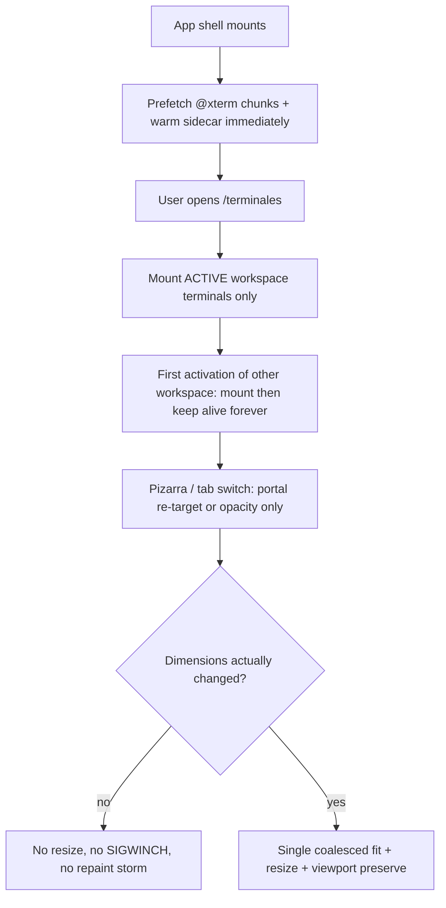

# Design: terminal-load-performance

## Quick path

1. **PR1** — Transition/resize instrumentation + baseline (no behavior change).
2. **PR2** — Dev cold start: prefetch `@xterm/*` at app-shell start + Turbopack compile warm in `electron-up.cjs`.
3. **PR3** — Prod cold start: sidecar ∥ window, parallel probes, async session store, non-blocking parallel restore.
4. **PR4** — Mount storm: activate-then-keep-alive; drop connect defers for visible panels.
5. **PR5** — Total keep-alive: pizarra + v2 without remount; overlay only on true first boot.
6. **PR6** — TUI scroll integrity: resize guards, no fit while hidden, viewport preservation, kill Ctrl+L.
7. **PR7** — Re-baseline vs SLOs; close docs.

## Technical approach

## Architecture decisions

| Decision                | Choice                                                                                     | Alternatives                                                             | Rationale                                                                                                        |
| ----------------------- | ------------------------------------------------------------------------------------------ | ------------------------------------------------------------------------ | ---------------------------------------------------------------------------------------------------------------- |
| Transition model        | **Total keep-alive** (mount once, hide with opacity, portal re-target for pizarra)         | Conservative: fast reconnect only                                        | User decision; eliminates the whole remount/overlay/scroll-break class instead of patching symptoms              |
| Pizarra surfaces        | Single React parent (shared surfaces provider); portal re-target only                      | Keep direct render with `visibility:hidden` and project visually         | Avoids the direct↔singleton unmount boundary (`renderWorkspacePanel.jsx:642-693`); fallback kept if too invasive |
| Inactive workspaces     | **Activate-then-keep-alive**                                                               | Eager all (today) / full lazy with remount each switch                   | Fixes mount storm without reintroducing per-switch mount cost                                                    |
| Dev xterm import        | Prefetch at app-shell start + dev-server compile warm                                      | Keep post-project-ready idle warm                                        | Measured: warm at 13.1 s is too late; import requested at 3.8 s                                                  |
| Dev-server warm         | `electron-up.cjs` fires compile-triggering requests before spawning Electron               | Headless browser pre-warm                                                | Cheap, no new deps; Turbopack compiles routes/chunks on request                                                  |
| Sidecar boot            | Parallel with `createMainWindow()`                                                         | Keep serial before window                                                | Frontend already tolerates sidecar-not-ready (warm/retry path)                                                   |
| Port probes             | Race port-file/4000/4001, single ~800 ms budget                                            | Sequential probes (today)                                                | Worst case today sums all timeouts before ttyServer fallback                                                     |
| Session store           | Async writes, coalesced ~250 ms flush + flush-on-shutdown                                  | `writeFileSync` per spawn (today)                                        | Removes N×sync-IO from spawn path; tmp+rename stays atomic                                                       |
| Backend restore         | Parallel (cap 4), non-blocking, single final save                                          | Serial inside first `ensureTTYServer` (today)                            | Today blocks first `/api/terminal/session` response                                                              |
| Resize policy           | **Send only on real cols/rows delta**; no fit while hidden; single coalesced fit on reveal | Current multi-phase bursts + bounded 48-frame polling                    | Zero-delta resize is pure TUI-scroll damage                                                                      |
| Reattach redraw         | Local xterm repaint; **remove server Ctrl+L** (`ttyServer.js:2078-2084`)                   | Keep Ctrl+L                                                              | Direct suspect for scroll position loss in TUIs                                                                  |
| connectionState updates | Per-panel subscription / memoized workspace rows                                           | Manager-level state map (today, `TerminalWorkspacesManager.jsx:350-363`) | Every transition today re-renders the whole `workspaces.map`                                                     |
| Flags                   | `devhub_terminal_keepalive` (new), `devhub_terminal_warm` (existing)                       | Build-time flags                                                         | Runtime kill-switch without rebuild                                                                              |
| WebKitGTK               | Keep-alive gated off by default (Tier-3-style)                                             | Same as Windows                                                          | Documented offscreen-GPU crash class                                                                             |

## Instrumentation contract (PR1)

New marks/counters in `startupPerfMarks.js` (persisted via existing `POST /api/terminal/perf`):

| Mark / counter                                                                       | Emitted where                     | Meaning                                                 |
| ------------------------------------------------------------------------------------ | --------------------------------- | ------------------------------------------------------- |
| `dh:workspace-switch-start` / `-end`                                                 | workspace tab controller          | Switch duration                                         |
| `dh:pizarra-exit-start` / `-end`                                                     | `SharedTerminalSurface` exit path | Pizarra return duration                                 |
| `terminal-remount` (counter, per panelId)                                            | `useTerminalEngine` boot          | How often a panel truly remounts                        |
| `terminal-resize-sent` (counter w/ `{cols,rows,prevCols,prevRows,hidden,tuiActive}`) | `sendResize`                      | Baseline of redundant resizes                           |
| `terminal-scroll-jump` (counter)                                                     | viewport watcher on reveal        | Unexpected viewport/scrollbase changes after transition |
| backend spawn durations                                                              | `ttyLog` (`WS_CONN`, `RESTORE`)   | Server-side spawn/restore timing                        |

All are no-ops unless perf collection is enabled (same gate as today: non-prod or `localStorage.devhub_perf=1`).

## Keep-alive contract (PR5)

| Surface                   | Before                                          | After                                                                   |
| ------------------------- | ----------------------------------------------- | ----------------------------------------------------------------------- |
| Workspace tab switch (v1) | keep-alive (opacity)                            | unchanged                                                               |
| Workspace tab switch (v2) | unmount → graveyard                             | keep-alive; graveyard only on memory pressure                           |
| Pizarra enter/exit        | unmount direct, mount singleton (or vice versa) | same React parent; portal re-target only                                |
| `hasConnectedOnce`        | resets on remount → overlay                     | persisted per panelId; overlay only on true first boot                  |
| WebGL context             | re-created per remount                          | retained across hide/show                                               |
| WS connection             | reconnect per remount                           | stays open; closes only on real dispose (panel close / renderer change) |

## Resize / scroll integrity contract (PR6)

1. `sendResize` to the PTY only when `cols`/`rows` differ from last sent value.
2. No fit/resize while panel is layout-hidden; on reveal, one coalesced fit; resize only on real delta.
3. Viewport position captured before any transition repaint and restored after, unless user was at bottom (then stay at bottom).
4. No Ctrl+L / app-level redraw from the server after reattach; local repaint only.
5. Churn bursts `[80,180,340]` / `[120,180,340,500]` and 48-frame bounded polling collapse to a single rAF-coalesced pass when keep-alive is active.

## Testing strategy

- Unit: new marks (pattern of `startupPerfMarks.test.js`), warm policy scheduling, session store async, parallel probes, resize guard (zero-delta suppressed, real delta flows), viewport preservation.
- Existing suites must stay green: `TerminalTTY`, `TerminalTTY.v2`, `TerminalTTY.xterm-webgl`, `PizarraPane.windowScopedAutofit`, workspace windows.
- New integration-style tests: "no remount on pizarra enter/exit" (remount counter stays 0), "no overlay after tab switch", "no resize without delta on transition with TUI active".
- Manual QA matrix ×20: pizarra ↔ workspace, tab switches, with OpenCode/Grok TUIs open and scrollback read mid-way; RSS before/after; packaged Linux (WebKitGTK) entry.
- Re-baseline: 5 dev cold starts + 2 packaged per PR that touches startup, into `data/logs/startup-perf/`.

## Coordination notes

- `terminal-engine-v2`: **complete** (documentation finalization pending). This change treats graveyard/snapshot/subscribe as stable contracts. The pending docs should be updated in PR7 to reflect: (a) v2 done, (b) graveyard demoted to memory-pressure valve under total keep-alive.
- `startup-latency-reoptimization`: previous change; its warm tiers and perf marks are extended, not replaced. Its pending items (Deps Waves C/D, bundle snapshot) remain out of scope here.
