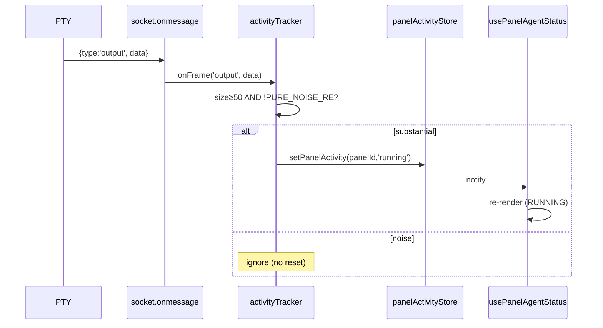
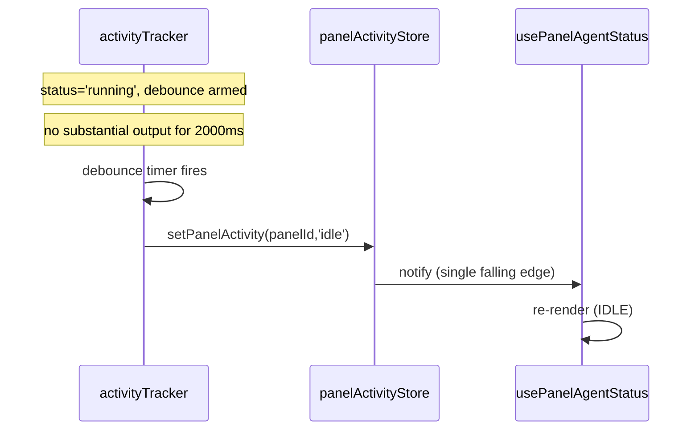
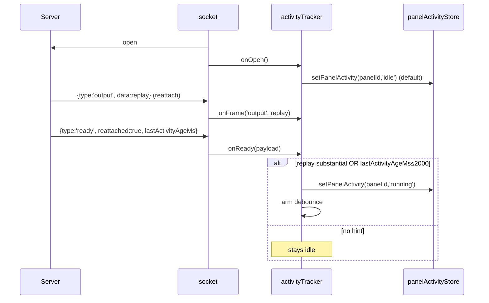

# Design: Terminal TUI Status — Event-Driven Detection

## Technical Approach

Drive the panel badge from the **already-open PTY WebSocket** in `TerminalTTY.jsx` instead of 6s HTTP polling. A small activity tracker hooks into the existing `socket.onmessage` (L4985): every PTY→client `output` frame is run through a noise filter + size threshold; substantial output promotes status to `running`, a ~2s debounce of no substantial output demotes to `idle`. Status is published to a module-level store keyed by `panelId`; `usePanelAgentStatus` reads it via `useSyncExternalStore` as the **primary** signal, with HTTP poll retained only as a >10s-silence fallback. `derivePanelStatus` gains a `liveActivity` priority lane; `PanelStatusBadge` needs no logic change (it already renders `status` from the hook). This maps directly to the proposal's approach and satisfies TTAS-1..5.

## Architecture Decisions

| Decision           | Choice                                                                                                                                          | Alternatives rejected                                                                                                                                                                                                                         | Rationale                                                                                                                                                                                                                |
| ------------------ | ----------------------------------------------------------------------------------------------------------------------------------------------- | --------------------------------------------------------------------------------------------------------------------------------------------------------------------------------------------------------------------------------------------- | ------------------------------------------------------------------------------------------------------------------------------------------------------------------------------------------------------------------------ |
| Signal propagation | Module-level store + `useSyncExternalStore` (React 19, no new dep)                                                                              | (a) Lift state to `TerminalWorkspacesManager` parent + props — invasive in a 7k-line file, re-renders parent; (b) React context — needs a provider above both TerminalTTY and the badge, awkward per-panel; (c) zustand — not currently a dep | TerminalTTY (WS owner) and `PanelStatusBadge` (consumer) are not parent-child; store decouples them, keys naturally by `panelId`, only re-renders subscribers, matches react-best-practices "subscribe to derived state" |
| Direction handling | Structural — count only `output`/raw frames; ignore `ready`/`exit`/`*-session-detected`; `input` is never received in `onmessage`               | Add explicit `direction` field to frames                                                                                                                                                                                                      | `onmessage` only receives PTY→client frames; `input` (client→PTY) is sent via `socket.send`. User-typing leakage is PTY echo, caught by the noise filter. Zero protocol change. Satisfies TTAS-S2                        |
| Bootstrap hint     | Server adds `lastActivityAgeMs` to `ready` (1 line; server already tracks `lastActivityAt`) + client treats substantial replay `output` as seed | Pure client (replay-only) — can't tell "recently active reattach" from "idle reattach with stale history"; pure server push — bigger change                                                                                                   | Clean spec-faithful hint (TTAS-S7); replay detection is a no-cost backup (TTAS-S8). Client treats missing field as no-hint → `idle`, so old servers still work                                                           |
| Noise filter       | Purpose-built `PURE_NOISE_RE` + 50-byte threshold in the tracker                                                                                | Reuse `containsTerminalResponseNoise` / `filterTerminalOutputForSession` — targets _render_ noise with different intent/thresholds                                                                                                            | Activity "substantial" ≠ render "noise"; decoupled filter is unit-testable in isolation (strict TDD) and independently tunable                                                                                           |
| HTTP poll fate     | Keep, demoted to fallback after `WS_SILENT_FALLBACK_MS`; still supplies `agentType`/`agentSessionId`/`alive` metadata                           | Remove entirely — loses liveness on WS silence and metadata used elsewhere                                                                                                                                                                    | Proposal risk table flags poll removal as Low-but-real; keeping limits blast radius (TTAS-S11/S12)                                                                                                                       |

## State Machine (`running` ↔ `idle`)

- **`running` trigger**: a substantial `output`/raw frame (size ≥ `NOISE_MIN_BYTES` AND not pure cursor-control/whitespace). Effect: clear pending debounce; if `idle`, emit rising edge → `running`; (re)arm debounce timer for `ACTIVITY_DEBOUNCE_MS`.
- **`idle` trigger**: debounce timer fires (no substantial output for `ACTIVITY_DEBOUNCE_MS`). Effect: emit single falling edge → `idle`; clear timer. Noise-filtered chunks do **not** reset the timer (TTAS-S6).
- **Bootstrap** (`socket.onopen`): default publish `idle`; enter a `BOOTSTRAP_WINDOW_MS` window. A substantial replay `output` frame promotes to `running`; the `ready` frame's `lastActivityAgeMs ≤ ACTIVITY_DEBOUNCE_MS` also seeds `running` and arms debounce. Window end with no hint → stays `idle` (TTAS-S7/S8).
- **Cleanup**: `onclose`/`onerror`/unmount/stale-epoch → clear debounce timer, publish `idle`, and on unmount `clearPanelActivity(panelId)`. Existing `connectionState` error/waiting handling in `derivePanelStatus` still outranks the live signal for terminal lifecycle.

## Data Flow

```
PTY ──child data──▶ Sidecar ──WS {type:'output',data}──▶ TerminalTTY.onmessage (L4985)
                                                            │
                                              ┌─────────────┴──────────────┐
                                              ▼                            ▼
                                    writeTerminalOutput          activityTracker.onFrame
                                    (render — existing)         (noise filter + debounce)
                                                                            │
                                                                            ▼
                                                                   panelActivityStore
                                                                   Map<panelId,'running'|'idle'>
                                                                            │ useSyncExternalStore
                                                                            ▼
                                                                   usePanelAgentStatus
                                                                            │ derivePanelStatus(liveActivity)
                                                                            ▼
                                                                   PanelStatusBadge (status)

HTTP poll (>10s WS silence) ──▶ usePanelAgentStatus (apiStatus/terminalActivity) ──▶ derivePanelStatus (fallback)
```

## Sequence Diagrams

### 1. PTY output → running



### 2. Debounce → idle



### 3. WS connect → bootstrap



## Noise Filter

A chunk is **substantial** iff `chunk.length >= NOISE_MIN_BYTES` AND `!PURE_NOISE_RE.test(chunk)`.

- **Size**: `chunk.length` (proxy for bytes; see Open Questions for multibyte). Filters single-keystroke echoes and tiny cursor jitters.
- **Pure-noise regex** (hoisted at module level — react-best-practices "hoist RegExp creation", hot path is `onmessage`):

```js
// Matches a string that is ENTIRELY cursor-control / whitespace / OSC noise.
export const PURE_NOISE_RE =
  /^(?:\x1b\[[0-9;?]*[a-zA-Z]|\x1b\][^\x07\x1b]*(?:\x07|\x1b\\)|[\r\n\t ])*$/;
```

- Covered: `\x1b[?25h/l` (cursor show/hide), `\x1b[H`, `\x1b[<n>A/B/C/D/G/J/K`, `\x1b[0m`, OSC `\x1b]...BEL`/ST, bare `\r`/`\n`/`\t`/space.
- `"hello\n"` → fails alternation at `h` → not pure noise → substantial if ≥50B. `"\x1b[?25h\r\n"` → all noise → not substantial.

## HTTP Poll Fallback

`usePanelAgentStatus` keeps the `/api/terminal/sessions/[id]` interval (for `agentType`/`agentSessionId`/`alive` metadata) but the poll no longer drives `running`/`idle` while the live signal is fresh:

- `liveActivity === 'running'` → **RUNNING wins** over any poll result (TTAS-S12).
- `liveActivity === 'idle'` AND `liveSilentMs ≤ WS_SILENT_FALLBACK_MS` → **IDLE** (poll suppressed).
- `liveActivity === null` (no terminal mounted) OR `liveSilentMs > WS_SILENT_FALLBACK_MS` → fall back to existing poll logic (`apiStatus`/`terminalActivity`/`agentRun`) for liveness (TTAS-S11).

The agenthub `/api/agenthub/sessions/[sid]/status` poll is kept as secondary reinforcement below the live signal (future cleanup candidate — see Open Questions).

## Component Interaction — Old vs New

| Aspect              | Old                                                                       | New                                                                                    |
| ------------------- | ------------------------------------------------------------------------- | -------------------------------------------------------------------------------------- |
| Primary signal      | HTTP poll `/api/terminal/sessions/[id]` every 6s → `isActive: age≤3000`   | Live WS `output` frames → tracker → store → `useSyncExternalStore`                     |
| Agent state         | Server `agentTuiState` (Kimi footer regex, narrow) → polled               | Agent-agnostic size+ANSI filter; `agentTuiState` demoted to secondary                  |
| Latency             | 6s poll vs 3s window → >3s gaps read IDLE (RC3)                           | Within one event-loop turn of frame receipt (TTAS-S1)                                  |
| Routing/DB          | RC1 404 + RC4 synthesized-id 404                                          | Irrelevant — WS already open per panel                                                 |
| `PanelStatusBadge`  | reads `status` from hook                                                  | unchanged — reads `status` from hook (now live-sourced)                                |
| `derivePanelStatus` | priority: connection → agentTuiState → apiStatus → ptyActivity → agentRun | adds `liveActivity` lane above agentTuiState/apiStatus; connection lifecycle still top |

## Interfaces / Contracts

```js
// panelActivityStore.js
export const ACTIVITY_DEBOUNCE_MS = 2000;
export const NOISE_MIN_BYTES = 50;
export const WS_SILENT_FALLBACK_MS = 10000;
export const BOOTSTRAP_WINDOW_MS = 1500;
export const PURE_NOISE_RE = /^(?:\x1b\[[0-9;?]*[a-zA-Z]|\x1b\][^\x07\x1b]*(?:\x07|\x1b\\)|[\r\n\t ])*$/;

export function getPanelActivity(panelId);        // 'running' | 'idle' | null
export function getPanelActivityAgeMs(panelId);   // ms since last substantial frame | null
export function subscribePanelActivity(panelId, cb); // -> unsubscribe
export function setPanelActivity(panelId, state); // notifies only on real change
export function clearPanelActivity(panelId);

// panelActivityTracker.js — pure, fake-timer-testable
export function createPanelActivityTracker(panelId, {
  store = panelActivityStore,
  debounceMs = ACTIVITY_DEBOUNCE_MS,
  noiseMinBytes = NOISE_MIN_BYTES,
  bootstrapMs = BOOTSTRAP_WINDOW_MS,
  now = Date.now, setTimeout: st = setTimeout, clearTimeout: ct = clearTimeout,
} = {});
// -> { onOpen(), onFrame(type, data, payload), onReady(payload), onClose(), dispose() }

// derivePanelStatus — additive params (existing signature preserved)
derivePanelStatus({ connectionState, agentRun, initialCommand, apiStatus, terminalActivity,
                    liveActivity, liveActivityAgeMs })
```

`getSnapshot` returns a primitive (`'running'|'idle'|null`) → `Object.is` is stable for `useSyncExternalStore`; no version counter needed. Store notifies only on real `running↔idle` change to avoid extra renders.

## File Changes

| File                                                      | Action                | Description                                                                                                                                        |
| --------------------------------------------------------- | --------------------- | -------------------------------------------------------------------------------------------------------------------------------------------------- | --- | -------------------------- |
| `src/components/terminal/utils/panelActivityStore.js`     | Create                | Module store + constants + `PURE_NOISE_RE` + subscribe/get/set/clear                                                                               |
| `src/components/terminal/utils/panelActivityTracker.js`   | Create                | `createPanelActivityTracker` factory (noise filter, debounce, bootstrap, cleanup)                                                                  |
| `src/components/TerminalTTY.jsx`                          | Modify                | Instantiate tracker (ref) in `connect()`; route `onopen`/`onmessage`(`output`/`ready`)/`onclose`; dispose on stale-epoch/unmount. ~L4880/4985/5078 |
| `src/hooks/usePanelAgentStatus.js`                        | Modify                | `useSyncExternalStore` on store; pass `liveActivity`+`liveSilentMs` to `derivePanelStatus`; demote poll to >10s fallback                           |
| `src/components/terminal/utils/panelStatusHelpers.js`     | Modify                | `derivePanelStatus` gains `liveActivity`/`liveActivityAgeMs` priority lane; keep `PANEL_STATUS`/existing maps                                      |
| `src/components/terminal/components/PanelStatusBadge.jsx` | Unchanged (test-only) | Already renders `status` from hook; live signal flows through transitively. Add `data-live-source` attr optional                                   |
| `sidecar-backend/server.js`                               | Modify (1 line)       | Add `lastActivityAgeMs: Date.now() - (session.lastActivityAt                                                                                       |     | 0)`to`ready` frame (~L448) |
| `__tests__/panelActivityStore.test.js`                    | Create                | subscribe/set/notify-on-change/clear semantics                                                                                                     |
| `__tests__/panelActivityTracker.test.js`                  | Create                | noise filter, debounce reset, rising/falling edges, bootstrap seeding, cleanup (fake timers)                                                       |
| `__tests__/usePanelAgentStatus.test.js`                   | Modify                | live primary; poll fallback after silence; live wins over poll                                                                                     |
| `__tests__/panelStatusHelpers.test.js`                    | Modify                | `derivePanelStatus` with `liveActivity` priority                                                                                                   |
| `__tests__/TerminalTTY.test.js`                           | Modify                | `output`→tracker; `ready` bootstrap; `close` clears; existing WS mock reused                                                                       |
| `__tests__/PanelStatusBadge.test.jsx`                     | Modify                | renders RUNNING/IDLE from live signal                                                                                                              |

## Testing Strategy

| Layer       | What                                                                                                                             | Approach                                                                                                              |
| ----------- | -------------------------------------------------------------------------------------------------------------------------------- | --------------------------------------------------------------------------------------------------------------------- |
| Unit        | store subscribe/notify; tracker noise filter, debounce reset, rising/falling edges, bootstrap, cleanup                           | Jest + fake timers (`jest.useFakeTimers`); inject `setTimeout`/`now` via factory                                      |
| Unit        | `derivePanelStatus` `liveActivity` priority vs connection/api/agentTuiState                                                      | Pure function tests, table-driven                                                                                     |
| Integration | `usePanelAgentStatus` wiring live store + fallback threshold; `TerminalTTY` WS handler emitting `output`/`ready` → store updates | Reuse existing `TerminalTTY.test.js` WS stub (onmessage invoked directly); `useSyncExternalStore` under test renderer |
| E2E         | Badge RUNNING while agent streams, IDLE ~2s after stop                                                                           | Playwright (optional/manual — agent launch is heavy); covered by integration for CI                                   |

## Key Constants

| Constant                | Value | Rationale                                                                               |
| ----------------------- | ----- | --------------------------------------------------------------------------------------- |
| `ACTIVITY_DEBOUNCE_MS`  | 2000  | Within spec 1500–2500; covers inter-token burst gaps without feeling stuck (TTAS-S5)    |
| `NOISE_MIN_BYTES`       | 50    | Filters keystroke echoes + cursor jitter; real agent chunks far exceed 50B (TTAS-S1/S3) |
| `WS_SILENT_FALLBACK_MS` | 10000 | Per TTAS-S11; if WS truly silent 10s, PTY may be hung — HTTP reconfirms liveness        |
| `BOOTSTRAP_WINDOW_MS`   | 1500  | Covers server replay + `ready` on reattach (sent synchronously after `onopen`)          |

## Migration / Rollout

No data migration; pure runtime change. **Rollback**: revert the commit — hook returns to HTTP-poll primary; `AGENT_STATE_PATTERNS` regex and 6s poll remain untouched; store/tracker modules become dead code removed by revert. Tests guard both directions. Optional instant-disable: gate behind `const ENABLE_LIVE_ACTIVITY = true` so a single flip restores poll-primary without revert. The server `ready`-field addition is backward-compatible (client treats missing field as no-hint → `idle`), so a reverted client still works against a new server and vice-versa.

## Open Questions

- [ ] Add `lastActivityAgeMs` to the server `ready` frame now (design assumes yes), or defer and rely on client-side replay detection only?
- [ ] Remove the agenthub `/api/agenthub/sessions/[sid]/status` poll now, or keep as secondary reinforcement (design keeps it)?
- [ ] Multibyte PTY output: is `chunk.length ≥ 50` an acceptable byte proxy, or invest in `TextEncoder` byte-length on the hot path?
