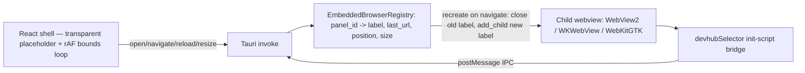
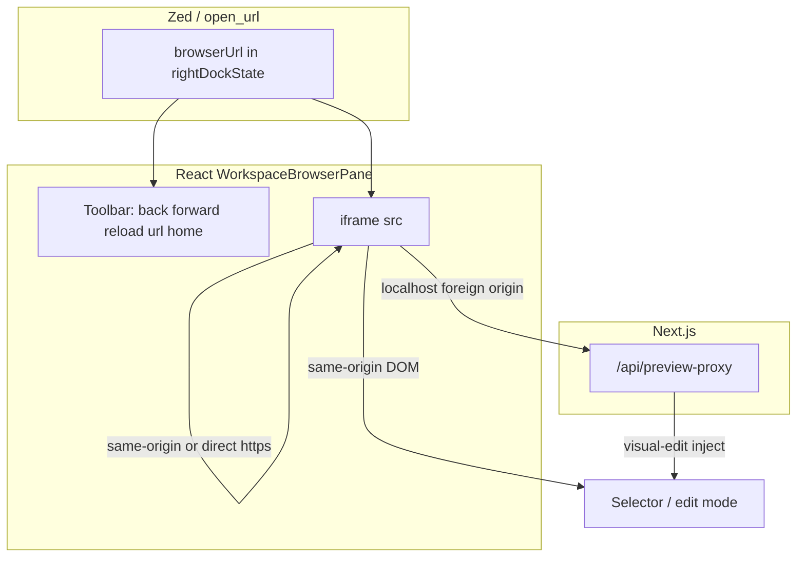

# Design: workspace-browser-wave-aligned

## Update (hardening pass — native overlay is now primary)

This document originally specced an **iframe-first default** with the native overlay as a Linux-only, opt-in "Phase 2" path. That plan is superseded — see `proposal.md` → "Update" for why (X-Frame-Options makes iframe embedding of the sites the user actually needs, like `google.com`/`youtube.com`, impossible in principle, not just difficult).

**Current architecture**: the Tauri child-webview overlay (`embedded_browser_enabled()` returns `true` unconditionally — Windows WebView2, macOS WKWebView, Linux WebKitGTK, no build flag) is the primary embedding for external/cross-origin sites, on every platform. `<iframe>` + `/api/preview-proxy` is kept only for same-origin/localhost dev-preview, where there's no cross-origin header to fight and spinning up a second web-engine instance is unnecessary overhead.

See "Hardened patterns (current architecture)" below for the bugs found and fixed while making this overlay actually reliable (it existed before this pass, but `navigate()`/`reload()` silently no-op'd on Windows, recreate had a teardown race, and position sync missed pure-move layout changes).

## Hardened patterns (current architecture)

These patterns live in `src-tauri/src/embedded_browser.rs` (Rust) and `src/components/workspace/useNativeBrowserSurface.js` (React) and apply to every platform, since `embedded_browser_enabled()` is unconditional.

### 1. Recreate-on-navigate (never in-place `navigate()`/`reload()`)

`WebviewWindow::add_child`'s returned `Webview.navigate()` / `.reload()` are **documented no-ops on Windows** for child webviews created this way — the WebView2 controller doesn't repaint on an in-place navigate the way a top-level `WebviewWindow` does. Rather than fight that ceiling, every URL change (address-bar Enter, Reload button, or `native_browser_open` called again with a different URL for an already-open panel) goes through the same `spawn_embedded_child` helper used for the very first open of a panel: close the existing child, `add_child` a brand-new one at the same bounds with the target URL. This is the only path proven to repaint reliably on Windows; it's used unconditionally on all platforms for consistency (Linux/macOS `navigate()` may work in-place, but recreate is not more expensive there and keeps one code path).

### 2. Fresh label per recreate (no teardown race)

The very first fix (recreate reusing the same webview label across close+add_child) had a race: `close()` isn't guaranteed to finish tearing down the native controller before the next `add_child` call with the **same label** runs, so a same-label recreate could silently fail (observed as "first navigation works, the next one doesn't"). The fix: `EmbeddedBrowserRegistry` keeps a monotonic `AtomicU64` counter, and every recreate gets a brand-new label (`emb-<safe-panel-id>-<n>`) instead of reusing the old one. `panel_id` — not the webview label — is the stable external key used everywhere (registry lookups, the selector init-script's baked-in `PANEL_ID`), so label churn is invisible to callers. The outgoing webview's `close()` is fire-and-forget (still dispatched via `run_on_main_thread` since WebView2 calls are STA-bound, but not awaited) — safe now that no two webviews ever share a label.

### 3. Dark background during the recreate gap

`WebviewBuilder::background_color` is set to the app's dark theme color (`#0d0d0d`, matching `src/app/page.js`) for every recreated child. WebView2's default background is white; without this, the brief gap between closing the old child and the new one's first paint flashed white across the visible area during every navigate/reload.

### 4. Continuous bounds sync (replaces `ResizeObserver` + manual epoch bumps)

Position sync previously relied on two triggers: a `ResizeObserver` on the panel container (fires on **size** changes only, not pure position/move) and a `layoutSyncKey` (`dockState.browserLayoutEpoch`) that call sites had to remember to bump manually (~5 places: `TerminalWorkspacesManager.jsx`, `WorkspaceRenderAssembly.jsx`, `useWorkspacePanelLifecycle.js`, `useZedWorkspaceEvents.js`). Any layout change outside those specific triggers (a splitter drag, a block move without a size change) left the native panel visually stuck while the DOM moved under it.

`useNativeBrowserSurface.js` now runs a single `requestAnimationFrame` loop whenever `active && nativeRuntimeReady && visibleInLayout`: each frame it measures bounds via `measureBounds()`, diffs against the last-applied bounds and avoid-rects (shallow x/y/width/height/avoid-rects compare), and only calls `resizeNativeBrowser`/`setNativeBrowserVisibility` when something actually changed. This makes sync unconditional for every cause instead of requiring call sites to remember to signal it; cost when idle is near-zero (one `getBoundingClientRect()` + a shallow compare per frame, no IPC unless the diff is non-empty). The loop stops via `cancelAnimationFrame` on cleanup/unmount/inactive. `layoutSyncKey`/`observeNode` props are still accepted from callers for backward compatibility but are no longer read.

### 5. Sync `try_send` when returning results from the main-thread closure

`spawn_embedded_child` dispatches `add_child` to the main thread (WebView2 is STA-bound) and awaits the result over a `tauri::async_runtime::channel` (tokio mpsc). Tokio's `Sender::send` is **async and lazy** — calling it inside the sync `run_on_main_thread` closure created a future that was dropped unpolled, so the result never arrived: every open reported `open-failed:add-child-disconnected` even though the webview had actually been created (leaving a live orphan the UI didn't know about). The closure must use the sync `try_send` (never full: capacity 1, single send). Same trap applies to any future main-thread → async-command result channel.

## Technical Approach (original Phase 0–1 plan, superseded for the default runtime — kept for the same-origin/localhost dev-preview path)

Adopt **Wave’s browser product patterns** (home URL, minimal chrome, full-bleed preview, quick launches) on DevHub’s **lite embedding contract**: a single primary runtime **`iframe`** with existing **preview-proxy** and **visual-edit** selector paths. ~~Retire native-gtk as default; gate the Linux GTK/WebKit overlay behind `NEXT_PUBLIC_BROWSER_NATIVE_GTK=1`~~ — superseded: the native overlay (all platforms) is now the default for external sites; iframe is the fallback for same-origin/localhost preview, not the other way around.

Wave’s **implementation** (Electron `<webview>`) is **not** ported; fluidity for the native overlay is achieved via the hardened patterns above (recreate-on-navigate, fresh labels, continuous bounds sync), not by changing the desktop framework.

## Architecture Decisions (current)

| Decision                          | Choice                                                                  | Alternatives                                                   | Rationale                                                                                                                        |
| --------------------------------- | ----------------------------------------------------------------------- | -------------------------------------------------------------- | -------------------------------------------------------------------------------------------------------------------------------- |
| Default embedding                 | Native child webview overlay (Tauri `add_child`), all platforms         | `iframe` + proxy default                                       | `X-Frame-Options`/CSP make iframe embedding of target sites (google/youtube/most SaaS) impossible in principle                   |
| Native overlay availability       | Unconditional (`embedded_browser_enabled() -> true`)                    | Build-time opt-in flag                                         | The overlay is the only path that works for external sites at all; gating it behind a flag would break the default experience    |
| Navigate/reload on existing panel | Recreate (close + `add_child` with fresh label)                         | In-place `webview.navigate()`/`.reload()`                      | `navigate()`/`.reload()` are documented Windows WebView2 no-ops for child webviews                                               |
| Position sync                     | Continuous `requestAnimationFrame` diff loop                            | `ResizeObserver` (size-only) + manually-bumped `layoutSyncKey` | Catches every layout cause (drag/splitter/resize) unconditionally instead of requiring call sites to remember to signal a change |
| iframe path                       | Kept for same-origin/localhost dev-preview only                         | Remove entirely                                                | No `X-Frame-Options` fight for own-origin content; cheaper than a second web-engine instance for that case                       |
| Wave engine                       | Not ported                                                              | Electron webview                                               | Scope; Tauri stays; fluidity achieved via the hardened patterns instead                                                          |
| Selector                          | `devhubSelector` init-script bridge on the native panel (all platforms) | iframe/proxy-only selector                                     | Must work on the same external sites the overlay now targets by default                                                          |

## Data Flow (current)

Native overlay (default, all platforms, external + cross-origin sites):



Same-origin / localhost dev-preview path (unchanged, iframe + proxy):



## File Changes (hardening pass, implemented)

| File                                                  | Action | Description                                                                                                                                                                                                                                                                                               |
| ----------------------------------------------------- | ------ | --------------------------------------------------------------------------------------------------------------------------------------------------------------------------------------------------------------------------------------------------------------------------------------------------------- |
| `src-tauri/src/embedded_browser.rs`                   | Modify | `EmbeddedPanelRecord` gains `position`/`size`; `spawn_embedded_child` helper; monotonic `label_seq` counter (`next_child_label`); `close_embedded_child_fire_and_forget`; `embedded_browser_open`/`load_url`/`reload` all use recreate-with-fresh-label; dark `background_color` on every recreated child |
| `src-tauri/src/native_browser.rs`                     | Modify | `native_browser_reload` made `async`, returns `Result`, awaits the embedded recreate path                                                                                                                                                                                                                 |
| `src/components/workspace/useNativeBrowserSurface.js` | Modify | Removed `ResizeObserver` effect and `layoutSyncKey`-driven effect; added single continuous rAF diff-sync loop                                                                                                                                                                                             |

The original Phase 0–1 file list below (policy module, favorites, Wave toolbar UX) was **not implemented** as originally scoped — the default-runtime premise it depended on (iframe-first) was superseded before that work started. Any future Wave-UX pass (home/pinned URL, favorites strip) should target the native-overlay path as primary, not iframe.

<details>
<summary>Original Phase 0–1 file list (not implemented, kept for history)</summary>

| File                                                     | Action | Description                                                                                                              |
| -------------------------------------------------------- | ------ | ------------------------------------------------------------------------------------------------------------------------ |
| `src/lib/browser/browserRuntimePolicy.js`                | Create | `getDefaultBrowserRuntime`, `sanitizeBrowserRuntime`, `canRequestNativeGtkBrowser`, `shouldProbeNativeBrowserCapability` |
| `src/lib/browser/__tests__/browserRuntimePolicy.test.js` | Create | Policy unit tests                                                                                                        |
| `src/components/workspace/rightDockState.js`             | Modify | Default `iframe`; sanitize via policy                                                                                    |
| `src/components/workspace/WorkspaceBrowserPane.jsx`      | Modify | Policy wiring; Wave toolbar (home, pinned); status chip “Integrado”; hide native chip noise when lite                    |
| `src/components/workspace/browserPreviewSupport.js`      | Modify | Import sanitize for `resolveBrowserRuntimeSelection` input                                                               |
| `src/components/pizarra/PizarraBrowserSurface.jsx`       | Modify | Remove auto `native-gtk` upgrade; carried cards stay iframe unless opt-in                                                |
| `src/components/workspace/browserFavorites.js`           | Create | Load/save favorites list                                                                                                 |
| `src/components/workspace/BrowserFavoritesStrip.jsx`     | Create | Optional chip row under toolbar                                                                                          |

</details>

## Interfaces / Contracts (current)

### `embedded_browser.rs` internals

```rust
fn next_child_label(registry: &EmbeddedBrowserRegistry, panel_id: &str) -> String; // "emb-<safe>-<n>", monotonic
fn close_embedded_child_fire_and_forget(main_window: &WebviewWindow, webview: Webview);
async fn spawn_embedded_child(app, main_window, panel_id, label, url, position, size) -> Result<Webview, String>;
```

`EmbeddedPanelRecord { webview_label, last_url, position, size }` — keyed by stable `panel_id` in `EmbeddedBrowserRegistry.panels`; `webview_label` changes on every recreate, everything else (registry key, selector `PANEL_ID`) does not.

### Dock state (unchanged)

```ts
browserPinnedUrl?: string
browserFavorites?: { id, label, url, icon? }[]
```

`browserRuntime` policy fields (`'iframe' | 'native-gtk'`) from the original plan were never introduced; there is currently no runtime-selection field because there is only one primary runtime (native overlay) plus the always-available same-origin iframe fallback.

## Selector Compatibility Matrix (current)

| Mode                                    | Edit / inspect                                                                                              |
| --------------------------------------- | ----------------------------------------------------------------------------------------------------------- |
| Native overlay (default, all platforms) | `devhubSelector` init-script bridge via `embedded_browser_selector_command`/`embedded_browser_selector_ipc` |
| iframe same-origin (dev-preview)        | DOM + visual-edits                                                                                          |
| iframe + preview-proxy (dev-preview)    | Injected protocol                                                                                           |
| iframe cross-origin                     | Unsupported (honest copy) — this is exactly the case the native overlay now covers instead                  |

## Verification

| Platform            | Check                                                                                                                                                                                                                                                        |
| ------------------- | ------------------------------------------------------------------------------------------------------------------------------------------------------------------------------------------------------------------------------------------------------------ |
| Windows Tauri       | Address-bar Enter navigates repeatedly (2nd/3rd nav, not just the first); Reload button works; drag/resize the panel and confirm it tracks without a manual epoch bump; `https://google.com`/`https://youtube.com` render (previously impossible via iframe) |
| Linux / macOS Tauri | Same overlay path exercised (WebKitGTK / WKWebView) — `cargo check`/`cargo build` catch platform `#[cfg]` regressions; manual verification pending hardware access                                                                                           |
| Web dev (no Tauri)  | Falls back to `unsupported-platform` reason; same-origin dev-preview still uses iframe                                                                                                                                                                       |

## Phase 2 Option — done, not optional

The "Tauri embedded WebView2 (Windows) / WKWebView (macOS)" option originally documented here as an optional future phase is now the shipped, default, unconditionally-enabled primary path (this hardening pass). Nothing further is gated behind a flag or a future decision; remaining future work is UX polish (Wave-style toolbar/favorites) layered on top of the native overlay, not a runtime-selection decision.
