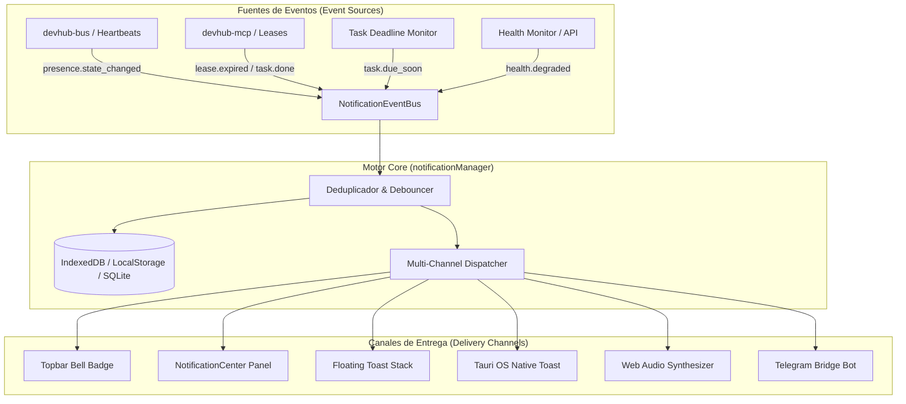
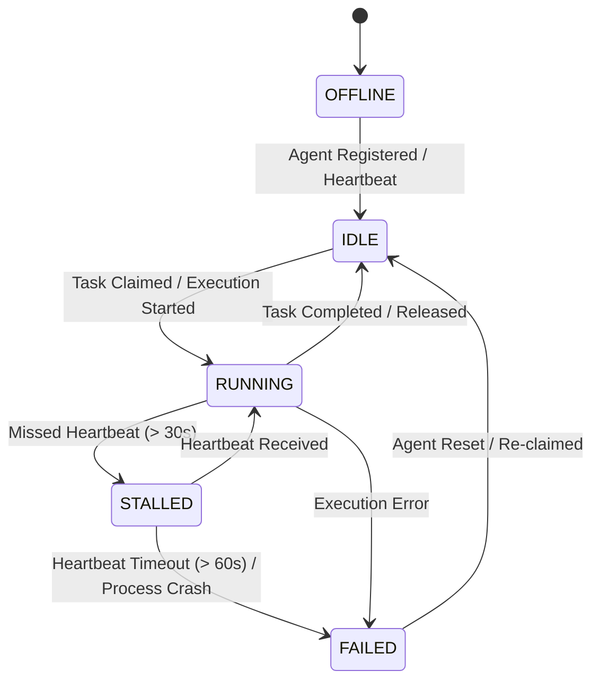

# Architecture & Design: Sistema de Notificaciones & Presence Engine Integration

## Architecture Overview

El Sistema de Notificaciones de DevHub opera como una capa intermedia desacoplada entre los generadores de eventos (Presencia de Agentes, Deadlines de Tareas, Salud de Sistema) y los canales de renderizado y entrega (Interfaz Web, Notificaciones Nativas de SO, Sonido y Telegram Bridge).



---

## Data Models & Schemas

### 1. DevHubNotification Object

```typescript
export interface DevHubNotification {
  id: string; // UUID v4 o identificador único
  dedupe_key: string; // Clave de deduplicación (ej: "presence:stalled:agent-01")
  category: 'agents' | 'tasks' | 'system'; // Categoría para filtrado en UI
  severity: 'info' | 'success' | 'warning' | 'critical'; // Nivel de severidad
  title: string; // Título breve (ej: "Agente Stalled")
  message: string; // Detalle explicativo
  source: 'presence' | 'swarm' | 'tasks' | 'health' | 'mcp'; // Origen del evento
  entity_id?: string; // ID del agente, tarea o servicio relacionado
  metadata?: Record<string, any>; // Payload contextual adicional
  created_at: string; // ISO 8601 Timestamp
  read_at?: string | null; // ISO 8601 Timestamp o null si no leída
  occurrence_count: number; // Cantidad de veces que se ha consolidado este evento
  actions?: NotificationAction[]; // Botones de acción rápida en UI
}

export interface NotificationAction {
  label: string; // Texto del botón (ej: "Ver Agente")
  action_type: 'navigate' | 'command' | 'dismiss';
  target: string; // URL o comando a ejecutar (ej: "/control-room?agent=agent-01")
}
```

### 2. Presence State Machine Schema



---

## Presence Notifier Engine (`presenceNotifier.js`)

El motor de notificación de presencia escucha el feed de eventos de `devhub-bus` y mantiene una tabla hash en memoria de los latidos de agentes activos.

```
+-------------------------------------------------------------------------+
|                        Presence Monitor Loop                            |
|                                                                         |
|  Cada 5 segundos:                                                       |
|   1. Leer lista de agentes activos en devhub.db / memory               |
|   2. Para cada agente en RUNNING:                                       |
|      - Si (now - last_seen_at) > 30s Y estado != STALLED:              |
|          -> Marcar STALLED                                             |
|          -> Disparar `notificationManager.publish(...)`                |
|      - Si (now - last_seen_at) > 60s Y estado != FAILED:               |
|          -> Marcar FAILED                                              |
|          -> Disparar `notificationManager.publish(...)` (Critical)     |
+-------------------------------------------------------------------------+
```

---

## Component Layout & UI Architecture

### 1. `NotificationCenter.jsx` (Refactored)

El componente principal se divide en 3 áreas clave:
- **Header Control**: Contador de no leídos, botón de actualizar, botón de "Marcar todas como leídas" y engranaje de configuración.
- **Tab Navigation**:
  - *Todos* (`unreadCount`)
  - *Agentes & Swarm* (Notificaciones de presencia, stalls, completados)
  - *Tareas & Deadlines* (Alertas de vencimiento en 24h)
  - *Sistema* (Health checks, conectividad MCP)
- **Notification Item Card**:
  - Icono indicador con código de color según severidad.
  - Título, timestamp relativo (ej: "hace 3m") y badge de contador de ocurrencias si `occurrence_count > 1`.
  - Botones de acción contextual ("Ir al Swarm", "Inspeccionar Logs").

### 2. `NotificationToastStack.jsx`

Componente montado globalmente en el layout raíz de la aplicación (`src/App.js` o `layout.jsx`):
- Posicionado en la esquina inferior derecha (`bottom-5 right-5`).
- Muestra un máximo de 4 toasts simultáneos.
- Animación fluida de entrada (fade-in + slide-up) y salida (fade-out + shrink) utilizando Framer Motion / Tailwind transitions.
- Soporta pausa al pasar el puntero sobre el toast (`pauseOnHover`).

### 3. Audio Alert Synthesizer (`soundEffects.js`)

Implementación nativa sin librerías pesadas utilizando `AudioContext`:

```javascript
// Tono de alerta sintético para severidad warning / critical
export function playAlertSound(severity = 'info') {
  if (typeof window === 'undefined') return;
  const ctx = new (window.AudioContext || window.webkitAudioContext)();
  const osc = ctx.createOscillator();
  const gain = ctx.createGain();

  osc.connect(gain);
  gain.connect(ctx.destination);

  if (severity === 'critical') {
    osc.frequency.setValueAtTime(880, ctx.currentTime); // A5
    osc.frequency.exponentialRampToValueAtTime(440, ctx.currentTime + 0.3);
    gain.gain.setValueAtTime(0.15, ctx.currentTime);
    gain.gain.exponentialRampToValueAtTime(0.01, ctx.currentTime + 0.3);
    osc.start();
    osc.stop(ctx.currentTime + 0.3);
  } else if (severity === 'warning') {
    osc.frequency.setValueAtTime(587.33, ctx.currentTime); // D5
    gain.gain.setValueAtTime(0.1, ctx.currentTime);
    gain.gain.exponentialRampToValueAtTime(0.01, ctx.currentTime + 0.2);
    osc.start();
    osc.stop(ctx.currentTime + 0.2);
  }
}
```

---

## Technical Integration Plan

1. **Local Storage & State Keys**:
   - `STORAGE_KEY_V2 = 'devhub:notifications:v2'`
   - `PREFERENCES_KEY = 'devhub:notifications:preferences'`
2. **Channel Toggles in Preferences**:
   - `enable_toasts`: boolean (default: `true`)
   - `enable_native_os`: boolean (default: `true`)
   - `enable_sound`: boolean (default: `true`)
   - `enable_telegram`: boolean (default: `false`)
   - `min_severity`: `'info' | 'warning' | 'critical'` (default: `'info'`)
